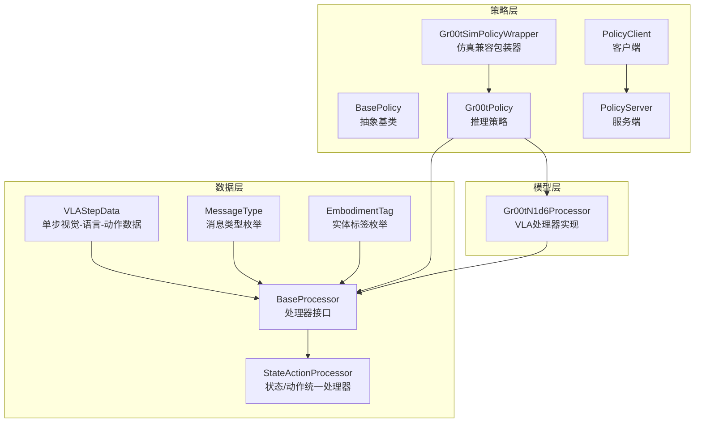
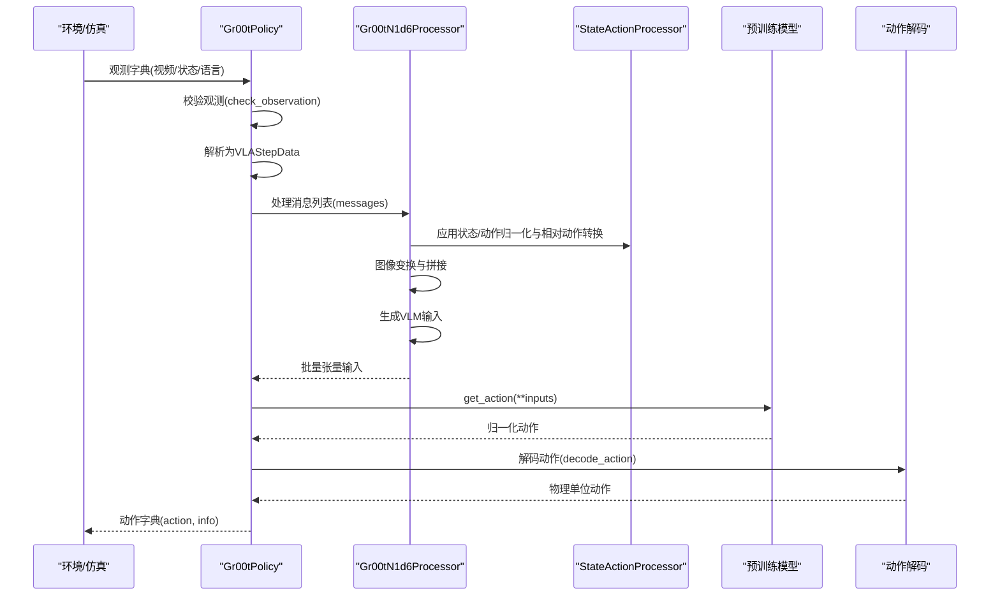
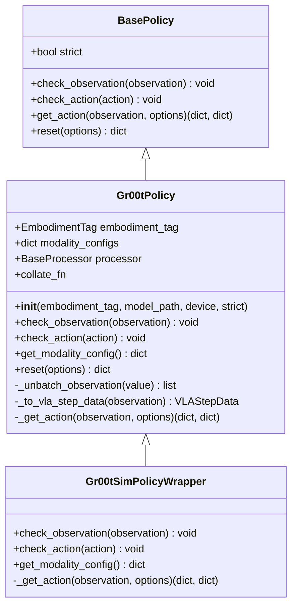
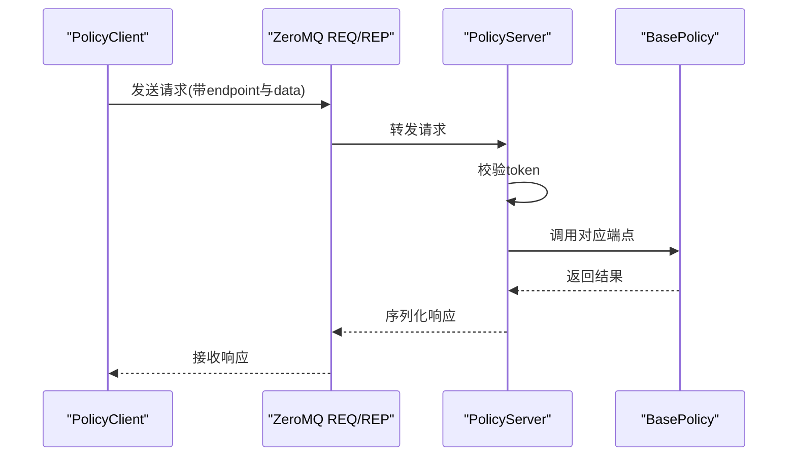
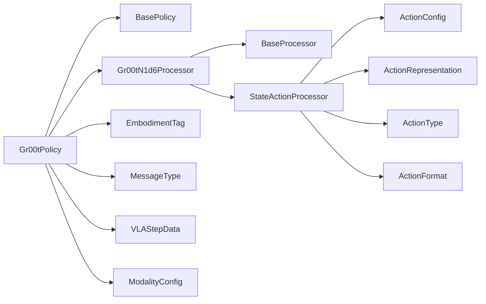
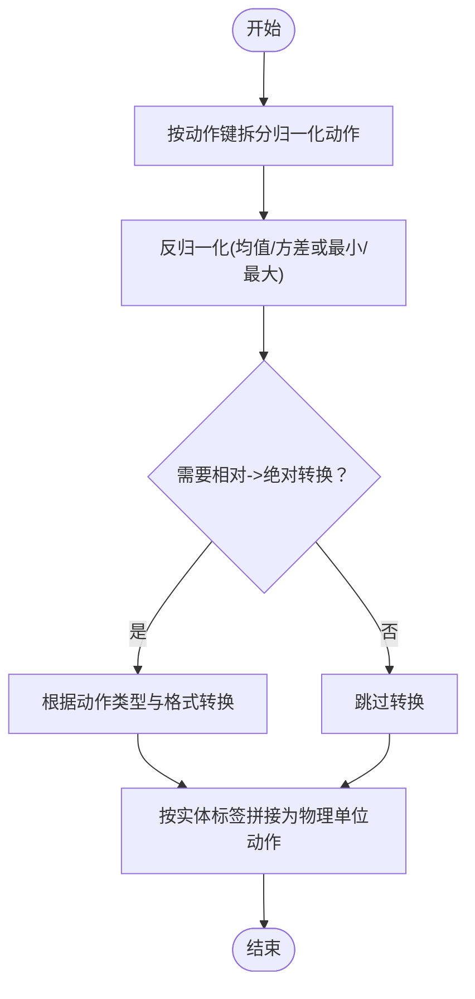

# API参考

<cite>
**本文档引用的文件**
- [gr00t/policy/gr00t_policy.py](file://gr00t/policy/gr00t_policy.py)
- [gr00t/policy/policy.py](file://gr00t/policy/policy.py)
- [gr00t/policy/server_client.py](file://gr00t/policy/server_client.py)
- [gr00t/data/types.py](file://gr00t/data/types.py)
- [gr00t/data/interfaces.py](file://gr00t/data/interfaces.py)
- [gr00t/data/embodiment_tags.py](file://gr00t/data/embodiment_tags.py)
- [gr00t/model/gr00t_n1d6/processing_gr00t_n1d6.py](file://gr00t/model/gr00t_n1d6/processing_gr00t_n1d6.py)
- [gr00t/data/state_action/state_action_processor.py](file://gr00t/data/state_action/state_action_processor.py)
- [gr00t/configs/data/embodiment_configs.py](file://gr00t/configs/data/embodiment_configs.py)
- [gr00t/data/utils.py](file://gr00t/data/utils.py)
- [getting_started/policy.md](file://getting_started/policy.md)
- [scripts/deployment/standalone_inference_script.py](file://scripts/deployment/standalone_inference_script.py)
</cite>

## 目录
1. [简介](#简介)
2. [项目结构](#项目结构)
3. [核心组件](#核心组件)
4. [架构总览](#架构总览)
5. [详细组件分析](#详细组件分析)
6. [依赖关系分析](#依赖关系分析)
7. [性能考量](#性能考量)
8. [故障排除指南](#故障排除指南)
9. [结论](#结论)
10. [附录](#附录)

## 简介
本文件是 Isaac-GR00T API 的全面参考文档，聚焦于策略API、数据类型与配置接口。内容涵盖：
- Gr00tPolicy 类的公共接口、方法参数与返回值
- 关键数据类型：VLAStepData、MessageType、EmbodimentTag 等的定义与用途
- 配置接口：模态配置（ModalityConfig）、动作配置（ActionConfig）与姿态表示（ActionRepresentation、ActionType、ActionFormat）
- 服务器/客户端通信协议与序列化机制
- 常见用例与最佳实践
- 故障排除与性能优化建议

## 项目结构
Isaac-GR00T 的策略与数据处理模块主要分布在以下子目录：
- 策略层：gr00t/policy
- 数据类型与接口：gr00t/data
- 模型处理器：gr00t/model/gr00t_n1d6
- 配置与工具：gr00t/configs、gr00t/data/utils
- 示例与部署：getting_started、scripts/deployment

图表来源
- [gr00t/policy/policy.py](file://gr00t/policy/policy.py#L5-L118)
- [gr00t/policy/gr00t_policy.py](file://gr00t/policy/gr00t_policy.py#L46-L418)
- [gr00t/policy/server_client.py](file://gr00t/policy/server_client.py#L51-L241)
- [gr00t/data/types.py](file://gr00t/data/types.py#L10-L103)
- [gr00t/data/interfaces.py](file://gr00t/data/interfaces.py#L10-L128)
- [gr00t/data/state_action/state_action_processor.py](file://gr00t/data/state_action/state_action_processor.py#L33-L683)
- [gr00t/model/gr00t_n1d6/processing_gr00t_n1d6.py](file://gr00t/model/gr00t_n1d6/processing_gr00t_n1d6.py#L107-L526)

章节来源
- [gr00t/policy/gr00t_policy.py](file://gr00t/policy/gr00t_policy.py#L1-L674)
- [gr00t/policy/policy.py](file://gr00t/policy/policy.py#L1-L118)
- [gr00t/policy/server_client.py](file://gr00t/policy/server_client.py#L1-L241)
- [gr00t/data/types.py](file://gr00t/data/types.py#L1-L103)
- [gr00t/data/interfaces.py](file://gr00t/data/interfaces.py#L1-L128)
- [gr00t/data/state_action/state_action_processor.py](file://gr00t/data/state_action/state_action_processor.py#L1-L683)
- [gr00t/model/gr00t_n1d6/processing_gr00t_n1d6.py](file://gr00t/model/gr00t_n1d6/processing_gr00t_n1d6.py#L1-L526)

## 核心组件
本节概述策略API、数据类型与配置接口的核心能力与职责。

- 策略API
  - BasePolicy：定义策略的抽象接口，包括输入输出校验、动作计算与重置逻辑
  - Gr00tPolicy：面向推理的策略实现，负责观测验证、处理器调用、模型推理与动作解码
  - Gr00tSimPolicyWrapper：为现有仿真环境提供兼容层，转换扁平观测格式到嵌套格式
  - PolicyClient/PolicyServer：基于 ZeroMQ 的远程推理服务，支持注册自定义端点

- 数据类型与接口
  - VLAStepData：单步视觉-语言-动作数据载体
  - MessageType：消息类型枚举（开始/结束/步骤/图像/文本）
  - EmbodimentTag：实体标签枚举，标识机器人/场景
  - BaseProcessor：处理器接口，定义消息处理、动作解码、批处理合并与统计设置

- 配置接口
  - ModalityConfig：描述模态采样索引、键集合、可选的正弦余弦编码与均值方差归一化键，以及动作配置列表
  - ActionConfig：动作表示、类型与格式配置
  - EmbodimentTag 与 ModalityConfig 共同决定动作空间维度与归一化参数

章节来源
- [gr00t/policy/policy.py](file://gr00t/policy/policy.py#L5-L118)
- [gr00t/policy/gr00t_policy.py](file://gr00t/policy/gr00t_policy.py#L46-L418)
- [gr00t/policy/server_client.py](file://gr00t/policy/server_client.py#L51-L241)
- [gr00t/data/types.py](file://gr00t/data/types.py#L10-L103)
- [gr00t/data/interfaces.py](file://gr00t/data/interfaces.py#L10-L128)
- [gr00t/configs/data/embodiment_configs.py](file://gr00t/configs/data/embodiment_configs.py#L11-L200)

## 架构总览
下图展示了策略、处理器与数据流之间的交互关系。

图表来源
- [gr00t/policy/gr00t_policy.py](file://gr00t/policy/gr00t_policy.py#L306-L358)
- [gr00t/model/gr00t_n1d6/processing_gr00t_n1d6.py](file://gr00t/model/gr00t_n1d6/processing_gr00t_n1d6.py#L287-L388)
- [gr00t/data/state_action/state_action_processor.py](file://gr00t/data/state_action/state_action_processor.py#L294-L487)

## 详细组件分析

### Gr00tPolicy 类
Gr00tPolicy 是推理阶段的核心策略类，负责：
- 初始化模型与处理器，并加载对应实体的模态配置
- 校验观测结构与数据类型（视频为 uint8、状态为 float32、语言为字符串列表）
- 将观测转换为 VLAStepData 并通过处理器进行消息封装
- 调用模型执行推理，解码得到物理单位的动作

关键方法与行为
- __init__(embodiment_tag, model_path, device, strict)
  - 加载预训练模型与处理器，绑定实体标签与模态配置
  - 严格模式下启用输入/输出校验
- check_observation(observation)
  - 校验视频键存在且形状为 (B, T, H, W, 3)，dtype 为 np.uint8
  - 校验状态键存在且形状为 (B, T, D)，dtype 为 np.float32
  - 校验语言键存在且为 (B, T) 的字符串列表，当前实现要求每个时间步仅一个指令
- _to_vla_step_data(observation)
  - 构造 VLAStepData，包含 images、states、actions（推理时为空）、text 与 embodiment
- _get_action(observation, options)
  - 单步流程：解包观测、转为 VLAStepData、消息封装、批处理合并、模型推理、解码动作
  - 返回动作字典与信息字典
- check_action(action)
  - 校验动作键存在、形状为 (B, T, D)、dtype 为 np.float32
- get_modality_config()
  - 返回当前实体的模态配置
- reset(options)
  - 重置策略内部状态（当前实现为空）

图表来源
- [gr00t/policy/policy.py](file://gr00t/policy/policy.py#L5-L118)
- [gr00t/policy/gr00t_policy.py](file://gr00t/policy/gr00t_policy.py#L46-L418)

章节来源
- [gr00t/policy/gr00t_policy.py](file://gr00t/policy/gr00t_policy.py#L46-L418)
- [gr00t/policy/policy.py](file://gr00t/policy/policy.py#L5-L118)

### 数据类型与配置

#### VLAStepData
- 字段
  - images: dict[str, list[np.ndarray]]，键为视图名，值为按时间堆叠的图像帧
  - states: dict[str, np.ndarray]，单步或轨迹形状 (T, D) 或 (B, T, D)
  - actions: dict[str, np.ndarray]，动作块形状 (T, D) 或 (B, T, D)
  - text: str | None，任务描述或指令
  - embodiment: EmbodimentTag，默认 NEW_EMBODIMENT
  - is_demonstration: bool，是否演示步，用于损失计算控制
  - metadata: dict[str, Any]，扩展元数据
- 用途
  - 作为处理器的消息内容，承载单步 VLA 数据

章节来源
- [gr00t/data/types.py](file://gr00t/data/types.py#L35-L58)

#### MessageType
- 枚举值
  - START_OF_EPISODE
  - END_OF_EPISODE
  - EPISODE_STEP
  - IMAGE
  - TEXT
- 用途
  - 标识消息类型，驱动处理器在不同阶段的处理逻辑

章节来源
- [gr00t/data/types.py](file://gr00t/data/types.py#L10-L16)

#### EmbodimentTag
- 预训练实体标签
  - ROBOCASA_PANDA_OMRON、GR1
- 后训练实体标签
  - UNITREE_G1、LIBERO_PANDA、OXE_GOOGLE、OXE_WIDOWX
- 新实体标签
  - NEW_EMBODIMENT
- 用途
  - 选择对应的模态配置与投影映射

章节来源
- [gr00t/data/embodiment_tags.py](file://gr00t/data/embodiment_tags.py#L14-L57)

#### ModalityConfig 与 ActionConfig
- ModalityConfig
  - delta_indices: 相对采样索引列表
  - modality_keys: 模态键集合
  - sin_cos_embedding_keys/mean_std_embedding_keys: 可选的编码/归一化键
  - action_configs: 动作配置列表（长度需与 modality_keys 一致）
- ActionConfig
  - rep: ActionRepresentation（相对/绝对/增量）
  - type: ActionType（末端执行器/非末端执行器）
  - format: ActionFormat（默认/xyz+rot6d/xyz+rotvec）
  - state_key: 参考状态键（可选）

章节来源
- [gr00t/data/types.py](file://gr00t/data/types.py#L68-L103)
- [gr00t/configs/data/embodiment_configs.py](file://gr00t/configs/data/embodiment_configs.py#L11-L200)
- [gr00t/data/utils.py](file://gr00t/data/utils.py#L281-L293)

### 处理器与动作解码

#### BaseProcessor 接口
- __call__(messages) -> dict[str, Any]
  - 输入消息列表，输出模型输入字典
- decode_action(action, embodiment_tag, state) -> dict[str, np.ndarray]
  - 将归一化动作解码为物理单位
- collator 属性
  - 返回批处理合并器
- set_statistics(statistics, override) -> None
  - 设置归一化统计参数

章节来源
- [gr00t/data/interfaces.py](file://gr00t/data/interfaces.py#L10-L69)

#### Gr00tN1d6Processor 实现
- 职责
  - 统一处理状态/动作归一化、相对动作转换、图像变换与拼接、VLM 输入构造
  - 提供批处理合并器与动作解码
- 关键流程
  - apply(state, action, embodiment_tag)
    - 先将绝对动作转换为相对（若配置），再进行归一化
  - decode_action(action, embodiment_tag, state)
    - 反向操作：先反归一化，再将相对动作转换为绝对
  - __call__(messages)
    - 构造状态张量、动作张量、VLM 文本与图像输入，并添加掩码与实体ID

章节来源
- [gr00t/model/gr00t_n1d6/processing_gr00t_n1d6.py](file://gr00t/model/gr00t_n1d6/processing_gr00t_n1d6.py#L107-L526)
- [gr00t/data/state_action/state_action_processor.py](file://gr00t/data/state_action/state_action_processor.py#L294-L487)

### 服务器/客户端通信

#### PolicyServer/PolicyClient
- 支持端点
  - ping、kill、get_action、reset、get_modality_config
- 序列化
  - 使用 msgpack 对自定义类型（如 ModalityConfig、np.ndarray）进行编码/解码
- 安全
  - 可选 API token 校验

图表来源
- [gr00t/policy/server_client.py](file://gr00t/policy/server_client.py#L51-L241)

章节来源
- [gr00t/policy/server_client.py](file://gr00t/policy/server_client.py#L51-L241)

## 依赖关系分析

图表来源
- [gr00t/policy/gr00t_policy.py](file://gr00t/policy/gr00t_policy.py#L46-L418)
- [gr00t/model/gr00t_n1d6/processing_gr00t_n1d6.py](file://gr00t/model/gr00t_n1d6/processing_gr00t_n1d6.py#L107-L526)
- [gr00t/data/state_action/state_action_processor.py](file://gr00t/data/state_action/state_action_processor.py#L33-L683)
- [gr00t/data/types.py](file://gr00t/data/types.py#L10-L103)
- [gr00t/data/interfaces.py](file://gr00t/data/interfaces.py#L10-L128)
- [gr00t/data/embodiment_tags.py](file://gr00t/data/embodiment_tags.py#L14-L57)
- [gr00t/configs/data/embodiment_configs.py](file://gr00t/configs/data/embodiment_configs.py#L11-L200)

章节来源
- [gr00t/policy/gr00t_policy.py](file://gr00t/policy/gr00t_policy.py#L46-L418)
- [gr00t/model/gr00t_n1d6/processing_gr00t_n1d6.py](file://gr00t/model/gr00t_n1d6/processing_gr00t_n1d6.py#L107-L526)
- [gr00t/data/state_action/state_action_processor.py](file://gr00t/data/state_action/state_action_processor.py#L33-L683)
- [gr00t/data/types.py](file://gr00t/data/types.py#L10-L103)
- [gr00t/data/interfaces.py](file://gr00t/data/interfaces.py#L10-L128)
- [gr00t/data/embodiment_tags.py](file://gr00t/data/embodiment_tags.py#L14-L57)
- [gr00t/configs/data/embodiment_configs.py](file://gr00t/configs/data/embodiment_configs.py#L11-L200)

## 性能考量
- 推理模式
  - PyTorch 默认精度：bfloat16，降低显存占用
  - TensorRT 加速：通过替换 DiT 前向实现，显著提升吞吐
- 数据处理
  - 图像变换：支持 torchvision 与 albumentations，可按需选择以平衡速度与一致性
  - 批处理合并：统一张量栈叠，减少跨模态拼接开销
- 动作维度与时间步
  - 动作维度与时间步上限可通过配置限制，避免过长轨迹导致内存压力
- 服务器端点
  - 使用 ZeroMQ 进行轻量级 RPC，注意网络延迟与序列化开销

章节来源
- [gr00t/policy/gr00t_policy.py](file://gr00t/policy/gr00t_policy.py#L82-L85)
- [gr00t/model/gr00t_n1d6/processing_gr00t_n1d6.py](file://gr00t/model/gr00t_n1d6/processing_gr00t_n1d6.py#L177-L198)
- [scripts/deployment/standalone_inference_script.py](file://scripts/deployment/standalone_inference_script.py#L78-L195)

## 故障排除指南
- 观测结构错误
  - 视频：确保 dtype 为 np.uint8，形状为 (B, T, H, W, 3)，通道数为 3
  - 状态：确保 dtype 为 np.float32，形状为 (B, T, D)
  - 语言：确保为 (B, T) 的字符串列表，当前实现要求每个时间步仅一个指令
- 动作结构错误
  - 确保动作键存在于配置中，形状为 (B, T, D)，dtype 为 np.float32
- 严格模式
  - 开发阶段建议开启 strict=True，以便在早期发现格式不匹配问题
- 仿真兼容
  - 若使用现有仿真环境，可使用 Gr00tSimPolicyWrapper 将扁平键转换为嵌套格式
- 服务器连接
  - 使用 PolicyClient.ping() 检查连通性；确认端口与 API token 正确

章节来源
- [gr00t/policy/gr00t_policy.py](file://gr00t/policy/gr00t_policy.py#L144-L404)
- [gr00t/policy/server_client.py](file://gr00t/policy/server_client.py#L172-L241)
- [getting_started/policy.md](file://getting_started/policy.md#L454-L461)

## 结论
本文档系统梳理了 Isaac-GR00T 的策略API、数据类型与配置接口，提供了从概念到实现的完整参考。Gr00tPolicy 作为推理入口，结合 Gr00tN1d6Processor 与 StateActionProcessor，实现了从多模态观测到物理单位动作的端到端流程。通过 ModalityConfig 与 ActionConfig，系统支持多种机器人与任务配置，具备良好的扩展性与稳定性。

## 附录

### 常见用例与示例路径
- 单步/批量推理
  - 参考路径：[getting_started/policy.md](file://getting_started/policy.md#L390-L461)
- 服务器/客户端部署
  - 参考路径：[gr00t/policy/server_client.py](file://gr00t/policy/server_client.py#L51-L241)
- 独立推理脚本（含 TensorRT）
  - 参考路径：[scripts/deployment/standalone_inference_script.py](file://scripts/deployment/standalone_inference_script.py#L1-L200)

### 关键流程图：动作解码

图表来源
- [gr00t/model/gr00t_n1d6/processing_gr00t_n1d6.py](file://gr00t/model/gr00t_n1d6/processing_gr00t_n1d6.py#L228-L250)
- [gr00t/data/state_action/state_action_processor.py](file://gr00t/data/state_action/state_action_processor.py#L382-L487)