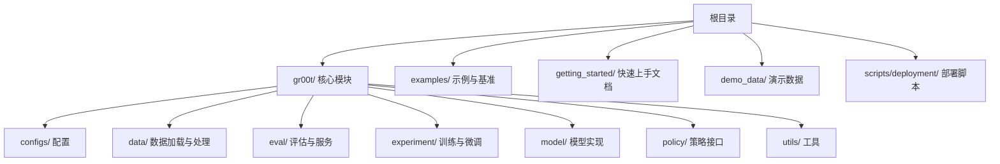
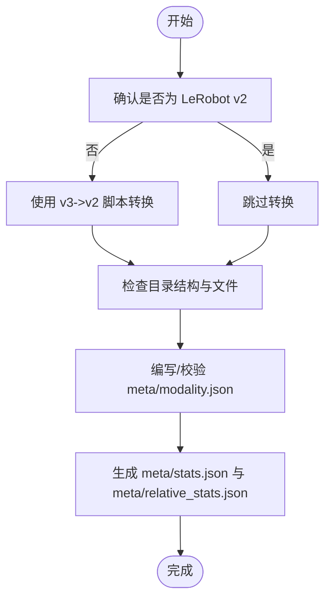
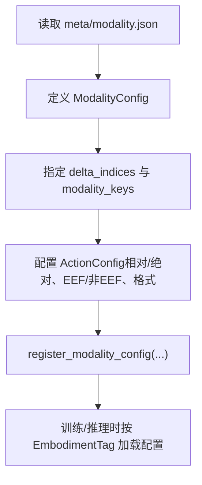
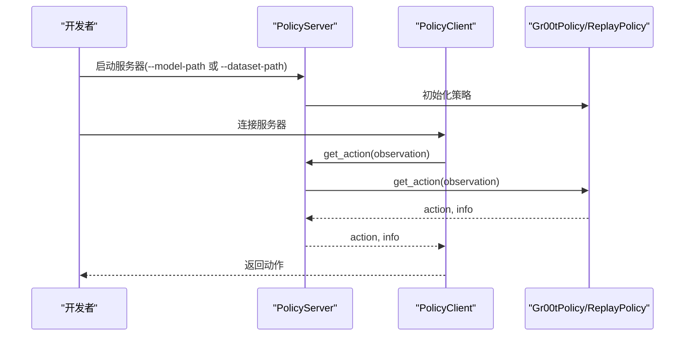
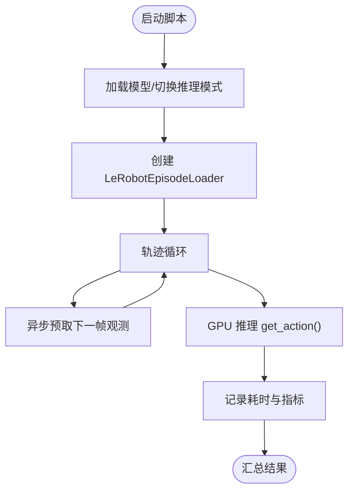

# 快速开始

<cite>
**本文引用的文件**
- [README.md](file://README.md)
- [getting_started/data_preparation.md](file://getting_started/data_preparation.md)
- [getting_started/data_config.md](file://getting_started/data_config.md)
- [getting_started/policy.md](file://getting_started/policy.md)
- [getting_started/finetune_new_embodiment.md](file://getting_started/finetune_new_embodiment.md)
- [getting_started/hardware_recommendation.md](file://getting_started/hardware_recommendation.md)
- [demo_data/cube_to_bowl_5/meta/modality.json](file://demo_data/cube_to_bowl_5/meta/modality.json)
- [examples/LIBERO/modality.json](file://examples/LIBERO/modality.json)
- [examples/PointNav/modality.json](file://examples/PointNav/modality.json)
- [examples/SO100/so100_config.py](file://examples/SO100/so100_config.py)
- [scripts/deployment/standalone_inference_script.py](file://scripts/deployment/standalone_inference_script.py)
- [gr00t/eval/run_gr00t_server.py](file://gr00t/eval/run_gr00t_server.py)
- [examples/robocasa-gr1-tabletop-tasks/README.md](file://examples/robocasa-gr1-tabletop-tasks/README.md)
</cite>

## 目录
1. [简介](#简介)
2. [项目结构](#项目结构)
3. [核心组件](#核心组件)
4. [架构总览](#架构总览)
5. [详细组件分析](#详细组件分析)
6. [依赖关系分析](#依赖关系分析)
7. [性能考虑](#性能考虑)
8. [故障排除指南](#故障排除指南)
9. [结论](#结论)
10. [附录](#附录)

## 简介
本指南面向首次接触 Isaac-GR00T 的用户，帮助您从零开始完成环境搭建、数据准备、基础推理与评估，并逐步过渡到微调与部署。文档严格遵循仓库内现有术语与流程，提供可直接复用的命令与路径指引，同时为有经验的开发者提供高级配置与性能优化建议。

## 项目结构
仓库采用“模块化+示例驱动”的组织方式：
- 核心训练/推理框架位于 gr00t/
- 示例与基准在 examples/ 下，包含多种机器人平台与任务
- 快速上手文档在 getting_started/
- 演示数据在 demo_data/，便于快速验证
- 部署脚本在 scripts/deployment/



图表来源
- [README.md](file://README.md#L1-L388)

章节来源
- [README.md](file://README.md#L1-L388)

## 核心组件
- 数据准备与格式：LeRobot v2 扩展（含 meta/modality.json），支持多注解通道与统计元数据。
- 模态配置：Python 字典定义视频/状态/动作/语言的采样时序、键映射与动作表示。
- 推理策略：Gr00tPolicy 提供本地或远程（ZeroMQ）推理能力；ReplayPolicy 支持离线回放调试。
- 服务器-客户端：run_gr00t_server.py 提供统一入口，支持真实模型与回放模式。
- 部署脚本：standalone_inference_script.py 支持 PyTorch/TensorRT 模式，内置异步预取与性能统计。

章节来源
- [getting_started/data_preparation.md](file://getting_started/data_preparation.md#L1-L156)
- [getting_started/data_config.md](file://getting_started/data_config.md#L1-L296)
- [getting_started/policy.md](file://getting_started/policy.md#L1-L461)
- [gr00t/eval/run_gr00t_server.py](file://gr00t/eval/run_gr00t_server.py#L1-L111)
- [scripts/deployment/standalone_inference_script.py](file://scripts/deployment/standalone_inference_script.py#L1-L817)

## 架构总览
下图展示从数据到推理的关键交互路径，涵盖本地推理、服务器-客户端与回放调试三种模式。

```mermaid
graph TB
subgraph "数据层"
D1["demo_data/*/meta/modality.json"]
D2["demo_data/*/data/chunk-*/episode_*.parquet"]
D3["demo_data/*/videos/chunk-*/observation.images.*.mp4"]
end
subgraph "配置层"
C1["模态配置 Python 文件<br/>examples/*/modality_config.py"]
C2["EmbodimentTag 注册"]
end
subgraph "推理层"
P1["Gr00tPolicy"]
P2["ReplayPolicy"]
S1["PolicyServer"]
C11["PolicyClient"]
end
subgraph "部署层"
DE1["standalone_inference_script.py"]
DE2["run_gr00t_server.py"]
end
D1 --> C1
D2 --> C1
D3 --> C1
C1 --> P1
C1 --> P2
P1 --> S1
P2 --> S1
S1 <- --> C11
DE1 --> P1
DE2 --> S1
```

图表来源
- [scripts/deployment/standalone_inference_script.py](file://scripts/deployment/standalone_inference_script.py#L1-L817)
- [gr00t/eval/run_gr00t_server.py](file://gr00t/eval/run_gr00t_server.py#L1-L111)
- [examples/SO100/so100_config.py](file://examples/SO100/so100_config.py#L1-L67)
- [demo_data/cube_to_bowl_5/meta/modality.json](file://demo_data/cube_to_bowl_5/meta/modality.json#L1-L35)

## 详细组件分析

### 组件一：数据准备与 modality.json
- 目标：将机器人示范数据转换为 GR00T-flavored LeRobot v2 格式，关键在于 meta/modality.json 的正确配置。
- 关键点：
  - 视频命名规范：observation.images.<key>.mp4
  - 状态/动作数组：按 modality.json 中 start/end 切片解析
  - 多注解通道：通过 annotation.<source>.<type> 键索引到 meta/tasks.jsonl
  - 统计元数据：自动生成 meta/stats.json 与 meta/relative_stats.json



图表来源
- [getting_started/data_preparation.md](file://getting_started/data_preparation.md#L1-L156)

章节来源
- [getting_started/data_preparation.md](file://getting_started/data_preparation.md#L1-L156)
- [demo_data/cube_to_bowl_5/meta/modality.json](file://demo_data/cube_to_bowl_5/meta/modality.json#L1-L35)

### 组件二：模态配置（ModalityConfig）
- 目标：将数据结构与模型处理管线对接，定义各模态的采样时序、键映射与动作表示。
- 关键点：
  - delta_indices：当前帧、历史帧、未来动作预测的相对时间索引
  - modality_keys：必须与 meta/modality.json 对应
  - 动作配置：ActionConfig 定义相对/绝对控制、EEF/非EEF、XYZ_ROT6D 等
  - 注册：通过 register_modality_config 将配置绑定到 EmbodimentTag



图表来源
- [getting_started/data_config.md](file://getting_started/data_config.md#L1-L296)
- [examples/SO100/so100_config.py](file://examples/SO100/so100_config.py#L1-L67)
- [examples/LIBERO/modality.json](file://examples/LIBERO/modality.json#L1-L76)
- [examples/PointNav/modality.json](file://examples/PointNav/modality.json#L1-L35)

章节来源
- [getting_started/data_config.md](file://getting_started/data_config.md#L1-L296)
- [examples/SO100/so100_config.py](file://examples/SO100/so100_config.py#L1-L67)

### 组件三：策略 API 与服务器-客户端
- 目标：以 Gr00tPolicy 为核心，提供本地推理与远程推理两种模式；ReplayPolicy 用于开发调试。
- 关键点：
  - 观察格式：video/state/language 三层嵌套字典，含维度与类型约束
  - 动作格式：物理单位、未归一化，支持动作分块（action horizon）
  - 服务器启动：run_gr00t_server.py 支持真实模型与回放模式
  - 客户端：PolicyClient 与 BasePolicy 接口一致，便于替换



图表来源
- [gr00t/eval/run_gr00t_server.py](file://gr00t/eval/run_gr00t_server.py#L1-L111)
- [getting_started/policy.md](file://getting_started/policy.md#L1-L461)

章节来源
- [getting_started/policy.md](file://getting_started/policy.md#L1-L461)
- [gr00t/eval/run_gr00t_server.py](file://gr00t/eval/run_gr00t_server.py#L1-L111)

### 组件四：部署脚本与推理模式
- 目标：提供一键式推理脚本，支持 PyTorch 与 TensorRT 两种模式，并内置异步预取与性能统计。
- 关键点：
  - standalone_inference_script.py：支持 PyTorch/torch.compile 与 TensorRT 引擎替换
  - 异步数据预取：ThreadPoolExecutor 在 GPU 推理的同时准备下一帧观测
  - 性能统计：记录 episode 加载、数据准备与推理耗时



图表来源
- [scripts/deployment/standalone_inference_script.py](file://scripts/deployment/standalone_inference_script.py#L1-L817)

章节来源
- [scripts/deployment/standalone_inference_script.py](file://scripts/deployment/standalone_inference_script.py#L1-L817)

## 依赖关系分析
- 数据依赖：LeRobot v2 结构 + meta/modality.json + 生成的统计元数据
- 配置依赖：EmbodimentTag 与 register_modality_config 的一致性
- 推理依赖：Gr00tPolicy 与 ZeroMQ 通信栈（PolicyServer/PolicyClient）
- 部署依赖：standalone_inference_script.py 与 run_gr00t_server.py 的参数耦合

```mermaid
graph LR
M["meta/modality.json"] --> CFG["模态配置"]
CFG --> POL["Gr00tPolicy"]
POL --> SRV["PolicyServer"]
SRV < --> CLI["PolicyClient"]
INF["standalone_inference_script.py"] --> POL
INF --> SRV
```

图表来源
- [getting_started/data_preparation.md](file://getting_started/data_preparation.md#L1-L156)
- [getting_started/data_config.md](file://getting_started/data_config.md#L1-L296)
- [gr00t/eval/run_gr00t_server.py](file://gr00t/eval/run_gr00t_server.py#L1-L111)
- [scripts/deployment/standalone_inference_script.py](file://scripts/deployment/standalone_inference_script.py#L1-L817)

章节来源
- [getting_started/data_preparation.md](file://getting_started/data_preparation.md#L1-L156)
- [getting_started/data_config.md](file://getting_started/data_config.md#L1-L296)
- [gr00t/eval/run_gr00t_server.py](file://gr00t/eval/run_gr00t_server.py#L1-L111)
- [scripts/deployment/standalone_inference_script.py](file://scripts/deployment/standalone_inference_script.py#L1-L817)

## 性能考虑
- 推理模式选择
  - PyTorch + torch.compile：适合开发与验证，自动优化内核
  - TensorRT：适合生产部署，需先导出 ONNX 并构建引擎
- 异步预取：在 CPU 准备下一帧的同时 GPU 执行推理，减少等待
- 数据加载优化：合理设置 dataloader_num_workers、shard_size、num_shards_per_epoch
- 硬件建议：参考硬件推荐文档，根据任务规模选择合适设备

章节来源
- [scripts/deployment/standalone_inference_script.py](file://scripts/deployment/standalone_inference_script.py#L1-L817)
- [getting_started/hardware_recommendation.md](file://getting_started/hardware_recommendation.md#L1-L44)

## 故障排除指南
- 观察格式不匹配
  - 使用 get_modality_config() 核对期望键与时序长度
  - 确认 delta_indices 与 modality_keys 与 meta/modality.json 一致
- 服务器连接失败
  - 检查主机/端口配置，确认 PolicyClient 与 PolicyServer 参数一致
  - 使用 ping() 验证连通性
- 回放模式调试
  - 使用 ReplayPolicy 替代真实模型，验证环境与动作执行链路
  - 通过 reset(options={"episode_index": N}) 切换轨迹
- 训练/微调参数
  - 使用 launch_finetune.py 的 --help 查看可用参数
  - 建议开启 --use-wandb 进行实验追踪
- 环境准备
  - 按 examples/* 的 README 设置仿真环境依赖（如 RoboCasa GR1）

章节来源
- [getting_started/policy.md](file://getting_started/policy.md#L1-L461)
- [gr00t/eval/run_gr00t_server.py](file://gr00t/eval/run_gr00t_server.py#L1-L111)
- [examples/robocasa-gr1-tabletop-tasks/README.md](file://examples/robocasa-gr1-tabletop-tasks/README.md#L1-L70)

## 结论
通过本快速入门，您已掌握从数据准备、模态配置、基础推理到服务器-客户端部署的完整流程。建议先以 demo_data 与示例配置进行验证，再逐步迁移到自定义数据与机器人平台。对于生产部署，优先考虑 TensorRT 与异步预取策略以获得最佳吞吐与延迟表现。

## 附录

### 快速体验：零样本推理（GR1）
- 启动推理服务器
  - 参考命令：在 GPU 服务器上启动 PolicyServer，使用 GR1 人形体征标签与预训练模型
  - 路径参考：[README.md](file://README.md#L138-L147)
- 仿真评估（可选）
  - RoboCasa GR1 桌面任务评估流程与命令
  - 路径参考：[examples/robocasa-gr1-tabletop-tasks/README.md](file://examples/robocasa-gr1-tabletop-tasks/README.md#L49-L70)

章节来源
- [README.md](file://README.md#L138-L147)
- [examples/robocasa-gr1-tabletop-tasks/README.md](file://examples/robocasa-gr1-tabletop-tasks/README.md#L49-L70)

### 快速体验：本地推理脚本
- 单机推理脚本
  - 支持 PyTorch 与 TensorRT 模式，内置异步预取与性能统计
  - 路径参考：[scripts/deployment/standalone_inference_script.py](file://scripts/deployment/standalone_inference_script.py#L1-L817)
- 命令示例
  - 参考 README 中的推理命令与参数说明
  - 路径参考：[README.md](file://README.md#L156-L179)

章节来源
- [scripts/deployment/standalone_inference_script.py](file://scripts/deployment/standalone_inference_script.py#L1-L817)
- [README.md](file://README.md#L156-L179)

### 微调与评估（自定义人形体征）
- 数据准备
  - 遵循 LeRobot v2 扩展格式，编写 meta/modality.json
  - 路径参考：[getting_started/data_preparation.md](file://getting_started/data_preparation.md#L1-L156)
- 模态配置
  - 定义 ModalityConfig 并注册到 EmbodimentTag.NEW_EMBODIMENT
  - 路径参考：[getting_started/data_config.md](file://getting_started/data_config.md#L1-L296)，[examples/SO100/so100_config.py](file://examples/SO100/so100_config.py#L1-L67)
- 微调
  - 使用 launch_finetune.py 或 launch_train.py
  - 路径参考：[getting_started/finetune_new_embodiment.md](file://getting_started/finetune_new_embodiment.md#L67-L129)
- 开环评估
  - 使用 open_loop_eval.py 生成可视化与指标
  - 路径参考：[README.md](file://README.md#L242-L270)

章节来源
- [getting_started/data_preparation.md](file://getting_started/data_preparation.md#L1-L156)
- [getting_started/data_config.md](file://getting_started/data_config.md#L1-L296)
- [getting_started/finetune_new_embodiment.md](file://getting_started/finetune_new_embodiment.md#L1-L129)
- [examples/SO100/so100_config.py](file://examples/SO100/so100_config.py#L1-L67)
- [README.md](file://README.md#L242-L270)

### 硬件与部署建议
- 硬件规格与推荐
  - 参考硬件推荐文档中的服务器与 Jetson 平台配置
  - 路径参考：[getting_started/hardware_recommendation.md](file://getting_started/hardware_recommendation.md#L1-L44)

章节来源
- [getting_started/hardware_recommendation.md](file://getting_started/hardware_recommendation.md#L1-L44)