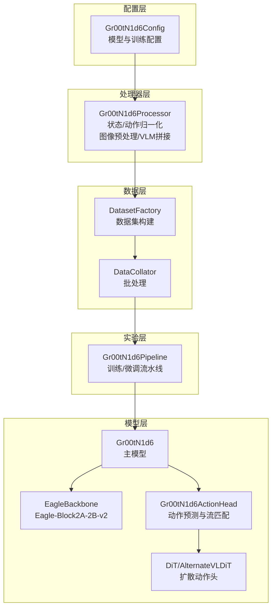
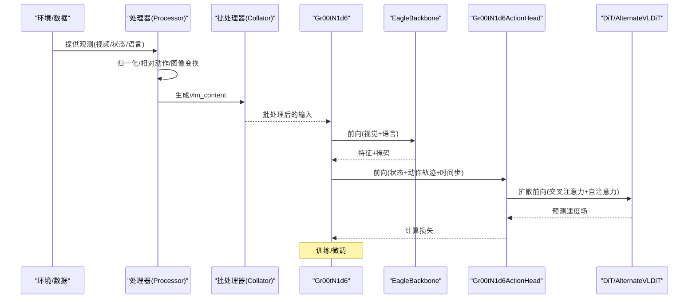
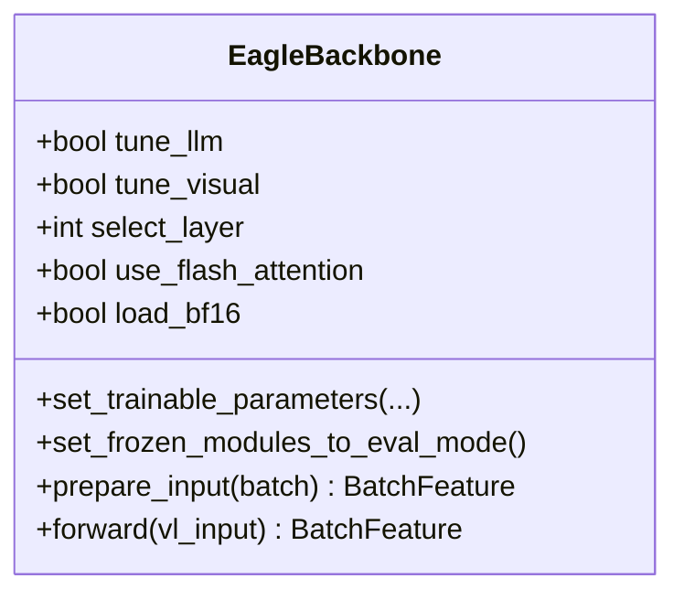
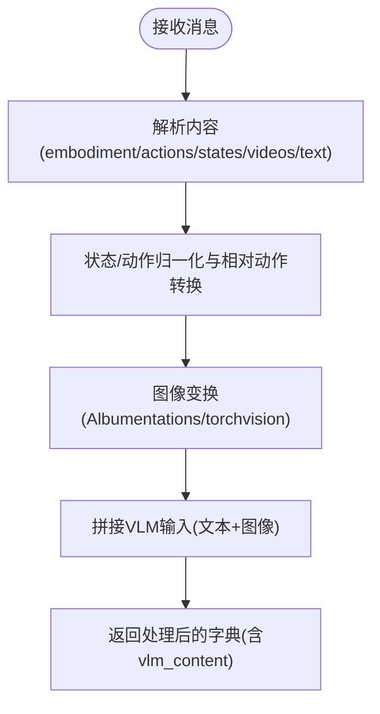
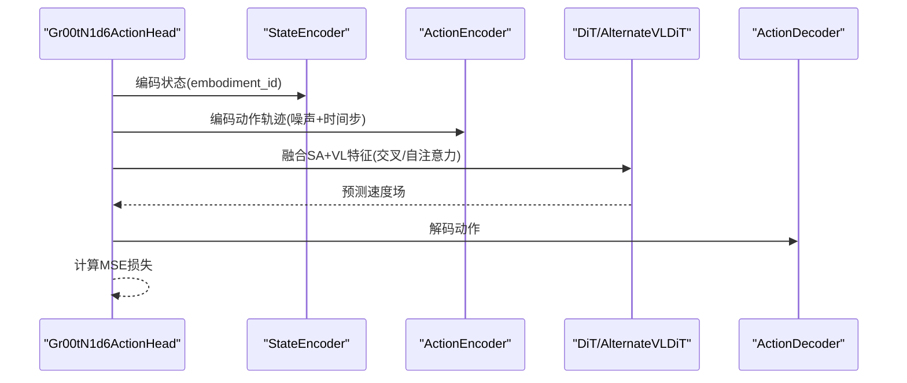
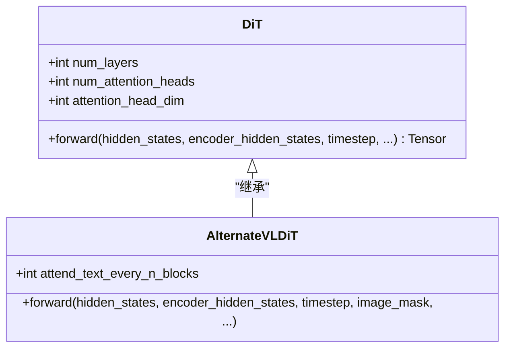
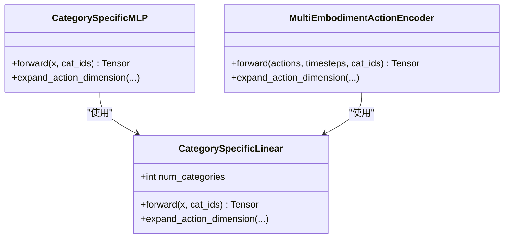
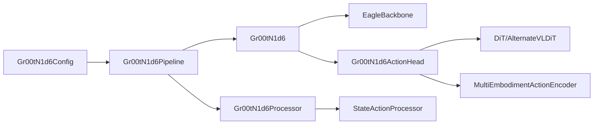

# 核心技术设计

<cite>
**本文引用的文件**
- [gr00t/model/gr00t_n1d6/gr00t_n1d6.py](file://gr00t/model/gr00t_n1d6/gr00t_n1d6.py)
- [gr00t/model/modules/dit.py](file://gr00t/model/modules/dit.py)
- [gr00t/model/modules/eagle_backbone.py](file://gr00t/model/modules/eagle_backbone.py)
- [gr00t/model/modules/embodiment_conditioned_mlp.py](file://gr00t/model/modules/embodiment_conditioned_mlp.py)
- [gr00t/model/modules/flowmatching_modules.py](file://gr00t/model/modules/flowmatching_modules.py)
- [gr00t/configs/model/gr00t_n1d6.py](file://gr00t/configs/model/gr00t_n1d6.py)
- [gr00t/model/gr00t_n1d6/processing_gr00t_n1d6.py](file://gr00t/model/gr00t_n1d6/processing_gr00t_n1d6.py)
- [gr00t/data/state_action/state_action_processor.py](file://gr00t/data/state_action/state_action_processor.py)
- [gr00t/model/base/model_pipeline.py](file://gr00t/model/base/model_pipeline.py)
- [gr00t/model/gr00t_n1d6/setup.py](file://gr00t/model/gr00t_n1d6/setup.py)
- [examples/BEHAVIOR/finetune_BEHAVIOR.sh](file://examples/BEHAVIOR/finetune_BEHAVIOR.sh)
- [getting_started/policy.md](file://getting_started/policy.md)
</cite>

## 目录
1. [简介](#简介)
2. [项目结构](#项目结构)
3. [核心组件](#核心组件)
4. [架构总览](#架构总览)
5. [详细组件分析](#详细组件分析)
6. [依赖关系分析](#依赖关系分析)
7. [性能考量](#性能考量)
8. [故障排除指南](#故障排除指南)
9. [结论](#结论)
10. [附录](#附录)

## 简介
本文件面向Isaac-GR00T的核心技术设计，聚焦于模型架构、数据处理与训练架构。重点阐述视觉编码器（Eagle-Block2A-2B-v2）、语言模型与动作头（DiT）的设计原理与实现细节；解释Eagle-Block2A-2B-v2模块、embodiment_conditioned_mlp与flowmatching_modules的功能；提供从入门到进阶的分层说明，并结合代码库一致术语给出常见用例与故障排除建议。

## 项目结构
Isaac-GR00T采用“配置-处理器-模型-数据集-实验”分层组织：
- 配置层：统一的模型配置类，定义骨干网络、扩散模型、流匹配参数等
- 处理器层：负责状态/动作归一化、相对动作转换、图像预处理与VLM输入拼接
- 模型层：Gr00tN1d6主模型，包含Eagle视觉语言骨干与DiT动作头
- 数据层：数据集工厂、批处理与数据增强
- 实验层：训练/微调流水线、分布式工具与评估脚本

图示来源
- [gr00t/configs/model/gr00t_n1d6.py](file://gr00t/configs/model/gr00t_n1d6.py#L12-L164)
- [gr00t/model/gr00t_n1d6/processing_gr00t_n1d6.py](file://gr00t/model/gr00t_n1d6/processing_gr00t_n1d6.py#L107-L200)
- [gr00t/model/gr00t_n1d6/gr00t_n1d6.py](file://gr00t/model/gr00t_n1d6/gr00t_n1d6.py#L411-L540)
- [gr00t/model/gr00t_n1d6/setup.py](file://gr00t/model/gr00t_n1d6/setup.py#L32-L199)

章节来源
- [gr00t/configs/model/gr00t_n1d6.py](file://gr00t/configs/model/gr00t_n1d6.py#L12-L164)
- [gr00t/model/gr00t_n1d6/processing_gr00t_n1d6.py](file://gr00t/model/gr00t_n1d6/processing_gr00t_n1d6.py#L107-L200)
- [gr00t/model/gr00t_n1d6/gr00t_n1d6.py](file://gr00t/model/gr00t_n1d6/gr00t_n1d6.py#L411-L540)
- [gr00t/model/gr00t_n1d6/setup.py](file://gr00t/model/gr00t_n1d6/setup.py#L32-L199)

## 核心组件
- 视觉语言骨干（EagleBackbone）
  - 使用Eagle-Block2A-2B-v2作为骨干，支持Flash Attention与bfloat16加载，可选择性冻结LLM/视觉层，支持投影维度与Top LLM层微调
- 动作头（Gr00tN1d6ActionHead）
  - 基于DiT或AlternateVLDiT的扩散动作头，融合视觉语言特征与状态/动作嵌入，支持位置嵌入、Dropout与噪声注入
- 扩散模型（DiT/AlternateVLDiT）
  - 时间步嵌入、AdaLayerNorm条件归一化、交叉注意力与自注意力交替，支持图像/非图像token分离的跨注意力
- 多形态体MLP（embodiment_conditioned_mlp）
  - 分类特定权重的MLP，支持多形态体动作编码与正弦位置编码
- 流匹配模块（flowmatching_modules）
  - 动作轨迹的正弦位置编码与MLP映射，用于流匹配训练

章节来源
- [gr00t/model/modules/eagle_backbone.py](file://gr00t/model/modules/eagle_backbone.py#L8-L121)
- [gr00t/model/gr00t_n1d6/gr00t_n1d6.py](file://gr00t/model/gr00t_n1d6/gr00t_n1d6.py#L19-L257)
- [gr00t/model/modules/dit.py](file://gr00t/model/modules/dit.py#L172-L365)
- [gr00t/model/modules/embodiment_conditioned_mlp.py](file://gr00t/model/modules/embodiment_conditioned_mlp.py#L128-L224)
- [gr00t/model/modules/flowmatching_modules.py](file://gr00t/model/modules/flowmatching_modules.py#L54-L99)

## 架构总览
Gr00tN1d6由“视觉语言骨干 + 动作头（DiT）”构成，训练时通过流匹配损失对动作轨迹进行去噪回归，推理时执行欧拉积分的扩散采样。

图示来源
- [gr00t/model/gr00t_n1d6/gr00t_n1d6.py](file://gr00t/model/gr00t_n1d6/gr00t_n1d6.py#L496-L526)
- [gr00t/model/modules/eagle_backbone.py](file://gr00t/model/modules/eagle_backbone.py#L105-L121)
- [gr00t/model/gr00t_n1d6/processing_gr00t_n1d6.py](file://gr00t/model/gr00t_n1d6/processing_gr00t_n1d6.py#L287-L388)

## 详细组件分析

### 视觉编码器（Eagle-Block2A-2B-v2）
- 设计要点
  - 专用的Eagle骨干，要求Flash Attention与bfloat16以提升吞吐
  - 支持选择性冻结LLM/视觉分支与Top LLM层微调
  - 输出隐藏状态序列与注意力掩码，区分图像token与文本token
- 关键实现
  - 通过AutoConfig/AutoModel按本地路径加载，支持bf16与flash attn
  - 前向输出包含backbone_features、backbone_attention_mask、image_mask

图示来源
- [gr00t/model/modules/eagle_backbone.py](file://gr00t/model/modules/eagle_backbone.py#L8-L121)

章节来源
- [gr00t/model/modules/eagle_backbone.py](file://gr00t/model/modules/eagle_backbone.py#L8-L121)

### 语言模型与视觉-语言处理
- 设计要点
  - 统一的VLM输入拼接：文本+多视角图像，经AutoProcessor应用chat模板
  - 图像变换：支持Albumentations或torchvision，保证时序一致性
  - 语言规范化：小写与标点清理，便于下游处理
- 关键实现
  - vlm_content格式：text/images/conversation三元组
  - 处理后返回BatchFeature，供批处理器合并

图示来源
- [gr00t/model/gr00t_n1d6/processing_gr00t_n1d6.py](file://gr00t/model/gr00t_n1d6/processing_gr00t_n1d6.py#L287-L388)

章节来源
- [gr00t/model/gr00t_n1d6/processing_gr00t_n1d6.py](file://gr00t/model/gr00t_n1d6/processing_gr00t_n1d6.py#L107-L200)
- [gr00t/model/gr00t_n1d6/processing_gr00t_n1d6.py](file://gr00t/model/gr00t_n1d6/processing_gr00t_n1d6.py#L287-L388)

### 动作头（DiT）与流匹配
- 设计要点
  - 动作轨迹被加性噪声扰动，目标是预测速度场（velocity）
  - 时间步离散化并作为条件输入，支持Beta分布采样
  - 可选AlternateVLDiT：按图像/非图像token交替进行跨注意力
- 关键实现
  - Gr00tN1d6ActionHead封装状态/动作编码器、DiT/AlternateVLDiT与解码器
  - 训练阶段计算MSE损失，推理阶段执行欧拉积分的扩散采样

图示来源
- [gr00t/model/gr00t_n1d6/gr00t_n1d6.py](file://gr00t/model/gr00t_n1d6/gr00t_n1d6.py#L19-L257)
- [gr00t/model/modules/dit.py](file://gr00t/model/modules/dit.py#L172-L365)

章节来源
- [gr00t/model/gr00t_n1d6/gr00t_n1d6.py](file://gr00t/model/gr00t_n1d6/gr00t_n1d6.py#L19-L257)
- [gr00t/model/modules/dit.py](file://gr00t/model/modules/dit.py#L172-L365)

### DiT与AlternateVLDiT
- 设计要点
  - 时间步嵌入+AdaLayerNorm条件归一化，输出通道与模型维度匹配
  - 交替自注意力与交叉注意力，支持图像/非图像token分离的跨注意力
- 关键实现
  - AlternateVLDiT在跨注意力块中根据attend_text_every_n_blocks切换图像/非图像掩码

图示来源
- [gr00t/model/modules/dit.py](file://gr00t/model/modules/dit.py#L172-L365)

章节来源
- [gr00t/model/modules/dit.py](file://gr00t/model/modules/dit.py#L172-L365)

### 多形态体条件MLP（embodiment_conditioned_mlp）
- 设计要点
  - CategorySpecificLinear按形态体ID选择权重矩阵，实现多形态体共享但参数独立
  - MultiEmbodimentActionEncoder将动作与时间步正弦编码拼接，经两层MLP映射
- 关键实现
  - 正弦位置编码维度与隐藏维一致，支持维度扩展

图示来源
- [gr00t/model/modules/embodiment_conditioned_mlp.py](file://gr00t/model/modules/embodiment_conditioned_mlp.py#L128-L224)

章节来源
- [gr00t/model/modules/embodiment_conditioned_mlp.py](file://gr00t/model/modules/embodiment_conditioned_mlp.py#L128-L224)

### 流匹配模块（flowmatching_modules）
- 设计要点
  - 与embodiment_conditioned_mlp类似，但不支持多形态体分类特定权重
  - 仅用于对比或替代方案
- 关键实现
  - 正弦位置编码与三层MLP映射

章节来源
- [gr00t/model/modules/flowmatching_modules.py](file://gr00t/model/modules/flowmatching_modules.py#L54-L99)

### 数据处理与归一化（StateActionProcessor）
- 设计要点
  - 支持最小-最大、均值-标准差两种归一化策略
  - 可选相对动作表示，基于参考状态帧进行相对化
  - 支持Sin/Cos编码（不可逆），用于状态维度扩展
- 关键实现
  - apply/unapply成对方法，确保训练/推理一致性
  - 维度统计来自数据集，支持百分位数裁剪异常值

章节来源
- [gr00t/data/state_action/state_action_processor.py](file://gr00t/data/state_action/state_action_processor.py#L33-L683)

### 训练与微调流水线（Gr00tN1d6Pipeline）
- 设计要点
  - 自动加载/保存处理器配置与数据集统计
  - 支持从检查点继续训练，自动初始化缺失参数（如mask_token）
  - 参数统计打印，便于监控可训练参数比例
- 关键实现
  - _create_model/_create_dataset/_create_collator三段式构建

章节来源
- [gr00t/model/gr00t_n1d6/setup.py](file://gr00t/model/gr00t_n1d6/setup.py#L32-L199)

## 依赖关系分析
- 组件耦合
  - Gr00tN1d6ActionHead依赖EagleBackbone输出的backbone_features与image_mask
  - DiT/AlternateVLDiT依赖时间步条件与交叉注意力掩码
  - MultiEmbodimentActionEncoder依赖embodiment_id进行分类特定映射
- 外部依赖
  - Transformers AutoModel/AutoProcessor用于加载Eagle骨干与VLM处理器
  - Diffusers DiT作为基础扩散模块
  - Albumentations/torchvision用于图像增强

图示来源
- [gr00t/model/gr00t_n1d6/setup.py](file://gr00t/model/gr00t_n1d6/setup.py#L32-L199)
- [gr00t/model/gr00t_n1d6/gr00t_n1d6.py](file://gr00t/model/gr00t_n1d6/gr00t_n1d6.py#L411-L540)
- [gr00t/model/gr00t_n1d6/processing_gr00t_n1d6.py](file://gr00t/model/gr00t_n1d6/processing_gr00t_n1d6.py#L107-L200)

章节来源
- [gr00t/model/gr00t_n1d6/setup.py](file://gr00t/model/gr00t_n1d6/setup.py#L32-L199)
- [gr00t/model/gr00t_n1d6/gr00t_n1d6.py](file://gr00t/model/gr00t_n1d6/gr00t_n1d6.py#L411-L540)
- [gr00t/model/gr00t_n1d6/processing_gr00t_n1d6.py](file://gr00t/model/gr00t_n1d6/processing_gr00t_n1d6.py#L107-L200)

## 性能考量
- 计算与内存
  - Flash Attention与bfloat16显著降低显存占用并提升吞吐
  - 可选择性冻结LLM/视觉层与Top LLM层微调，控制可训练参数比例
- 训练稳定性
  - 动作Dropout与高斯噪声注入有助于泛化
  - 时间步离散化与Beta分布采样增强流匹配鲁棒性
- 推理效率
  - DiT层数与注意力头数影响延迟，可通过配置调整
  - 位置嵌入可选，减少额外开销

[本节为通用指导，无需引用具体文件]

## 故障排除指南
- 加载与配置
  - 若从检查点继续训练且缺少mask_token，会自动初始化；若仍报错，检查checkpoint完整性
  - 确认transformers加载参数（trust_remote_code/local_files_only/cache/token/revision）正确
- 数据格式
  - 观测格式需满足Policy API规范：video/state/language键齐全，dtype与shape符合要求
  - 相对动作启用时，必须提供状态参考帧
- 推理问题
  - 启用strict模式定位输入/输出不匹配
  - 使用ReplayPolicy验证环境集成，再切换到真实模型
- 微调脚本
  - BEHAVIOR微调示例展示了典型参数设置与颜色抖动配置

章节来源
- [gr00t/model/gr00t_n1d6/setup.py](file://gr00t/model/gr00t_n1d6/setup.py#L68-L94)
- [getting_started/policy.md](file://getting_started/policy.md#L454-L461)
- [examples/BEHAVIOR/finetune_BEHAVIOR.sh](file://examples/BEHAVIOR/finetune_BEHAVIOR.sh#L1-L23)

## 结论
Isaac-GR00T通过Eagle-Block2A-2B-v2视觉语言骨干与DiT动作头，结合多形态体条件MLP与流匹配训练范式，实现了高效、可扩展的动作预测系统。配置驱动的处理器与严格的训练流水线确保了跨任务与多形态体的迁移能力。建议在实际部署中优先启用Flash Attention与bfloat16，合理冻结/微调骨干参数，并通过ReplayPolicy进行端到端验证。

[本节为总结性内容，无需引用具体文件]

## 附录

### 常见用例与示例
- 微调（BEHAVIOR）
  - 使用示例脚本启动多GPU训练，设置学习率、批次大小与颜色抖动参数
- 推理与部署
  - 使用Policy API加载模型，支持批量推理与动作分片
  - 通过服务器-客户端架构实现远程推理，便于分布式部署

章节来源
- [examples/BEHAVIOR/finetune_BEHAVIOR.sh](file://examples/BEHAVIOR/finetune_BEHAVIOR.sh#L1-L23)
- [getting_started/policy.md](file://getting_started/policy.md#L9-L27)
- [getting_started/policy.md](file://getting_started/policy.md#L181-L275)