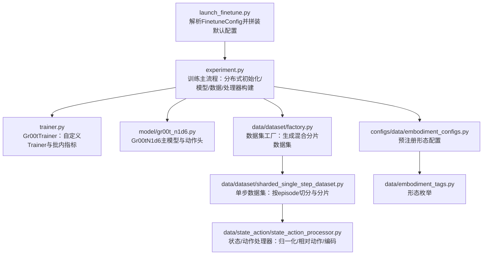
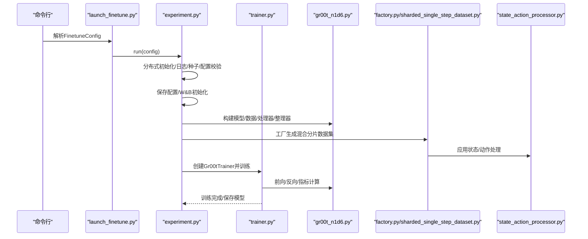
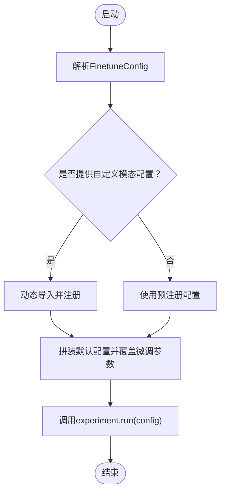
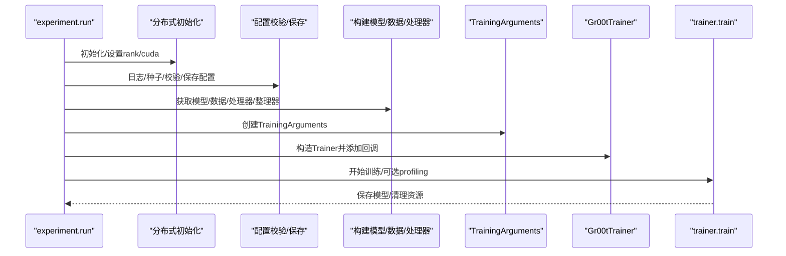
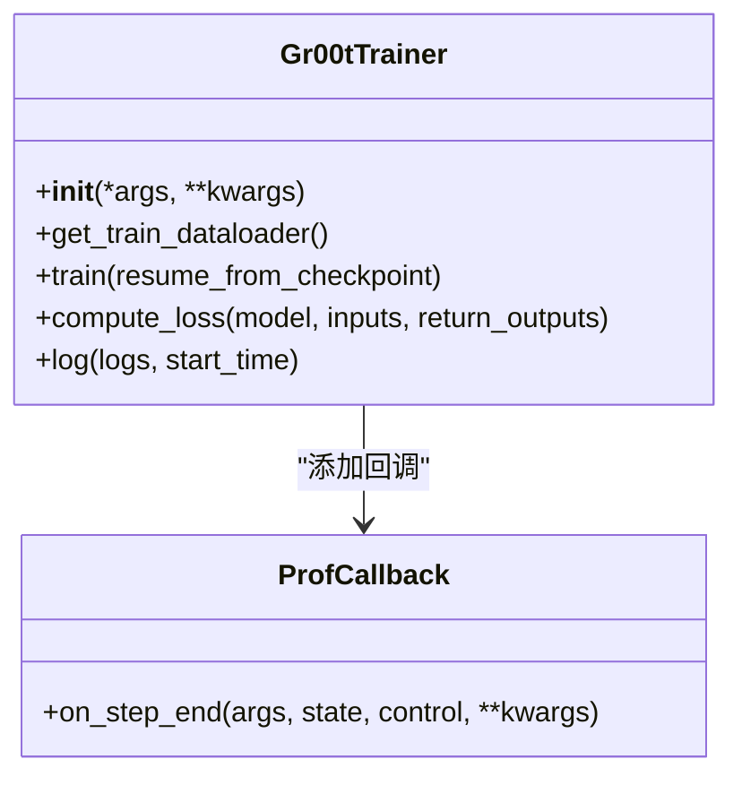
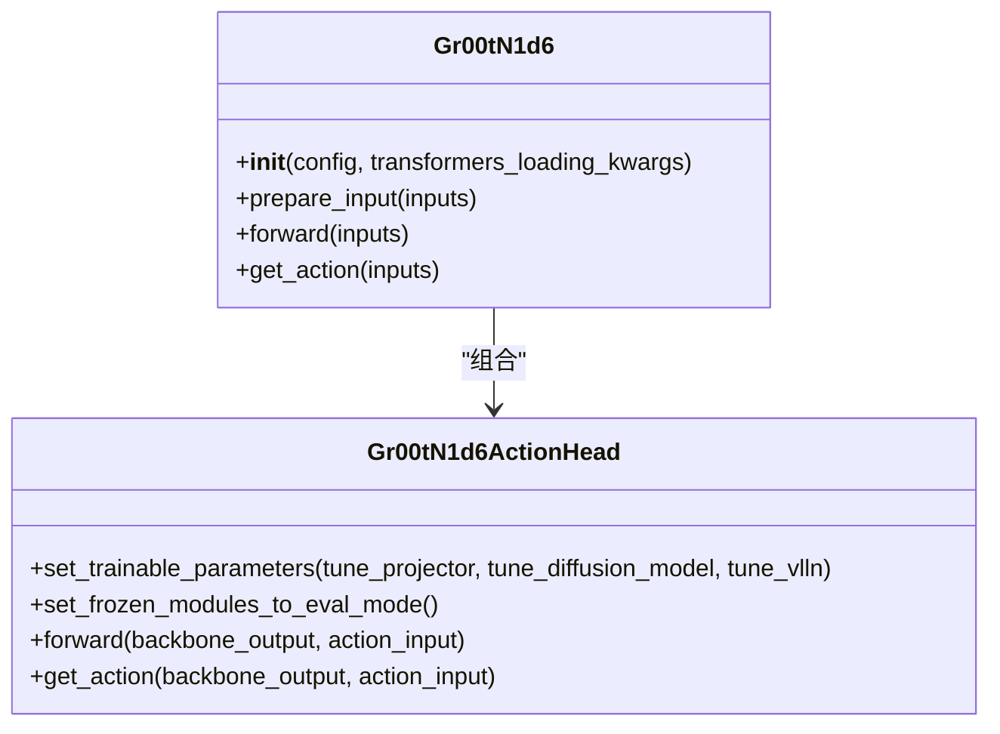
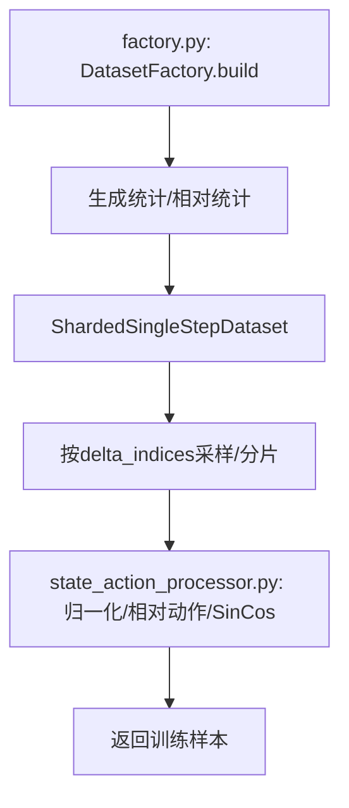
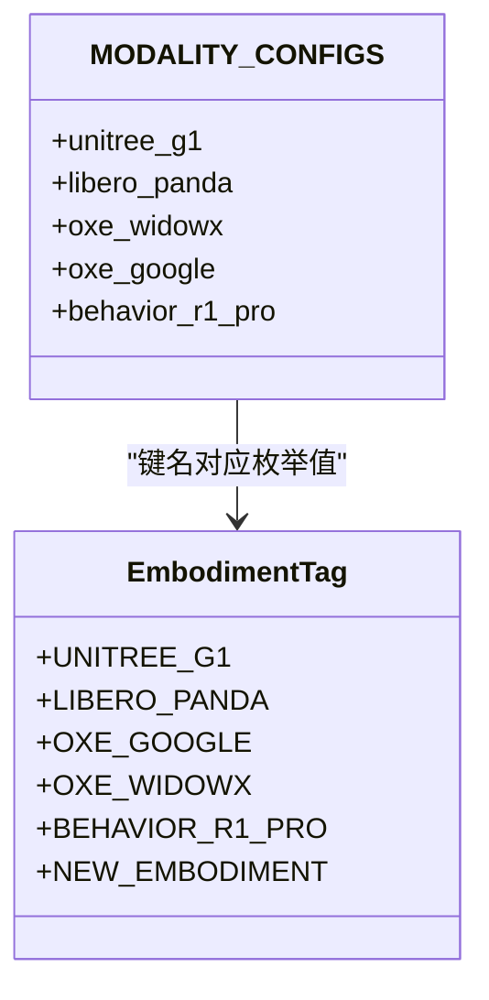
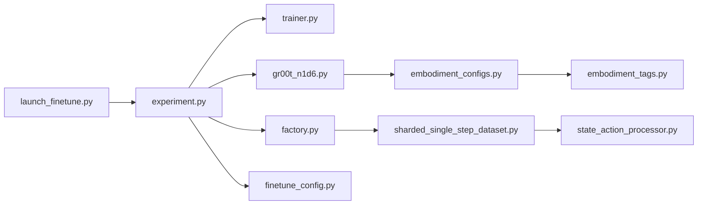

# 模型微调

<cite>
**本文引用的文件**
- [launch_finetune.py](file://gr00t/experiment/launch_finetune.py)
- [finetune_config.py](file://gr00t/configs/finetune_config.py)
- [experiment.py](file://gr00t/experiment/experiment.py)
- [trainer.py](file://gr00t/experiment/trainer.py)
- [gr00t_n1d6.py](file://gr00t/model/gr00t_n1d6/gr00t_n1d6.py)
- [embodiment_configs.py](file://gr00t/configs/data/embodiment_configs.py)
- [embodiment_tags.py](file://gr00t/data/embodiment_tags.py)
- [state_action_processor.py](file://gr00t/data/state_action/state_action_processor.py)
- [factory.py](file://gr00t/data/dataset/factory.py)
- [sharded_single_step_dataset.py](file://gr00t/data/dataset/sharded_single_step_dataset.py)
- [modality_config.py](file://examples/PointNav/modality_config.py)
- [so100_config.py](file://examples/SO100/so100_config.py)
- [finetune_BEHAVIOR.sh](file://examples/BEHAVIOR/finetune_BEHAVIOR.sh)
- [data_preparation.md](file://getting_started/data_preparation.md)
</cite>

## 目录
1. [简介](#简介)
2. [项目结构](#项目结构)
3. [核心组件](#核心组件)
4. [架构总览](#架构总览)
5. [详细组件分析](#详细组件分析)
6. [依赖关系分析](#依赖关系分析)
7. [性能考虑](#性能考虑)
8. [故障排除指南](#故障排除指南)
9. [结论](#结论)
10. [附录](#附录)

## 简介
本指南面向在小型自定义数据集上微调 Isaac-GR00T 预训练模型（N1.6）的用户，系统讲解两类微调路径：
- 预注册实体微调：直接使用仓库内已注册的机器人形态配置（如 G1、Libero、Oxe 等），通过指定形态标签即可快速启动。
- 自定义实体微调：为新机器人或新任务编写自定义模态配置文件，动态注册后参与微调。

文档覆盖从数据准备、配置项解读、脚本执行到训练过程与性能优化的完整链路，并提供循序渐进的入门步骤与面向专家的高级配置建议。

## 项目结构
围绕“微调”主题，关键目录与文件如下：
- 实验入口与配置
  - gr00t/experiment/launch_finetune.py：单机微调入口，解析 FinetuneConfig 并拼装默认配置，调用 run 启动训练。
  - gr00t/configs/finetune_config.py：微调参数数据类，涵盖模型可训练开关、数据增强、训练超参等。
  - gr00t/experiment/experiment.py：训练主流程，初始化分布式、构建模型/数据/处理器、创建 TrainingArguments 和 Gr00tTrainer 并开始训练。
  - gr00t/experiment/trainer.py：自定义 Trainer，支持批内评估指标计算、数据加载与前向耗时轻量分析。
- 模型与动作头
  - gr00t/model/gr00t_n1d6/gr00t_n1d6.py：Gr00tN1d6 主模型与动作头实现，支持扩散式动作解码、投影层与视觉/语言/状态融合。
- 数据与处理
  - gr00t/data/dataset/factory.py：数据集工厂，基于配置生成分片混合数据集。
  - gr00t/data/dataset/sharded_single_step_dataset.py：单步数据集，按 episode 切分为时间步，按策略分片以提升加载效率。
  - gr00t/data/state_action/state_action_processor.py：统一的状态与动作处理器，负责归一化、相对/绝对动作转换、Sin/Cos 编码等。
  - gr00t/configs/data/embodiment_configs.py：预注册的形态配置集合；gr00t/data/embodiment_tags.py：形态枚举。
- 示例与准备
  - examples/PointNav/modality_config.py、examples/SO100/so100_config.py：自定义形态配置示例。
  - examples/BEHAVIOR/finetune_BEHAVIOR.sh：单机多卡微调示例脚本。
  - getting_started/data_preparation.md：LeRobot v2 格式数据准备规范与 modality.json 要求。

图表来源
- [launch_finetune.py](file://gr00t/experiment/launch_finetune.py#L1-L93)
- [experiment.py](file://gr00t/experiment/experiment.py#L100-L304)
- [trainer.py](file://gr00t/experiment/trainer.py#L178-L328)
- [gr00t_n1d6.py](file://gr00t/model/gr00t_n1d6/gr00t_n1d6.py#L411-L540)
- [factory.py](file://gr00t/data/dataset/factory.py#L13-L79)
- [sharded_single_step_dataset.py](file://gr00t/data/dataset/sharded_single_step_dataset.py#L66-L275)
- [state_action_processor.py](file://gr00t/data/state_action/state_action_processor.py#L33-L683)
- [embodiment_configs.py](file://gr00t/configs/data/embodiment_configs.py#L11-L313)
- [embodiment_tags.py](file://gr00t/data/embodiment_tags.py#L14-L57)

章节来源
- [launch_finetune.py](file://gr00t/experiment/launch_finetune.py#L1-L93)
- [experiment.py](file://gr00t/experiment/experiment.py#L100-L304)

## 核心组件
- 微调配置（FinetuneConfig）
  - 关键字段：base_model_path、dataset_path、embodiment_tag、modality_config_path、tune_llm/tune_visual/tune_projector/tune_diffusion_model、state_dropout_prob、random_rotation_angle、color_jitter_params、global_batch_size、learning_rate、gradient_accumulation_steps、output_dir、save_steps、save_total_limit、num_gpus、use_wandb、max_steps、weight_decay、warmup_ratio、shard_size、episode_sampling_rate、num_shards_per_epoch。
  - 作用：作为命令行输入，驱动默认配置装配与训练参数设置。
- 训练入口（launch_finetune.py）
  - 加载用户提供的自定义模态配置（若提供），拼装默认配置，覆盖微调参数，最终调用 run(config)。
- 训练主流程（experiment.py）
  - 分布式初始化、日志与种子设置、配置校验、输出目录与配置保存、W&B 初始化、模型/数据/处理器/数据整理器构建、TrainingArguments 创建、Gr00tTrainer 构建与训练。
- 自定义Trainer（trainer.py）
  - 批内 token 级准确率计算、自定义数据加载器、训练状态恢复、轻量性能分析回调。
- 模型与动作头（gr00t_n1d6.py）
  - Gr00tN1d6 主模型：EagleBackbone + 动作头（DiT/AlternateVLDiT + 多形态动作解码器）。
  - 动作头：支持投影层、扩散式动作解码、状态 dropout、噪声注入、位置嵌入等。
- 数据与处理（factory.py、sharded_single_step_dataset.py、state_action_processor.py）
  - 工厂：根据配置生成混合分片数据集，统计与相对统计预计算。
  - 单步数据集：按 episode 切分时间步，按策略分片，支持 delta_indices 采样与允许填充。
  - 处理器：状态/动作归一化、相对/绝对动作转换、Sin/Cos 编码、异常值裁剪等。
- 形态配置（embodiment_configs.py、embodiment_tags.py）
  - 预注册形态配置集合与枚举，支持视频、状态、动作、语言等多模态键映射与动作表示（相对/绝对）。

章节来源
- [finetune_config.py](file://gr00t/configs/finetune_config.py#L7-L119)
- [launch_finetune.py](file://gr00t/experiment/launch_finetune.py#L14-L92)
- [experiment.py](file://gr00t/experiment/experiment.py#L100-L304)
- [trainer.py](file://gr00t/experiment/trainer.py#L178-L328)
- [gr00t_n1d6.py](file://gr00t/model/gr00t_n1d6/gr00t_n1d6.py#L411-L540)
- [factory.py](file://gr00t/data/dataset/factory.py#L13-L79)
- [sharded_single_step_dataset.py](file://gr00t/data/dataset/sharded_single_step_dataset.py#L66-L275)
- [state_action_processor.py](file://gr00t/data/state_action/state_action_processor.py#L33-L683)
- [embodiment_configs.py](file://gr00t/configs/data/embodiment_configs.py#L11-L313)
- [embodiment_tags.py](file://gr00t/data/embodiment_tags.py#L14-L57)

## 架构总览
下图展示从命令行到训练完成的关键交互：

图表来源
- [launch_finetune.py](file://gr00t/experiment/launch_finetune.py#L28-L92)
- [experiment.py](file://gr00t/experiment/experiment.py#L100-L304)
- [trainer.py](file://gr00t/experiment/trainer.py#L178-L328)
- [gr00t_n1d6.py](file://gr00t/model/gr00t_n1d6/gr00t_n1d6.py#L411-L540)
- [factory.py](file://gr00t/data/dataset/factory.py#L21-L79)
- [sharded_single_step_dataset.py](file://gr00t/data/dataset/sharded_single_step_dataset.py#L115-L275)
- [state_action_processor.py](file://gr00t/data/state_action/state_action_processor.py#L33-L683)

## 详细组件分析

### 组件A：微调入口与配置装配（launch_finetune.py）
- 功能要点
  - 使用 tyro 解析 FinetuneConfig，支持命令行传参。
  - 若提供自定义模态配置路径，则动态导入并注册到全局配置。
  - 将微调参数写入默认配置对象，覆盖模型与训练相关字段，然后调用 run(config)。
- 关键参数映射
  - 模型可训练开关：tune_llm、tune_visual、tune_projector、tune_diffusion_model。
  - 数据增强：state_dropout_prob、random_rotation_angle、color_jitter_params。
  - 训练超参：global_batch_size、learning_rate、gradient_accumulation_steps、output_dir、save_steps、save_total_limit、num_gpus、use_wandb、max_steps、weight_decay、warmup_ratio。
  - 数据加载：shard_size、episode_sampling_rate、num_shards_per_epoch。
- 典型用法
  - 单机多卡：torchrun --nproc_per_node=NUM_GPUS --master_port=PORT launch_finetune.py ...
  - 预注册实体：指定 EmbodimentTag（如 UNITREE_G1、BEHAVIOR_R1_PRO）。
  - 自定义实体：提供 modality_config_path，动态注册新形态配置。

图表来源
- [launch_finetune.py](file://gr00t/experiment/launch_finetune.py#L14-L92)

章节来源
- [launch_finetune.py](file://gr00t/experiment/launch_finetune.py#L14-L92)
- [finetune_config.py](file://gr00t/configs/finetune_config.py#L7-L119)

### 组件B：训练主流程（experiment.py）
- 功能要点
  - 分布式初始化（NCCL）、本地/全局rank设置、CUDA设备选择。
  - 日志级别、随机种子设置、配置校验与输出目录创建。
  - 保存配置与 W&B 初始化（仅主进程）。
  - 通过 MODEL_REGISTRY 获取模型管线，构建模型、数据集、处理器、数据整理器。
  - 创建 TrainingArguments，构造 Gr00tTrainer，添加检查点与最佳指标回调。
  - 可选启用性能分析（torch.profiler），最后保存模型。
- 关键注意
  - global_batch_size 必须能被 num_gpus 整除。
  - 未来将弃用 batch_size、warmup_steps、image_* 等参数，请使用新的替代项。
  - 若开启 profiling，会自动导出 Chrome Trace 文件。

图表来源
- [experiment.py](file://gr00t/experiment/experiment.py#L100-L304)

章节来源
- [experiment.py](file://gr00t/experiment/experiment.py#L100-L304)

### 组件C：自定义Trainer（trainer.py）
- 功能要点
  - 批内 token 级准确率计算（忽略 -100 的标签位置）。
  - 自定义数据加载器：支持持久化工作进程、多进程上下文、重新播种以适配断点续训。
  - 训练状态恢复：从上次检查点读取 TrainerState，确保数据不跳过。
  - 轻量性能分析：ProfCallback 在每步记录 step，便于定位数据加载与前向瓶颈。
- 适用场景
  - 需要更细粒度的训练监控与指标记录。
  - 断点续训时保持数据一致性。

图表来源
- [trainer.py](file://gr00t/experiment/trainer.py#L178-L328)

章节来源
- [trainer.py](file://gr00t/experiment/trainer.py#L178-L328)

### 组件D：模型与动作头（gr00t_n1d6.py）
- 功能要点
  - Gr00tN1d6 主模型：EagleBackbone + Gr00tN1d6ActionHead。
  - 动作头：支持 AlternateVLDiT 或 DiT，状态/动作/视觉/语言特征融合，扩散式动作解码，投影层可训练控制，位置嵌入可选，状态 dropout 与噪声注入。
  - set_trainable_parameters：根据 tune_projector、tune_diffusion_model、tune_vlln 控制参数冻结/可训练。
- 训练开关
  - tune_llm、tune_visual、tune_projector、tune_diffusion_model 由 FinetuneConfig 传递至模型配置，影响 backbone 与动作头的可训练性。

图表来源
- [gr00t_n1d6.py](file://gr00t/model/gr00t_n1d6/gr00t_n1d6.py#L411-L540)

章节来源
- [gr00t_n1d6.py](file://gr00t/model/gr00t_n1d6/gr00t_n1d6.py#L411-L540)

### 组件E：数据与处理（factory.py、sharded_single_step_dataset.py、state_action_processor.py）
- 数据集工厂（factory.py）
  - 依据配置遍历数据集列表，生成统计与相对统计，构建 ShardedSingleStepDataset，再包装为混合分片数据集。
- 单步数据集（sharded_single_step_dataset.py）
  - 按 episode 切分时间步，支持 delta_indices 采样，按策略分片，支持允许填充以避免越界。
- 状态/动作处理器（state_action_processor.py）
  - 支持最小-最大/均值-方差归一化、Sin/Cos 编码、相对/绝对动作转换、异常值裁剪、动作维度推断等。

图表来源
- [factory.py](file://gr00t/data/dataset/factory.py#L21-L79)
- [sharded_single_step_dataset.py](file://gr00t/data/dataset/sharded_single_step_dataset.py#L115-L275)
- [state_action_processor.py](file://gr00t/data/state_action/state_action_processor.py#L33-L683)

章节来源
- [factory.py](file://gr00t/data/dataset/factory.py#L13-L79)
- [sharded_single_step_dataset.py](file://gr00t/data/dataset/sharded_single_step_dataset.py#L66-L275)
- [state_action_processor.py](file://gr00t/data/state_action/state_action_processor.py#L33-L683)

### 组件F：形态配置与枚举（embodiment_configs.py、embodiment_tags.py）
- 预注册形态配置
  - 包含视频、状态、动作、语言等键映射，动作可配置相对/绝对表示与参考状态键。
- 形态枚举
  - EmbodimentTag 提供统一标识，支持预训练与后训练形态标签。

图表来源
- [embodiment_tags.py](file://gr00t/data/embodiment_tags.py#L14-L57)
- [embodiment_configs.py](file://gr00t/configs/data/embodiment_configs.py#L11-L313)

章节来源
- [embodiment_tags.py](file://gr00t/data/embodiment_tags.py#L14-L57)
- [embodiment_configs.py](file://gr00t/configs/data/embodiment_configs.py#L11-L313)

### 组件G：数据准备与自定义形态配置
- 数据准备（data_preparation.md）
  - LeRobot v2 格式要求：meta/modality.json、parquet 中 state/action/annotation 字段、tasks.jsonl/episodes.jsonl。
  - GR00T 扩展：计算 stats.json/relative_stats.json，支持多注释通道。
- 自定义形态配置示例
  - examples/PointNav/modality_config.py：定义视频、状态、动作、语言键映射与 delta_indices。
  - examples/SO100/so100_config.py：演示相对/绝对动作混合配置。

章节来源
- [data_preparation.md](file://getting_started/data_preparation.md#L1-L156)
- [modality_config.py](file://examples/PointNav/modality_config.py#L1-L49)
- [so100_config.py](file://examples/SO100/so100_config.py#L1-L67)

## 依赖关系分析
- 组件耦合
  - launch_finetune.py 依赖 finetune_config.py 与 experiment.py。
  - experiment.py 依赖 MODEL_REGISTRY、Trainer、数据集工厂与处理器。
  - 数据集工厂依赖单步数据集与处理器。
  - 模型依赖动作头与数据整理器。
- 外部依赖
  - Transformers（TrainingArguments/Trainer）、OmegaConf、W&B、torch.distributed、torch.profiler。
- 潜在循环依赖
  - 当前模块间无明显循环导入；动态导入自定义模态配置避免了编译期耦合。

图表来源
- [launch_finetune.py](file://gr00t/experiment/launch_finetune.py#L1-L93)
- [experiment.py](file://gr00t/experiment/experiment.py#L100-L304)
- [trainer.py](file://gr00t/experiment/trainer.py#L178-L328)
- [gr00t_n1d6.py](file://gr00t/model/gr00t_n1d6/gr00t_n1d6.py#L411-L540)
- [factory.py](file://gr00t/data/dataset/factory.py#L13-L79)
- [sharded_single_step_dataset.py](file://gr00t/data/dataset/sharded_single_step_dataset.py#L66-L275)
- [state_action_processor.py](file://gr00t/data/state_action/state_action_processor.py#L33-L683)
- [embodiment_configs.py](file://gr00t/configs/data/embodiment_configs.py#L11-L313)
- [embodiment_tags.py](file://gr00t/data/embodiment_tags.py#L14-L57)

章节来源
- [launch_finetune.py](file://gr00t/experiment/launch_finetune.py#L1-L93)
- [experiment.py](file://gr00t/experiment/experiment.py#L100-L304)

## 性能考虑
- 批大小与梯度累积
  - global_batch_size 必须能被 num_gpus 整除；可通过 gradient_accumulation_steps 达到更大有效 batch。
- 数据加载
  - dataloader_num_workers > 0 时启用持久化工作进程；合理设置 shard_size 与 num_shards_per_epoch 以平衡内存占用与吞吐。
- 图像增强
  - random_rotation_angle 与 color_jitter_params 可提升泛化，但会增加 CPU/GPU 时间；可根据显存与速度需求调整。
- 模型可训练范围
  - 默认仅微调投影层与扩散动作解码器；若显存紧张，可关闭 tune_llm/tune_visual/tune_diffusion_model。
- 分布式与混合精度
  - NCCL 后端、bf16/tf32 可显著加速；DeepSpeed 零冗余优化在多卡场景下更省显存。
- 断点续训
  - 重新播种以保证数据顺序一致，避免非可复现性；仅在需要时使用。

[本节为通用指导，无需特定文件引用]

## 故障排除指南
- 常见错误与解决
  - global_batch_size 无法被 num_gpus 整除：调整 num_gpus 或 global_batch_size。
  - 视频后端非 torchcodec：当前仅 torchcodec 受支持，未来版本将弃用其他后端。
  - batch_size/warmup_steps/image_* 参数冲突：请使用新的替代项（如 warmup_ratio、shortest_image_edge/crop_fraction）。
  - 自定义模态配置未注册：确保通过 modality_config_path 动态导入并在所有 rank 上注册。
  - 数据集中找不到某列：确认 meta/modality.json 与 parquet 列名一致。
  - 相对动作转换缺少状态：当 use_relative_action 为真且动作配置为 RELATIVE 时，必须提供 state。
- 调试建议
  - 启用 ProfCallback 与 torch.profiler，查看数据加载与前向耗时。
  - 使用 wandb 记录指标，定位学习曲线异常。
  - 降低 num_shards_per_epoch 与 dataloader_num_workers 以缓解显存压力。
  - 检查 state_dropout_prob 与 color_jitter_params 是否导致训练不稳定。

章节来源
- [experiment.py](file://gr00t/experiment/experiment.py#L35-L98)
- [launch_finetune.py](file://gr00t/experiment/launch_finetune.py#L14-L26)
- [data_preparation.md](file://getting_started/data_preparation.md#L1-L156)

## 结论
本文系统梳理了 Isaac-GR00T 在小型自定义数据集上的微调流程，覆盖预注册实体与自定义实体两条路径，解释了 FinetuneConfig 的关键参数、launch_finetune.py 的装配逻辑、experiment.py 的训练主流程、trainer.py 的定制能力，以及数据与处理管道的细节。结合示例脚本与最佳实践，用户可在入门阶段快速上手，在进阶阶段灵活扩展形态配置与训练策略。

[本节为总结，无需特定文件引用]

## 附录

### A. 预注册实体微调（示例）
- 步骤
  - 准备数据：遵循 LeRobot v2 格式，生成 meta/modality.json、stats.json、relative_stats.json。
  - 选择形态标签：如 EmbodimentTag.UNITREE_G1。
  - 运行脚本：torchrun 启动 launch_finetune.py，传入 base_model_path、dataset_path、embodiment_tag、num_gpus、output_dir 等。
- 参考
  - examples/BEHAVIOR/finetune_BEHAVIOR.sh 展示了完整的多卡微调命令与常用参数。

章节来源
- [finetune_BEHAVIOR.sh](file://examples/BEHAVIOR/finetune_BEHAVIOR.sh#L1-L23)
- [embodiment_tags.py](file://gr00t/data/embodiment_tags.py#L14-L57)

### B. 自定义实体微调（示例）
- 步骤
  - 编写自定义形态配置：参考 examples/PointNav/modality_config.py 与 examples/SO100/so100_config.py。
  - 提供 modality_config_path：在 launch_finetune.py 中通过 --modality_config_path 指定。
  - 运行微调：其余参数与预注册实体相同。
- 注意
  - register_modality_config 会将新形态注册到全局配置字典中，需确保在所有 rank 上执行。

章节来源
- [modality_config.py](file://examples/PointNav/modality_config.py#L1-L49)
- [so100_config.py](file://examples/SO100/so100_config.py#L1-L67)
- [embodiment_configs.py](file://gr00t/configs/data/embodiment_configs.py#L306-L313)
- [launch_finetune.py](file://gr00t/experiment/launch_finetune.py#L14-L38)

### C. 微调配置最佳实践
- 学习率与优化器
  - 初始学习率 1e-4；AdamW（adamw_torch）通常表现稳定。
- 批大小与梯度累积
  - 优先增大 global_batch_size；若显存不足，使用 gradient_accumulation_steps。
- 数据增强
  - color_jitter_params 与 random_rotation_angle 可适度提升泛化；注意与数据质量平衡。
- 可训练范围
  - 默认仅微调投影层与扩散动作解码器；若显存紧张，关闭 tune_llm/tune_visual/tune_diffusion_model。
- 保存与日志
  - 定期保存（save_steps）与上限限制（save_total_limit）；启用 wandb 记录指标。

章节来源
- [finetune_config.py](file://gr00t/configs/finetune_config.py#L70-L119)
- [experiment.py](file://gr00t/experiment/experiment.py#L191-L221)