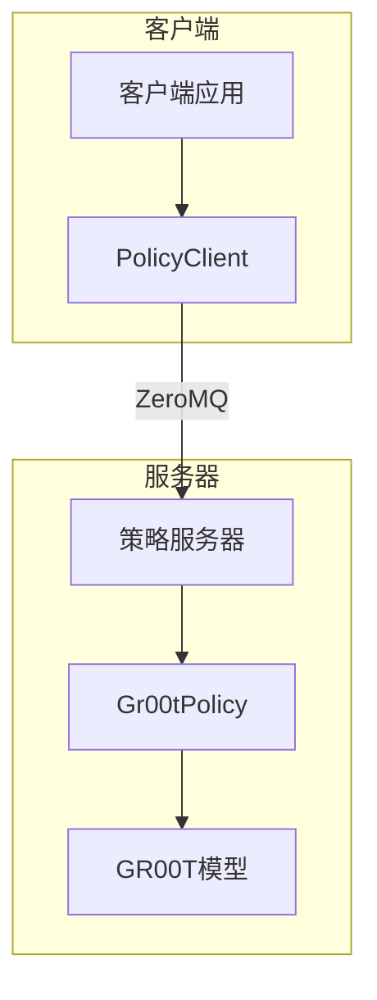

# 模型推理

<cite>
**本文档引用的文件**   
- [gr00t_policy.py](file://gr00t\policy\gr00t_policy.py)
- [server_client.py](file://gr00t\policy\server_client.py)
- [run_gr00t_server.py](file://gr00t\eval\run_gr00t_server.py)
- [GR00T_inference.ipynb](file://getting_started\GR00T_inference.ipynb)
</cite>

## 目录
1. [引言](#引言)
2. [服务器-客户端架构](#服务器-客户端架构)
3. [策略API使用](#策略api使用)
4. [批量推理](#批量推理)
5. [启动策略服务器](#启动策略服务器)
6. [集成到机器人系统](#集成到机器人系统)
7. [使用Gr00tPolicy类进行实时推理](#使用gr00tpolicy类进行实时推理)
8. [服务器-客户端通信协议](#服务器-客户端通信协议)
9. [消息类型和数据序列化](#消息类型和数据序列化)
10. [故障排除指南](#故障排除指南)
11. [性能优化技巧](#性能优化技巧)

## 引言
Isaac-GR00T模型推理系统提供了一个强大的框架，用于在机器人系统中执行视觉-语言-动作（VLA）任务。该系统基于服务器-客户端架构，允许远程执行模型推理，同时支持批量处理和实时推理。本指南将详细介绍如何使用Gr00tPolicy类进行推理，如何启动和配置策略服务器，以及如何将系统集成到机器人应用中。对于初学者，我们将提供概念性概述；对于经验丰富的开发者，我们将深入技术细节，包括通信协议、数据序列化和性能优化。

## 服务器-客户端架构
Isaac-GR00T模型推理系统采用服务器-客户端架构，其中策略服务器在远程主机上运行，负责加载和执行预训练的GR00T模型。客户端通过ZeroMQ套接字与服务器通信，发送观测数据并接收预测的动作。这种架构允许将计算密集型的模型推理任务与机器人控制逻辑分离，从而提高系统的灵活性和可扩展性。



**Diagram sources**
- [server_client.py](file://gr00t\policy\server_client.py#L51-L147)
- [gr00t_policy.py](file://gr00t\policy\gr00t_policy.py#L46-L674)

**Section sources**
- [server_client.py](file://gr00t\policy\server_client.py#L51-L147)
- [gr00t_policy.py](file://gr00t\policy\gr00t_policy.py#L46-L674)

## 策略API使用
策略API提供了与GR00T模型交互的接口。核心类是`Gr00tPolicy`，它封装了模型加载、输入验证、推理执行和动作解码的整个流程。API设计为与Hugging Face模型库兼容，允许像加载任何其他Hugging Face模型一样加载预训练的GR00T模型。

### 核心方法
- `get_action(observation)`: 接收包含视频、状态和语言模态的观测字典，返回预测的动作。
- `reset(options)`: 重置策略状态。
- `get_modality_config()`: 获取模态配置，包括每个模态的键和时间范围。

### 观测数据结构
观测数据必须是一个包含以下键的字典：
- `video`: 字典，包含视频流，形状为(B, T, H, W, C)，其中B是批次大小，T是时间范围，H和W是高度和宽度，C是通道数（必须为3）。
- `state`: 字典，包含状态流，形状为(B, T, D)，其中D是状态维度。
- `language`: 字典，包含语言指令，形状为(B, T)，其中T通常是1。

**Section sources**
- [gr00t_policy.py](file://gr00t\policy\gr00t_policy.py#L46-L674)

## 批量推理
批量推理允许同时处理多个观测样本，从而提高推理效率。`Gr00tPolicy`类支持批量处理，通过将多个观测样本组合成一个批次来执行推理。

### 批量处理流程
1. 将单个观测样本组合成一个批次。
2. 验证批次数据的结构和类型。
3. 将批次数据传递给模型进行推理。
4. 解码并返回批量动作。

### 批量推理示例
```python
# 假设有多个观测样本
observations = [obs1, obs2, obs3]

# 组合成批次
batched_observation = {
    "video": np.stack([obs["video"] for obs in observations]),
    "state": np.stack([obs["state"] for obs in observations]),
    "language": {"task": [[obs["language"]["task"]] for obs in observations]}
}

# 执行批量推理
actions, info = policy.get_action(batched_observation)
```

**Section sources**
- [gr00t_policy.py](file://gr00t\policy\gr00t_policy.py#L306-L358)

## 启动策略服务器
启动策略服务器涉及加载预训练模型、配置服务器参数并启动监听循环。`run_gr00t_server.py`脚本提供了启动服务器的命令行接口。

### 启动步骤
1. 导入必要的模块和类。
2. 定义服务器配置，包括模型路径、设备、主机和端口。
3. 创建`Gr00tPolicy`实例。
4. 创建`PolicyServer`实例并启动服务器。

### 服务器配置
```python
from dataclasses import dataclass

@dataclass
class ServerConfig:
    model_path: str | None = None
    embodiment_tag: EmbodimentTag = EmbodimentTag.NEW_EMBODIMENT
    device: str = "cuda"
    host: str = "127.0.0.1"
    port: int = 5555
    strict: bool = True
    use_sim_policy_wrapper: bool = False
```

### 启动服务器
```python
def main(config: ServerConfig):
    print("Starting GR00T inference server...")
    print(f"  Embodiment tag: {config.embodiment_tag}")
    print(f"  Model path: {config.model_path}")
    print(f"  Device: {config.device}")
    print(f"  Host: {config.host}")
    print(f"  Port: {config.port}")

    # 检查模型路径是否存在
    if config.model_path.startswith("/") and not os.path.exists(config.model_path):
        raise FileNotFoundError(f"Model path {config.model_path} does not exist")

    # 创建策略
    policy = Gr00tPolicy(
        embodiment_tag=config.embodiment_tag,
        model_path=config.model_path,
        device=config.device,
        strict=config.strict,
    )

    # 应用模拟策略包装器（如果需要）
    if config.use_sim_policy_wrapper:
        policy = Gr00tSimPolicyWrapper(policy)

    # 创建并启动服务器
    server = PolicyServer(
        policy=policy,
        host=config.host,
        port=config.port,
    )

    try:
        server.run()
    except KeyboardInterrupt:
        print("\nShutting down server...")
```

**Section sources**
- [run_gr00t_server.py](file://gr00t\eval\run_gr00t_server.py#L1-L111)

## 集成到机器人系统
将GR00T模型推理系统集成到机器人系统中涉及配置客户端以与策略服务器通信，并将预测的动作应用于机器人执行器。

### 集成步骤
1. 配置`PolicyClient`以连接到策略服务器。
2. 收集机器人系统的观测数据。
3. 将观测数据格式化为`Gr00tPolicy`期望的结构。
4. 使用`PolicyClient`发送观测数据并接收预测的动作。
5. 将预测的动作应用于机器人执行器。

### 客户端配置
```python
client = PolicyClient(
    host="localhost",
    port=5555,
    timeout_ms=15000,
    api_token=None,
    strict=False,
)
```

### 与机器人系统通信
```python
# 收集观测数据
observation = collect_observation()

# 发送观测数据并接收动作
action, info = client.get_action(observation)

# 应用动作
apply_action(action)
```

**Section sources**
- [server_client.py](file://gr00t\policy\server_client.py#L150-L241)
- [gr00t_policy.py](file://gr00t\policy\gr00t_policy.py#L46-L674)

## 使用Gr00tPolicy类进行实时推理
`Gr00tPolicy`类是执行实时推理的核心。它负责验证输入观测、处理观测数据、运行模型推理和解码动作。

### 实时推理流程
1. 验证观测数据的结构和类型。
2. 将观测数据转换为VLAStepData对象。
3. 使用处理器处理VLAStepData。
4. 将处理后的输入批处理为模型输入批次。
5. 运行模型推理以预测动作。
6. 解码并反归一化动作。

### 实时推理示例
```python
# 创建Gr00tPolicy实例
policy = Gr00tPolicy(
    model_path=MODEL_PATH,
    embodiment_tag=EmbodimentTag(EMBODIMENT_TAG),
    device=device,
    strict=True,
)

# 执行实时推理
action, info = policy.get_action(observation)
```

**Section sources**
- [gr00t_policy.py](file://gr00t\policy\gr00t_policy.py#L46-L674)

## 服务器-客户端通信协议
服务器-客户端通信协议基于ZeroMQ，使用请求-回复模式。客户端发送请求，服务器处理请求并返回响应。

### 通信流程
1. 客户端连接到服务器。
2. 客户端发送包含端点和数据的请求。
3. 服务器验证请求并调用相应的处理程序。
4. 服务器返回响应。

### 端点
- `ping`: 检查服务器是否运行。
- `kill`: 终止服务器。
- `get_action`: 获取预测的动作。
- `reset`: 重置策略状态。
- `get_modality_config`: 获取模态配置。

**Section sources**
- [server_client.py](file://gr00t\policy\server_client.py#L51-L147)

## 消息类型和数据序列化
消息类型和数据序列化确保客户端和服务器之间的数据能够正确传输和解析。系统使用MessagePack进行序列化，支持自定义类的编码和解码。

### 消息结构
请求消息包含以下字段：
- `endpoint`: 要调用的端点名称。
- `data`: 端点的输入数据。
- `api_token`: API令牌（如果需要）。

响应消息包含处理结果或错误信息。

### 数据序列化
```python
class MsgSerializer:
    @staticmethod
    def to_bytes(data: Any) -> bytes:
        return msgpack.packb(data, default=MsgSerializer.encode_custom_classes)

    @staticmethod
    def from_bytes(data: bytes) -> Any:
        return msgpack.unpackb(data, object_hook=MsgSerializer.decode_custom_classes)

    @staticmethod
    def encode_custom_classes(obj):
        if isinstance(obj, ModalityConfig):
            return {"__ModalityConfig_class__": True, "as_json": to_json_serializable(obj)}
        if isinstance(obj, np.ndarray):
            output = io.BytesIO()
            np.save(output, obj, allow_pickle=False)
            return {"__ndarray_class__": True, "as_npy": output.getvalue()}
        return obj

    @staticmethod
    def decode_custom_classes(obj):
        if not isinstance(obj, dict):
            return obj
        if "__ModalityConfig_class__" in obj:
            return ModalityConfig(**obj["as_json"])
        if "__ndarray_class__" in obj:
            return np.load(io.BytesIO(obj["as_npy"]), allow_pickle=False)
        return obj
```

**Section sources**
- [server_client.py](file://gr00t\policy\server_client.py#L15-L43)

## 故障排除指南
### 常见问题及解决方案
1. **服务器无法启动**
   - 检查模型路径是否正确。
   - 确保设备（如CUDA）可用。
   - 检查端口是否被占用。

2. **客户端无法连接到服务器**
   - 检查主机和端口配置。
   - 确保服务器正在运行。
   - 检查网络连接。

3. **观测数据验证失败**
   - 确保观测数据的结构和类型正确。
   - 检查批次大小、时间范围和维度是否匹配。

4. **动作预测不准确**
   - 检查语言指令是否清晰。
   - 确保视频和状态数据的质量。

### 调试技巧
- 使用`ping`端点检查服务器状态。
- 启用详细日志记录以跟踪请求和响应。
- 使用`get_modality_config`端点验证模态配置。

**Section sources**
- [server_client.py](file://gr00t\policy\server_client.py#L137-L143)
- [gr00t_policy.py](file://gr00t\policy\gr00t_policy.py#L144-L305)

## 性能优化技巧
### 优化建议
1. **使用批量推理**：批量处理多个观测样本以提高效率。
2. **优化数据传输**：压缩视频和状态数据以减少网络延迟。
3. **选择合适的设备**：使用GPU进行推理以提高速度。
4. **调整超参数**：根据具体任务调整模型超参数。

### 性能监控
- 监控服务器的CPU和内存使用情况。
- 测量推理延迟和吞吐量。
- 使用性能分析工具识别瓶颈。

**Section sources**
- [gr00t_policy.py](file://gr00t\policy\gr00t_policy.py#L342-L344)
- [server_client.py](file://gr00t\policy\server_client.py#L114-L136)