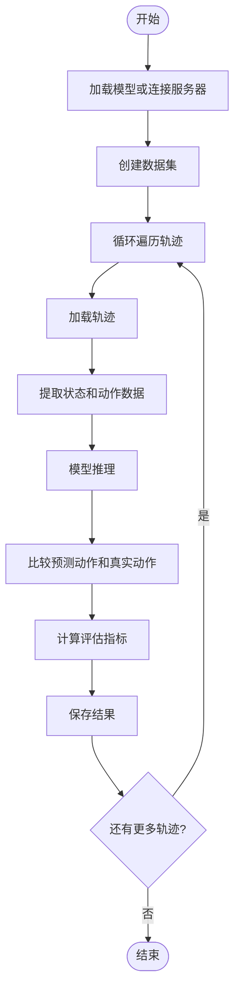
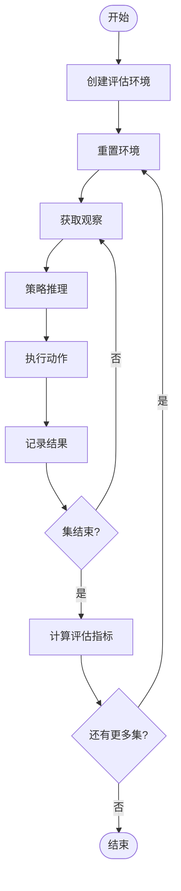
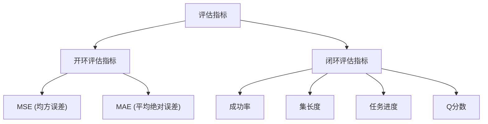
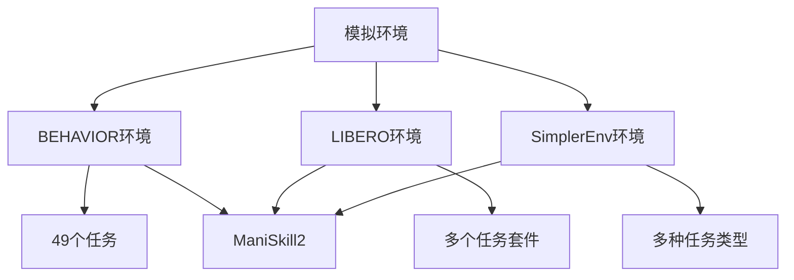
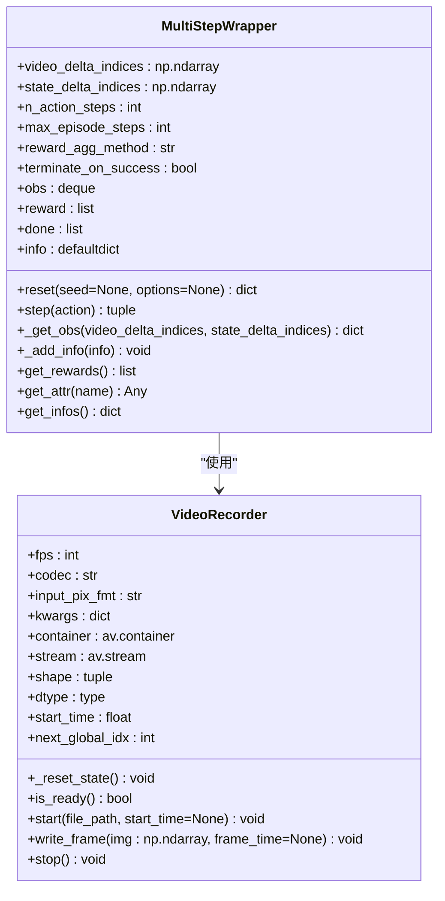
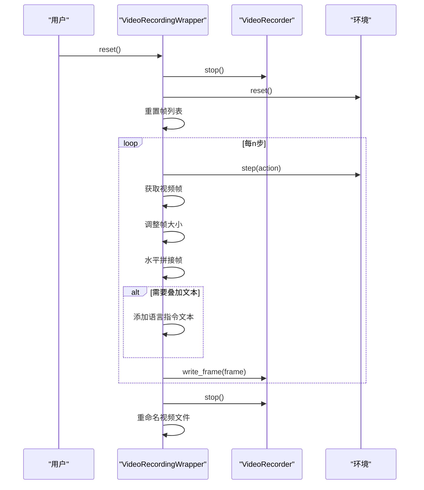
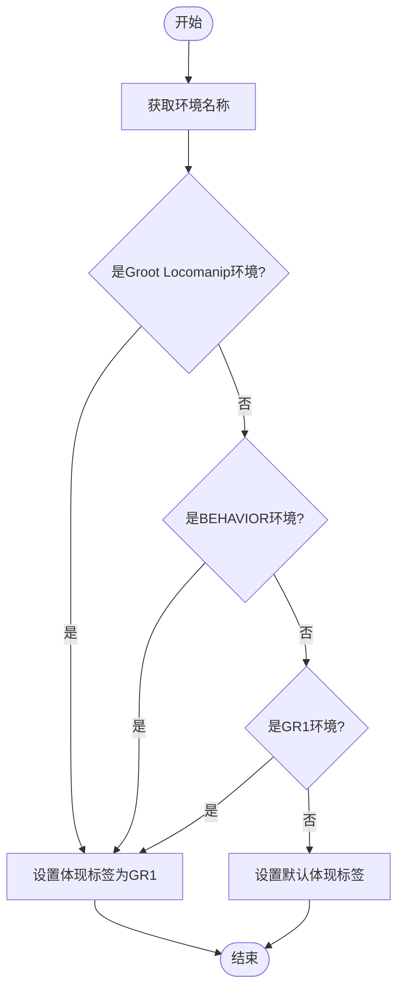
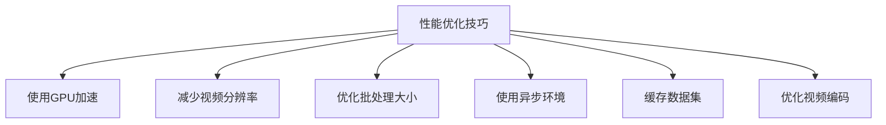

# 评估系统

<cite>
**本文档引用的文件**   
- [open_loop_eval.py](file://gr00t/eval/open_loop_eval.py)
- [behavior_env.py](file://gr00t/eval/sim/BEHAVIOR/behavior_env.py)
- [libero_env.py](file://gr00t/eval/sim/LIBERO/libero_env.py)
- [simpler_env.py](file://gr00t/eval/sim/SimplerEnv/simpler_env.py)
- [multistep_wrapper.py](file://gr00t/eval/sim/wrapper/multistep_wrapper.py)
- [video_recording_wrapper.py](file://gr00t/eval/sim/wrapper/video_recording_wrapper.py)
- [rollout_policy.py](file://gr00t/eval/rollout_policy.py)
- [env_utils.py](file://gr00t/eval/sim/env_utils.py)
- [gr00t_policy.py](file://gr00t/policy/gr00t_policy.py)
- [sharded_single_step_dataset.py](file://gr00t/data/dataset/sharded_single_step_dataset.py)
</cite>

## 目录
1. [简介](#简介)
2. [开环评估](#开环评估)
3. [闭环评估](#闭环评估)
4. [评估指标](#评估指标)
5. [模拟环境](#模拟环境)
6. [多步包装器](#多步包装器)
7. [视频记录包装器](#视频记录包装器)
8. [环境工具](#环境工具)
9. [故障排除指南](#故障排除指南)
10. [性能优化技巧](#性能优化技巧)

## 简介
Isaac-GR00T评估系统提供了一套全面的工具，用于评估机器人策略模型的性能。该系统支持开环和闭环两种评估模式，能够与多种模拟环境（如BEHAVIOR、LIBERO、SimplerEnv）集成，并提供详细的评估指标。评估系统的核心组件包括`open_loop_eval.py`脚本、多步包装器、视频记录包装器和环境工具，这些组件共同构成了一个完整的评估框架。本指南将详细介绍如何使用这些工具进行模型评估，为初学者提供循序渐进的指导，同时包含经验丰富的开发者可能需要的高级配置选项。

**Section sources**
- [open_loop_eval.py](file://gr00t/eval/open_loop_eval.py#L1-L352)
- [rollout_policy.py](file://gr00t/eval/rollout_policy.py#L1-L501)

## 开环评估
开环评估是一种评估策略模型性能的方法，它通过将模型的预测动作与数据集中的真实动作进行比较来计算误差。`open_loop_eval.py`脚本是执行开环评估的核心工具，它从数据集中加载轨迹，使用策略模型进行推理，并将预测动作与真实动作进行比较。

开环评估的主要步骤包括：
1. 加载策略模型或连接到策略服务器
2. 创建数据集加载器
3. 对每个轨迹执行评估
4. 计算并记录评估指标

`open_loop_eval.py`脚本提供了多种配置选项，包括：
- `host`和`port`：用于连接策略服务器
- `steps`：评估的最大步数
- `traj_ids`：要评估的轨迹ID列表
- `action_horizon`：动作视野
- `dataset_path`：数据集路径
- `embodiment_tag`：体现标签
- `model_path`：模型检查点路径
- `denoising_steps`：去噪步数
- `save_plot_path`：保存图表的路径
- `modality_keys`：要绘制的模态键列表

**Diagram sources **
- [open_loop_eval.py](file://gr00t/eval/open_loop_eval.py#L266-L351)

**Section sources**
- [open_loop_eval.py](file://gr00t/eval/open_loop_eval.py#L1-L352)

## 闭环评估
闭环评估通过在模拟环境中执行策略来评估模型性能，这种方法更接近真实世界的机器人操作。`rollout_policy.py`脚本是执行闭环评估的核心工具，它创建模拟环境，运行策略，并记录评估结果。

闭环评估的主要步骤包括：
1. 创建评估环境
2. 重置环境
3. 执行策略
4. 记录结果
5. 计算评估指标

`rollout_policy.py`脚本提供了多种配置选项，包括：
- `env_name`：环境名称
- `n_episodes`：要运行的集数
- `max_episode_steps`：每集的最大步数
- `model_path`：模型检查点路径
- `policy_client_host`和`policy_client_port`：策略服务器主机和端口
- `n_envs`：并行环境数量
- `n_action_steps`：动作步数

**Diagram sources **
- [rollout_policy.py](file://gr00t/eval/rollout_policy.py#L236-L365)

**Section sources**
- [rollout_policy.py](file://gr00t/eval/rollout_policy.py#L1-L501)

## 评估指标
Isaac-GR00T评估系统提供多种评估指标来衡量模型性能。这些指标包括：

### 开环评估指标
- **MSE（均方误差）**：预测动作和真实动作之间的均方误差
- **MAE（平均绝对误差）**：预测动作和真实动作之间的平均绝对误差

这些指标在`open_loop_eval.py`脚本中计算，用于衡量模型在开环评估中的性能。

### 闭环评估指标
- **成功率**：成功完成任务的集数比例
- **集长度**：每个集的步数
- **任务进度**：任务完成的百分比
- **Q分数**：任务质量分数

这些指标在`rollout_policy.py`脚本中计算，用于衡量模型在闭环评估中的性能。

**Diagram sources **
- [open_loop_eval.py](file://gr00t/eval/open_loop_eval.py#L203-L207)
- [rollout_policy.py](file://gr00t/eval/rollout_policy.py#L280-L281)

**Section sources**
- [open_loop_eval.py](file://gr00t/eval/open_loop_eval.py#L1-L352)
- [rollout_policy.py](file://gr00t/eval/rollout_policy.py#L1-L501)

## 模拟环境
Isaac-GR00T评估系统支持多种模拟环境，包括BEHAVIOR、LIBERO和SimplerEnv。这些环境通过特定的包装器和配置文件进行集成。

### BEHAVIOR环境
BEHAVIOR环境基于OmniGibson模拟器，提供了一个复杂的家庭环境，用于评估机器人执行日常任务的能力。`behavior_env.py`文件定义了BEHAVIOR环境的包装器，包括：
- 任务注册
- 观察预处理
- 动作后处理
- 环境重置和步骤执行

BEHAVIOR环境支持49个不同的任务，如"turning_on_radio"、"picking_up_trash"等。每个任务都有特定的场景和对象配置。

### LIBERO环境
LIBERO环境基于robosuite模拟器，提供了一系列机器人操作任务。`libero_env.py`文件定义了LIBERO环境的包装器，包括：
- 任务注册
- 观察空间和动作空间定义
- 观察预处理
- 动作标准化和反转

LIBERO环境支持多个任务套件，包括libero_10、libero_spatial、libero_object等。

### SimplerEnv环境
SimplerEnv环境基于ManiSkill2模拟器，提供了一系列简化的机器人操作任务。`simpler_env.py`文件定义了SimplerEnv环境的包装器，包括：
- Google/Fractal环境
- WidowX/Bridge环境
- 观察空间和动作空间定义
- 观察预处理
- 动作后处理

SimplerEnv环境支持多种任务，如"google_robot_pick_coke_can"、"widowx_spoon_on_towel"等。

**Diagram sources **
- [behavior_env.py](file://gr00t/eval/sim/BEHAVIOR/behavior_env.py#L307-L800)
- [libero_env.py](file://gr00t/eval/sim/LIBERO/libero_env.py#L86-L169)
- [simpler_env.py](file://gr00t/eval/sim/SimplerEnv/simpler_env.py#L10-L119)

**Section sources**
- [behavior_env.py](file://gr00t/eval/sim/BEHAVIOR/behavior_env.py#L1-L800)
- [libero_env.py](file://gr00t/eval/sim/LIBERO/libero_env.py#L1-L235)
- [simpler_env.py](file://gr00t/eval/sim/SimplerEnv/simpler_env.py#L1-L240)

## 多步包装器
多步包装器（MultiStepWrapper）是一个重要的组件，它允许策略模型在多个时间步上进行推理，并将多个动作应用于环境。这个包装器通过堆叠多个观察和动作来实现多步推理。

`multistep_wrapper.py`文件定义了MultiStepWrapper类，其主要功能包括：
- 堆叠重复的观察和动作
- 创建重复的空间
- 取最后n个元素
- 压缩字典列表
- 聚合数据

MultiStepWrapper的关键参数包括：
- `video_delta_indices`：视频观察的增量索引
- `state_delta_indices`：状态观察的增量索引
- `n_action_steps`：动作步数
- `max_episode_steps`：每集的最大步数
- `reward_agg_method`：奖励聚合方法
- `terminate_on_success`：成功时终止

**Diagram sources **
- [multistep_wrapper.py](file://gr00t/eval/sim/wrapper/multistep_wrapper.py#L121-L373)

**Section sources**
- [multistep_wrapper.py](file://gr00t/eval/sim/wrapper/multistep_wrapper.py#L1-L373)

## 视频记录包装器
视频记录包装器（VideoRecordingWrapper）用于在评估过程中记录环境的视频。这个包装器使用PyAV库将视频帧编码为H.264格式并保存为MP4文件。

`video_recording_wrapper.py`文件定义了VideoRecordingWrapper类，其主要功能包括：
- 创建视频记录器
- 启动和停止视频记录
- 写入视频帧
- 重置环境时重命名视频文件

VideoRecordingWrapper的关键参数包括：
- `video_dir`：视频保存目录
- `steps_per_render`：每渲染步数
- `max_episode_steps`：每集的最大步数
- `fps`：视频帧率
- `codec`：视频编解码器
- `input_pix_fmt`：输入像素格式
- `crf`：恒定速率因子
- `thread_type`：线程类型
- `thread_count`：线程数
- `overlay_text`：是否叠加文本

**Diagram sources **
- [video_recording_wrapper.py](file://gr00t/eval/sim/wrapper/video_recording_wrapper.py#L124-L466)

**Section sources**
- [video_recording_wrapper.py](file://gr00t/eval/sim/wrapper/video_recording_wrapper.py#L1-L466)

## 环境工具
环境工具（env_utils.py）提供了一系列辅助函数，用于处理不同环境的特定需求。这些工具函数简化了环境创建和配置的过程。

`env_utils.py`文件定义了以下函数：
- `is_groot_locomanip_env`：检查是否为Groot Locomanip环境
- `is_behavior_env`：检查是否为BEHAVIOR环境
- `is_gr1_env`：检查是否为GR1环境
- `get_embodiment_tag_from_env_name`：从环境名称获取体现标签

这些工具函数在`rollout_policy.py`脚本中被使用，用于根据环境名称确定正确的体现标签和环境配置。

**Diagram sources **
- [env_utils.py](file://gr00t/eval/sim/env_utils.py#L1-L33)

**Section sources**
- [env_utils.py](file://gr00t/eval/sim/env_utils.py#L1-L33)

## 故障排除指南
在使用Isaac-GR00T评估系统时，可能会遇到一些常见问题。以下是这些问题的解决方案：

### 模型加载失败
**问题**：模型检查点路径不正确或模型文件损坏。
**解决方案**：
1. 检查`model_path`参数是否指向正确的模型检查点文件
2. 确保模型文件完整且未损坏
3. 如果使用S3路径，确保网络连接正常

### 环境创建失败
**问题**：无法创建指定的模拟环境。
**解决方案**：
1. 检查环境名称是否正确
2. 确保已正确安装和配置相应的模拟器（如OmniGibson、robosuite、ManiSkill2）
3. 检查环境依赖项是否已正确安装

### 视频记录失败
**问题**：无法创建或写入视频文件。
**解决方案**：
1. 检查`video_dir`参数指定的目录是否存在且可写
2. 确保有足够的磁盘空间
3. 检查PyAV库是否正确安装

### 内存不足
**问题**：评估过程中出现内存不足错误。
**解决方案**：
1. 减少并行环境数量（`n_envs`参数）
2. 减少每集的最大步数（`max_episode_steps`参数）
3. 使用更小的视频分辨率

### 策略服务器连接失败
**问题**：无法连接到策略服务器。
**解决方案**：
1. 检查`host`和`port`参数是否正确
2. 确保策略服务器正在运行
3. 检查网络连接是否正常

**Section sources**
- [open_loop_eval.py](file://gr00t/eval/open_loop_eval.py#L270-L288)
- [rollout_policy.py](file://gr00t/eval/rollout_policy.py#L458-L487)
- [video_recording_wrapper.py](file://gr00t/eval/sim/wrapper/video_recording_wrapper.py#L68-L71)

## 性能优化技巧
为了提高评估系统的性能，可以采用以下优化技巧：

### 使用GPU加速
确保模型在GPU上运行，以充分利用GPU的并行计算能力。在`Gr00tPolicy`初始化时，将`device`参数设置为"cuda"。

### 减少视频分辨率
降低视频分辨率可以显著减少内存使用和计算时间。在环境配置中，将视频分辨率设置为较小的值。

### 优化批处理大小
调整批处理大小以平衡内存使用和计算效率。较大的批处理大小可以提高GPU利用率，但会增加内存使用。

### 使用异步环境
使用异步向量环境（AsyncVectorEnv）可以并行运行多个环境实例，提高评估速度。

### 缓存数据集
对于频繁使用的数据集，可以将其缓存到内存中，以减少磁盘I/O开销。

### 优化视频编码
调整视频编码参数（如CRF值）以平衡视频质量和编码速度。

**Diagram sources **
- [rollout_policy.py](file://gr00t/eval/rollout_policy.py#L270-L277)
- [video_recording_wrapper.py](file://gr00t/eval/sim/wrapper/video_recording_wrapper.py#L40-L58)

**Section sources**
- [gr00t_policy.py](file://gr00t/policy/gr00t_policy.py#L60-L84)
- [rollout_policy.py](file://gr00t/eval/rollout_policy.py#L270-L277)
- [video_recording_wrapper.py](file://gr00t/eval/sim/wrapper/video_recording_wrapper.py#L40-L58)