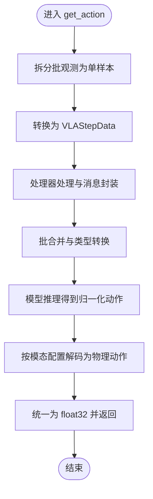

# 贡献指南

<cite>
**本文档引用的文件**
- [CONTRIBUTING.md](file://CONTRIBUTING.md)
- [README.md](file://README.md)
- [pyproject.toml](file://pyproject.toml)
- [getting_started/finetune_new_embodiment.md](file://getting_started/finetune_new_embodiment.md)
- [getting_started/policy.md](file://getting_started/policy.md)
- [getting_started/data_preparation.md](file://getting_started/data_preparation.md)
- [getting_started/data_config.md](file://getting_started/data_config.md)
- [scripts/deployment/README.md](file://scripts/deployment/README.md)
- [gr00t/policy/gr00t_policy.py](file://gr00t/policy/gr00t_policy.py)
- [gr00t/experiment/launch_finetune.py](file://gr00t/experiment/launch_finetune.py)
- [gr00t/eval/run_gr00t_server.py](file://gr00t/eval/run_gr00t_server.py)
- [examples/SO100/so100_config.py](file://examples/SO100/so100_config.py)
- [examples/PointNav/modality_config.py](file://examples/PointNav/modality_config.py)
</cite>

## 目录
1. [简介](#简介)
2. [项目结构](#项目结构)
3. [核心组件](#核心组件)
4. [架构总览](#架构总览)
5. [详细组件分析](#详细组件分析)
6. [依赖关系分析](#依赖关系分析)
7. [性能考虑](#性能考虑)
8. [故障排除指南](#故障排除指南)
9. [结论](#结论)
10. [附录](#附录)

## 简介
本指南面向希望为 Isaac-GR00T 做出贡献的开发者，覆盖代码贡献与文档贡献的完整流程。内容包括：
- 提交代码与变更的步骤（分支管理、本地测试、拉取请求）
- 编写与运行测试的方法
- 更新与维护文档的规范
- 遵循项目的编码风格与格式化要求
- Git 工作流、代码审查流程与版本发布策略
- 面向初学者的循序渐进指南与面向资深开发者的高级选项
- 常见问题与性能优化建议

## 项目结构
Isaac-GR00T 是一个以机器人技能学习为核心的研究型项目，围绕视觉-语言-动作（VLA）模型构建，支持多机器人平台与多模态数据处理。项目采用模块化设计，主要目录与职责如下：
- gr00t：核心模型与推理、训练、评估逻辑
- examples：不同机器人平台与任务的微调与评估示例
- getting_started：快速上手与使用指南
- scripts：部署与推理脚本（含 TensorRT 加速）
- external_dependencies：外部子模块与依赖（如 WholeBodyControl、LIBERO、SimplerEnv、RoboCasa）
- demo_data：演示数据集样例
- docker：容器化部署说明与脚本

图表来源
- [gr00t/policy/gr00t_policy.py](file://gr00t/policy/gr00t_policy.py#L46-L103)
- [gr00t/experiment/launch_finetune.py](file://gr00t/experiment/launch_finetune.py#L28-L92)
- [gr00t/eval/run_gr00t_server.py](file://gr00t/eval/run_gr00t_server.py#L53-L110)
- [examples/SO100/so100_config.py](file://examples/SO100/so100_config.py#L1-L67)
- [scripts/deployment/README.md](file://scripts/deployment/README.md#L1-L235)

章节来源
- [README.md](file://README.md#L1-L388)

## 核心组件
- 策略与推理接口：Gr00tPolicy 提供统一的推理 API，支持严格输入输出校验、批处理、动作分块等能力；Gr00tSimPolicyWrapper 用于兼容现有仿真环境。
- 训练入口：launch_finetune.py 通过命令行参数加载 FinetuneConfig，组织数据与训练配置并启动训练。
- 评估与服务端：run_gr00t_server.py 启动基于 ZeroMQ 的策略服务端，支持真实模型与回放模式。
- 数据准备与配置：data_preparation.md 定义 LeRobot v2 扩展格式与 meta/modality.json；data_config.md 解释模态配置结构与 ActionConfig。
- 部署与推理：scripts/deployment/README.md 提供 PyTorch 与 TensorRT 推理路径及基准测试方法。

章节来源
- [gr00t/policy/gr00t_policy.py](file://gr00t/policy/gr00t_policy.py#L46-L103)
- [gr00t/experiment/launch_finetune.py](file://gr00t/experiment/launch_finetune.py#L28-L92)
- [gr00t/eval/run_gr00t_server.py](file://gr00t/eval/run_gr00t_server.py#L53-L110)
- [getting_started/data_preparation.md](file://getting_started/data_preparation.md#L1-L156)
- [getting_started/data_config.md](file://getting_started/data_config.md#L1-L296)
- [scripts/deployment/README.md](file://scripts/deployment/README.md#L1-L235)

## 架构总览
下图展示了从数据到策略再到服务端的整体流程，以及可选的 TensorRT 加速路径。

图表来源
- [gr00t/experiment/launch_finetune.py](file://gr00t/experiment/launch_finetune.py#L28-L92)
- [gr00t/policy/gr00t_policy.py](file://gr00t/policy/gr00t_policy.py#L306-L358)
- [gr00t/eval/run_gr00t_server.py](file://gr00t/eval/run_gr00t_server.py#L53-L110)

## 详细组件分析

### 组件一：策略与推理接口（Gr00tPolicy）
- 功能要点
  - 输入验证：对视频（uint8, (B,T,H,W,3)）、状态（float32, (B,T,D)）、语言（list[list[str]], (B,T)）进行严格校验
  - 处理器集成：使用 AutoProcessor 将观测转换为模型输入
  - 模型推理：调用模型的 get_action 获取归一化动作
  - 动作解码：根据模态配置与参考状态将归一化动作还原为物理单位
  - 批处理与动作分块：支持批量观测与多步动作预测
- 关键流程

图表来源
- [gr00t/policy/gr00t_policy.py](file://gr00t/policy/gr00t_policy.py#L306-L358)

章节来源
- [gr00t/policy/gr00t_policy.py](file://gr00t/policy/gr00t_policy.py#L46-L103)
- [gr00t/policy/gr00t_policy.py](file://gr00t/policy/gr00t_policy.py#L144-L305)
- [gr00t/policy/gr00t_policy.py](file://gr00t/policy/gr00t_policy.py#L360-L418)

### 组件二：训练入口（launch_finetune.py）
- 功能要点
  - 使用 tyro CLI 解析 FinetuneConfig
  - 注册用户自定义模态配置（若提供）
  - 组织数据集路径、混合比例与 EmbodimentTag
  - 覆盖训练超参（学习率、全局批大小、保存策略等）
  - 调用实验执行器 run(config) 启动训练
- 关键流程

图表来源
- [gr00t/experiment/launch_finetune.py](file://gr00t/experiment/launch_finetune.py#L14-L92)

章节来源
- [gr00t/experiment/launch_finetune.py](file://gr00t/experiment/launch_finetune.py#L28-L92)

### 组件三：评估与服务端（run_gr00t_server.py）
- 功能要点
  - 支持两种模式：真实模型模式（Gr00tPolicy）与回放模式（ReplayPolicy）
  - 可选应用 Gr00tSimPolicyWrapper 兼容仿真环境
  - 基于 ZeroMQ 的 PolicyServer 提供远程推理能力
- 关键流程

图表来源
- [gr00t/eval/run_gr00t_server.py](file://gr00t/eval/run_gr00t_server.py#L53-L110)

章节来源
- [gr00t/eval/run_gr00t_server.py](file://gr00t/eval/run_gr00t_server.py#L53-L110)

### 组件四：数据准备与模态配置
- 数据准备（LeRobot v2 扩展）
  - 必须包含 meta/modality.json，定义 state/action/video/annotation 的键映射与切片范围
  - 视频存储为 MP4，命名遵循 observation.images.<key>
  - parquet 文件包含 state、action、timestamp、annotation 等字段
- 模态配置（Python）
  - 定义 video/state/action/language 的 delta_indices 与 modality_keys
  - action 配置需提供 ActionConfig 列表，描述相对/绝对控制、EEF/非EEF、格式等
  - 通过 register_modality_config 注册后在训练与推理中生效

章节来源
- [getting_started/data_preparation.md](file://getting_started/data_preparation.md#L1-L156)
- [getting_started/data_config.md](file://getting_started/data_config.md#L1-L296)
- [examples/SO100/so100_config.py](file://examples/SO100/so100_config.py#L1-L67)
- [examples/PointNav/modality_config.py](file://examples/PointNav/modality_config.py#L1-L49)

### 组件五：部署与推理（TensorRT 加速）
- PyTorch 模式：直接运行推理脚本
- TensorRT 模式：导出 ONNX -> 构建 TensorRT 引擎 -> 使用引擎推理
- 基准测试：提供组件级时延分解与设备对比

章节来源
- [scripts/deployment/README.md](file://scripts/deployment/README.md#L1-L235)

## 依赖关系分析
- 语言与工具
  - Python 3.10（项目要求）
  - uv 作为包管理与构建工具
  - Ruff 作为格式化与静态检查工具
- 第三方依赖
  - PyTorch/TensorVision/Transformers 等深度学习生态
  - flash-attn、deepspeed（部分平台）
  - ZeroMQ（策略服务端通信）
- 项目内模块耦合
  - policy 依赖 data 的类型与处理器
  - experiment 依赖 configs 与 model 注册
  - eval 依赖 policy 与 server_client

图表来源
- [pyproject.toml](file://pyproject.toml#L1-L100)
- [gr00t/policy/gr00t_policy.py](file://gr00t/policy/gr00t_policy.py#L1-L20)
- [gr00t/eval/run_gr00t_server.py](file://gr00t/eval/run_gr00t_server.py#L1-L10)

章节来源
- [pyproject.toml](file://pyproject.toml#L1-L100)

## 性能考虑
- 推理加速
  - torch.compile：显著降低动作头（DiT）时延
  - TensorRT：在支持的硬件上进一步提升端到端性能
- 训练优化
  - 增大全局批大小（受限于显存）
  - 合理设置 dataloader num_workers 与 shard_size
  - 使用相对动作（relative action）减少漂移风险
- 硬件建议
  - 推荐 H100 或 L40 节点进行微调
  - 推理阶段可使用 TensorRT 引擎以获得更稳定吞吐

章节来源
- [scripts/deployment/README.md](file://scripts/deployment/README.md#L136-L186)
- [gr00t/experiment/launch_finetune.py](file://gr00t/experiment/launch_finetune.py#L88-L91)

## 故障排除指南
- 输入输出格式错误
  - 使用严格模式（strict=True）进行开发期校验
  - 通过 get_modality_config() 打印期望的键与时间窗
  - 对齐观测形状与数据类型（uint8、float32）
- 服务器连接失败
  - 确认主机与端口配置一致
  - 使用 ping() 检查健康状态
  - 回放模式下确保 execution_horizon 与环境步长匹配
- 训练不稳定或结果波动
  - 注意图像增强等随机操作导致的方差
  - 固定随机种子并多次运行取均值
- TensorRT 引擎构建失败
  - 检查 GPU 显存与 CUDA 版本匹配
  - 适当降低 workspace 大小或精度

章节来源
- [gr00t/policy/gr00t_policy.py](file://gr00t/policy/gr00t_policy.py#L144-L305)
- [gr00t/eval/run_gr00t_server.py](file://gr00t/eval/run_gr00t_server.py#L53-L110)
- [scripts/deployment/README.md](file://scripts/deployment/README.md#L189-L202)

## 结论
本指南系统性地梳理了 Isaac-GR00T 的贡献流程与关键技术点，涵盖从数据准备、训练微调、推理部署到服务端集成的全链路实践。建议贡献者在提交前完成本地格式化与测试，并在 PR 描述中清晰阐述问题背景与解决方案，以便评审高效推进。

## 附录

### A. 代码贡献流程（面向初学者）
- 分支管理
  - fork 主仓库，添加上游源，保持与主分支同步
  - 为每个功能/修复创建独立分支
- 本地开发
  - 使用 uv 创建隔离环境并安装项目
  - 使用 Ruff 进行格式化与静态检查
  - 运行 pytest 验证相关模块
- 提交与评审
  - 提交 PR，填写描述并关联 Issue
  - 根据评审意见迭代修改

章节来源
- [CONTRIBUTING.md](file://CONTRIBUTING.md#L32-L132)
- [pyproject.toml](file://pyproject.toml#L62-L100)

### B. 文档贡献流程
- 更新 README、getting_started 或 examples 中的说明
- 保持术语一致性（如 EmbodimentTag、ModalityConfig、ActionConfig）
- 示例脚本与配置文件需与最新实现保持同步

章节来源
- [README.md](file://README.md#L1-L388)
- [getting_started/finetune_new_embodiment.md](file://getting_started/finetune_new_embodiment.md#L1-L129)

### C. 高级贡献选项
- 自定义模态配置：扩展新的 EmbodimentTag 并提供对应配置
- 新平台适配：在 examples 下新增平台示例与配置
- 性能优化：结合 TensorRT 与 torch.compile 进行端到端加速
- 外部依赖集成：通过子模块方式引入新生态（如 LIBERO、SimplerEnv）

章节来源
- [examples/SO100/so100_config.py](file://examples/SO100/so100_config.py#L1-L67)
- [examples/PointNav/modality_config.py](file://examples/PointNav/modality_config.py#L1-L49)
- [scripts/deployment/README.md](file://scripts/deployment/README.md#L1-L235)