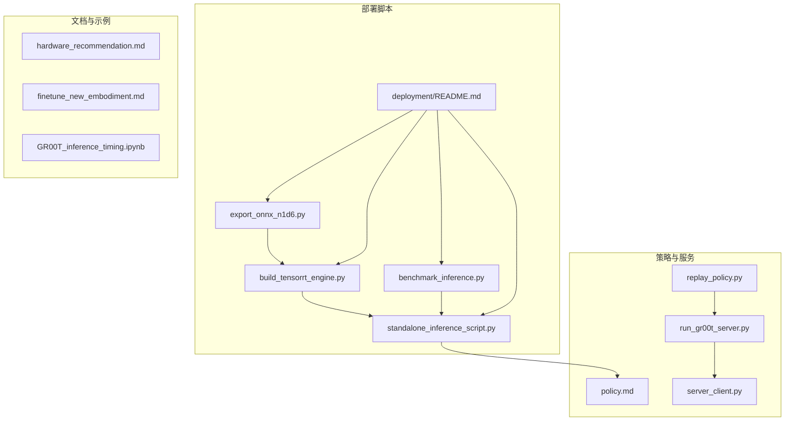
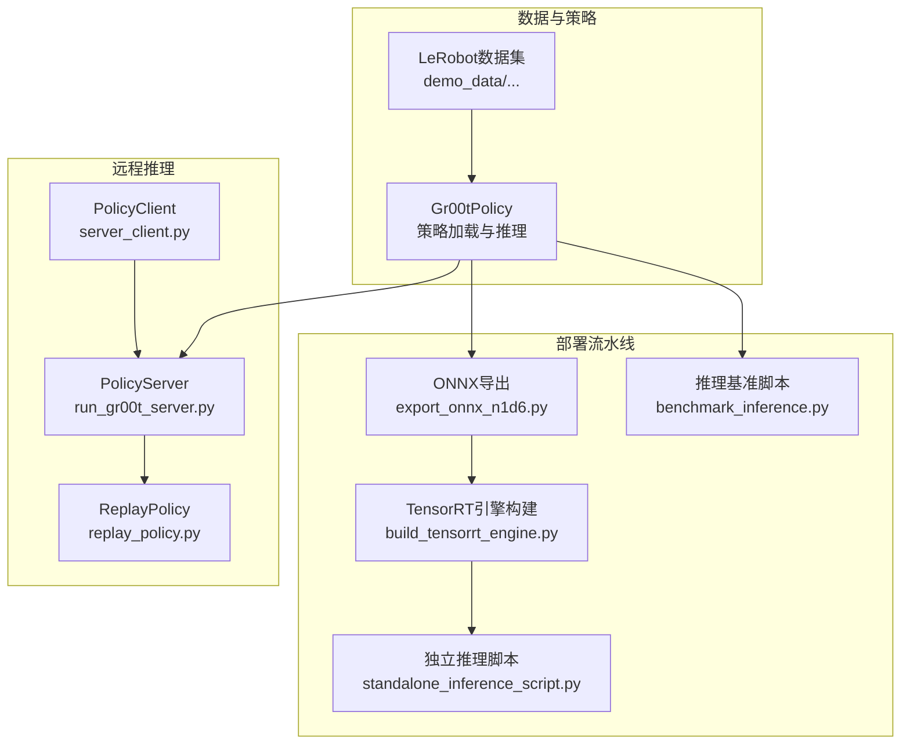
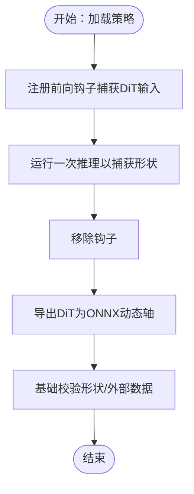
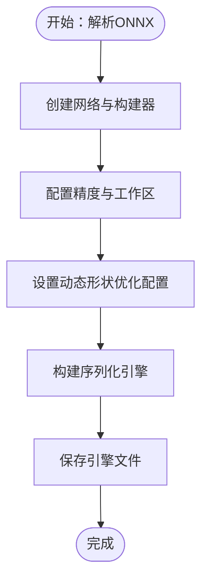
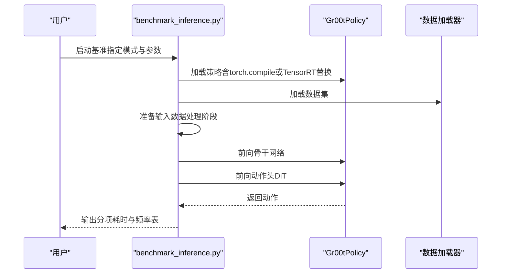
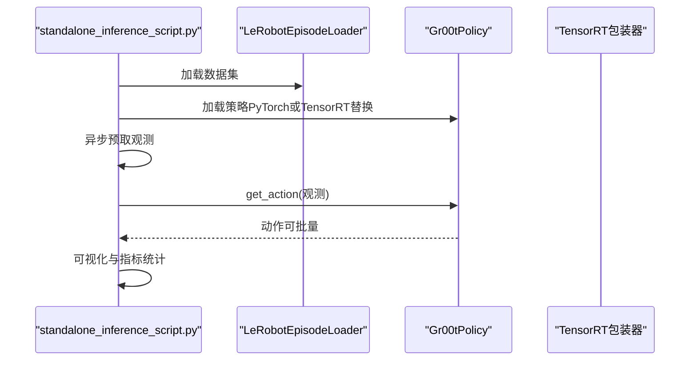
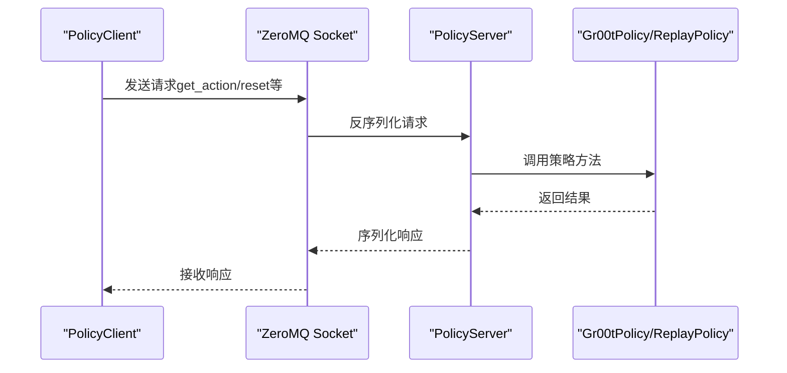
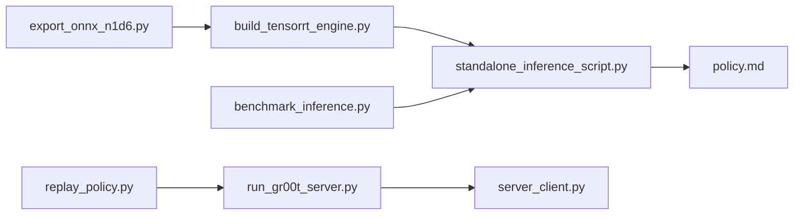

# 部署与优化

<cite>
**本文引用的文件**
- [README.md](file://README.md)
- [hardware_recommendation.md](file://getting_started/hardware_recommendation.md)
- [deployment/README.md](file://scripts/deployment/README.md)
- [build_tensorrt_engine.py](file://scripts/deployment/build_tensorrt_engine.py)
- [export_onnx_n1d6.py](file://scripts/deployment/export_onnx_n1d6.py)
- [benchmark_inference.py](file://scripts/deployment/benchmark_inference.py)
- [standalone_inference_script.py](file://scripts/deployment/standalone_inference_script.py)
- [policy.md](file://getting_started/policy.md)
- [server_client.py](file://gr00t/policy/server_client.py)
- [run_gr00t_server.py](file://gr00t/eval/run_gr00t_server.py)
- [replay_policy.py](file://gr00t/policy/replay_policy.py)
- [finetune_new_embodiment.md](file://getting_started/finetune_new_embodiment.md)
- [GR00T_inference_timing.ipynb](file://scripts/deployment/GR00T_inference_timing.ipynb)
</cite>

## 目录
1. [简介](#简介)
2. [项目结构](#项目结构)
3. [核心组件](#核心组件)
4. [架构总览](#架构总览)
5. [详细组件分析](#详细组件分析)
6. [依赖关系分析](#依赖关系分析)
7. [性能考量](#性能考量)
8. [故障排除指南](#故障排除指南)
9. [结论](#结论)
10. [附录](#附录)

## 简介
本文件面向Isaac-GR00T的部署与优化，围绕“构建TensorRT引擎、导出ONNX模型、推理性能基准测试”三大主题，系统阐述从入门到进阶的完整流程。文档同时覆盖服务器模式（远程推理）、客户端模式（本地轻量调用）与批量推理等部署选项的权衡，帮助初学者快速上手，也为有经验的开发者提供可落地的技术细节与最佳实践。

## 项目结构
本仓库包含训练、评估、推理与部署脚本，以及针对不同机器人平台的示例与配置。与部署优化直接相关的目录与文件如下：
- scripts/deployment：包含ONNX导出、TensorRT引擎构建、推理基准与独立推理脚本
- gr00t/policy：策略接口、服务端/客户端通信、回放策略
- gr00t/eval：推理服务器启动入口
- getting_started：硬件推荐、策略API、微调新体态等文档

图表来源
- [export_onnx_n1d6.py](file://scripts/deployment/export_onnx_n1d6.py#L1-L397)
- [build_tensorrt_engine.py](file://scripts/deployment/build_tensorrt_engine.py#L1-L227)
- [benchmark_inference.py](file://scripts/deployment/benchmark_inference.py#L1-L579)
- [standalone_inference_script.py](file://scripts/deployment/standalone_inference_script.py#L1-L817)
- [deployment/README.md](file://scripts/deployment/README.md#L1-L235)
- [policy.md](file://getting_started/policy.md#L1-L461)
- [server_client.py](file://gr00t/policy/server_client.py#L1-L241)
- [run_gr00t_server.py](file://gr00t/eval/run_gr00t_server.py#L1-L111)
- [replay_policy.py](file://gr00t/policy/replay_policy.py#L1-L403)
- [hardware_recommendation.md](file://getting_started/hardware_recommendation.md#L1-L44)
- [finetune_new_embodiment.md](file://getting_started/finetune_new_embodiment.md#L1-L129)
- [GR00T_inference_timing.ipynb](file://scripts/deployment/GR00T_inference_timing.ipynb#L1-L200)

章节来源
- [README.md](file://README.md#L1-L388)
- [deployment/README.md](file://scripts/deployment/README.md#L1-L235)

## 核心组件
- ONNX导出器：从已加载的策略中捕获DiT输入张量形状，导出DiT子模块为ONNX，支持动态维度以适配不同序列长度。
- TensorRT引擎构建器：解析ONNX，配置精度与优化配置文件，生成GPU特定的TensorRT引擎。
- 推理基准脚本：分别测量数据处理、骨干网络（Eagle VLM）与动作头（DiT）耗时，支持PyTorch eager、torch.compile与TensorRT三种模式。
- 独立推理脚本：统一入口，支持PyTorch与TensorRT两种模式；内置异步预取与批量推理能力。
- 服务器-客户端：基于ZeroMQ的远程推理架构，便于在分布式或边缘场景部署。
- 回放策略：从数据集中回放真实动作，用于开发调试与环境集成验证。

章节来源
- [export_onnx_n1d6.py](file://scripts/deployment/export_onnx_n1d6.py#L1-L397)
- [build_tensorrt_engine.py](file://scripts/deployment/build_tensorrt_engine.py#L1-L227)
- [benchmark_inference.py](file://scripts/deployment/benchmark_inference.py#L1-L579)
- [standalone_inference_script.py](file://scripts/deployment/standalone_inference_script.py#L1-L817)
- [server_client.py](file://gr00t/policy/server_client.py#L1-L241)
- [run_gr00t_server.py](file://gr00t/eval/run_gr00t_server.py#L1-L111)
- [replay_policy.py](file://gr00t/policy/replay_policy.py#L1-L403)

## 架构总览
下图展示了从数据准备到远程推理的整体路径，以及TensorRT优化的关键位置。

图表来源
- [export_onnx_n1d6.py](file://scripts/deployment/export_onnx_n1d6.py#L1-L397)
- [build_tensorrt_engine.py](file://scripts/deployment/build_tensorrt_engine.py#L1-L227)
- [standalone_inference_script.py](file://scripts/deployment/standalone_inference_script.py#L1-L817)
- [benchmark_inference.py](file://scripts/deployment/benchmark_inference.py#L1-L579)
- [run_gr00t_server.py](file://gr00t/eval/run_gr00t_server.py#L1-L111)
- [server_client.py](file://gr00t/policy/server_client.py#L1-L241)
- [replay_policy.py](file://gr00t/policy/replay_policy.py#L1-L403)

## 详细组件分析

### 组件A：ONNX导出（DiT子模块）
- 功能要点
  - 加载策略后，通过前向钩子捕获DiT输入张量形状（如sa_embs、vl_embs、timestep、mask等），确保导出形状与实际推理一致。
  - 使用动态轴设置，支持不同批次大小与序列长度，便于后续TensorRT优化。
  - 导出完成后进行基础校验（文件大小、外部数据文件存在性等），必要时跳过全量校验以避免内存压力。
- 关键参数
  - 模型路径、数据集路径（用于形状捕获）、输出目录、视频后端等。
- 复杂度与性能
  - 导出过程主要受模型规模与动态轴设置影响；建议在具备足够显存的GPU上执行，避免导出失败。

图表来源
- [export_onnx_n1d6.py](file://scripts/deployment/export_onnx_n1d6.py#L34-L356)

章节来源
- [export_onnx_n1d6.py](file://scripts/deployment/export_onnx_n1d6.py#L1-L397)

### 组件B：TensorRT引擎构建
- 功能要点
  - 解析ONNX模型，创建网络与构建器配置。
  - 设置精度（FP32/FP16/BF16/FP8），工作区内存限制，启用详细剖析以便检查层信息。
  - 定义动态形状优化配置（最小/最优/最大），确保不同序列长度下的稳定性能。
  - 序列化并保存引擎文件，记录构建时间与引擎大小。
- 关键参数
  - ONNX路径、引擎保存路径、精度、工作区内存（MB）。
- 复杂度与性能
  - 构建时间与GPU显存密切相关；BF16通常在精度与速度间取得平衡；FP8可能带来更小体积但需谨慎评估精度损失。

图表来源
- [build_tensorrt_engine.py](file://scripts/deployment/build_tensorrt_engine.py#L28-L166)

章节来源
- [build_tensorrt_engine.py](file://scripts/deployment/build_tensorrt_engine.py#L1-L227)

### 组件C：推理基准（组件级耗时测量）
- 功能要点
  - 分别测量数据处理、骨干网络（Eagle VLM）与动作头（DiT）耗时，支持PyTorch eager、torch.compile与TensorRT三种模式。
  - 提供轨迹级与单步级两种基准方式，轨迹级循环遍历同一episode内的多个步，更贴近真实闭环。
  - 输出Markdown表格，包含各设备与模式下的分项耗时与整体频率，便于横向对比。
- 关键参数
  - 模型路径、数据集路径、体态标签、TensorRT引擎路径、迭代次数、预热次数、是否跳过torch.compile基准等。
- 复杂度与性能
  - 数据处理为CPU密集型，需要更多预热；骨干网络与动作头为GPU密集型，受CUDA上下文与JIT编译影响较大。

图表来源
- [benchmark_inference.py](file://scripts/deployment/benchmark_inference.py#L181-L256)
- [standalone_inference_script.py](file://scripts/deployment/standalone_inference_script.py#L607-L800)

章节来源
- [benchmark_inference.py](file://scripts/deployment/benchmark_inference.py#L1-L579)
- [standalone_inference_script.py](file://scripts/deployment/standalone_inference_script.py#L607-L800)

### 组件D：独立推理脚本（PyTorch/TensorRT统一入口）
- 功能要点
  - 支持PyTorch与TensorRT两种模式；PyTorch默认启用torch.compile以提升性能。
  - 内置异步预取（ThreadPoolExecutor），在GPU推理的同时准备下一帧观测，减少等待时间。
  - 提供批量推理能力，支持多环境并行；支持轨迹级评估与可视化。
- 关键参数
  - 模型路径、数据集路径、体态标签、轨迹ID列表、步数、动作时域、推理模式、TensorRT引擎路径、跳过预热步数等。
- 复杂度与性能
  - 异步预取显著降低I/O等待；批量推理提升吞吐；TensorRT在动作头显著提速。

图表来源
- [standalone_inference_script.py](file://scripts/deployment/standalone_inference_script.py#L345-L500)
- [standalone_inference_script.py](file://scripts/deployment/standalone_inference_script.py#L607-L800)

章节来源
- [standalone_inference_script.py](file://scripts/deployment/standalone_inference_script.py#L1-L817)

### 组件E：服务器-客户端（远程推理）
- 功能要点
  - PolicyServer基于ZeroMQ监听请求，注册get_action、reset、get_modality_config等端点。
  - PolicyClient作为轻量客户端，支持ping、kill_server、get_action等操作，适合嵌入到机器人控制或仿真环境。
  - 支持ReplayPolicy回放模式，便于开发调试与验证环境集成。
- 关键参数
  - 主机地址、端口、超时、API令牌、严格模式等。
- 复杂度与性能
  - 网络延迟与消息序列化开销需纳入整体时延考虑；建议在低延迟局域网内部署。

图表来源
- [server_client.py](file://gr00t/policy/server_client.py#L150-L241)
- [run_gr00t_server.py](file://gr00t/eval/run_gr00t_server.py#L53-L111)
- [replay_policy.py](file://gr00t/policy/replay_policy.py#L18-L403)

章节来源
- [server_client.py](file://gr00t/policy/server_client.py#L1-L241)
- [run_gr00t_server.py](file://gr00t/eval/run_gr00t_server.py#L1-L111)
- [replay_policy.py](file://gr00t/policy/replay_policy.py#L1-L403)

### 组件F：策略API与部署选项
- 服务器模式（远程推理）
  - 优点：计算资源与控制解耦，便于扩展与隔离依赖；适合真实机器人或分布式系统。
  - 注意：网络延迟与序列化成本；需保证服务稳定性与安全（令牌校验）。
- 客户端模式（本地轻量）
  - 优点：部署简单，延迟更低；客户端仅依赖少量接口文件。
  - 注意：客户端需满足依赖要求；严格模式有助于早期发现格式问题。
- 批量推理
  - 通过增加batch维度提升吞吐；注意内存占用与序列长度上限。
- 回放策略（ReplayPolicy）
  - 在开发阶段替代真实模型，验证观测格式、动作执行与通信链路。

章节来源
- [policy.md](file://getting_started/policy.md#L181-L386)
- [server_client.py](file://gr00t/policy/server_client.py#L150-L241)
- [run_gr00t_server.py](file://gr00t/eval/run_gr00t_server.py#L53-L111)
- [replay_policy.py](file://gr00t/policy/replay_policy.py#L18-L403)

## 依赖关系分析
- 组件耦合
  - standalone_inference_script.py与benchmark_inference.py共享Gr00tPolicy与数据加载逻辑，便于统一基准与推理路径。
  - export_onnx_n1d6.py与build_tensorrt_engine.py形成“导出-构建-替换”的闭环，确保形状与精度一致性。
  - server_client.py与run_gr00t_server.py构成远程推理基础设施，replay_policy.py作为开发辅助。
- 外部依赖
  - TensorRT、ONNX、ZeroMQ、msgpack等第三方库；CUDA版本与驱动需匹配。
- 潜在环路
  - 当前脚本之间通过函数调用而非循环导入，未见明显环路。

图表来源
- [export_onnx_n1d6.py](file://scripts/deployment/export_onnx_n1d6.py#L1-L397)
- [build_tensorrt_engine.py](file://scripts/deployment/build_tensorrt_engine.py#L1-L227)
- [standalone_inference_script.py](file://scripts/deployment/standalone_inference_script.py#L1-L817)
- [benchmark_inference.py](file://scripts/deployment/benchmark_inference.py#L1-L579)
- [run_gr00t_server.py](file://gr00t/eval/run_gr00t_server.py#L1-L111)
- [server_client.py](file://gr00t/policy/server_client.py#L1-L241)
- [replay_policy.py](file://gr00t/policy/replay_policy.py#L1-L403)

章节来源
- [standalone_inference_script.py](file://scripts/deployment/standalone_inference_script.py#L1-L817)
- [benchmark_inference.py](file://scripts/deployment/benchmark_inference.py#L1-L579)
- [export_onnx_n1d6.py](file://scripts/deployment/export_onnx_n1d6.py#L1-L397)
- [build_tensorrt_engine.py](file://scripts/deployment/build_tensorrt_engine.py#L1-L227)
- [server_client.py](file://gr00t/policy/server_client.py#L1-L241)
- [run_gr00t_server.py](file://gr00t/eval/run_gr00t_server.py#L1-L111)
- [replay_policy.py](file://gr00t/policy/replay_policy.py#L1-L403)

## 性能考量
- 硬件推荐
  - 训练与推理：RTX Pro服务器（Blackwell GPU）、DGX B300（Blackwell Ultra GPU）等高显存平台；边缘部署可选Jetson AGX Thor。
- 模式选择
  - torch.compile：首次编译开销大，后续稳定加速；适合CPU侧预热与GPU侧JIT优化。
  - TensorRT：动作头（DiT）显著提速，适合实时性要求高的场景；需为不同GPU架构重建引擎。
- 数据处理
  - 视频解码与数据拼装为CPU瓶颈，建议使用高效后端（如torchcodec）并配合异步预取。
- 批量与时域
  - 增大批量与动作时域可提升吞吐，但会增加显存占用；需根据硬件能力权衡。
- 基准与可视化
  - 使用benchmark_inference.py与GR00T_inference_timing.ipynb进行组件级与端到端分析，定位瓶颈。

章节来源
- [hardware_recommendation.md](file://getting_started/hardware_recommendation.md#L1-L44)
- [deployment/README.md](file://scripts/deployment/README.md#L136-L184)
- [GR00T_inference_timing.ipynb](file://scripts/deployment/GR00T_inference_timing.ipynb#L1-L200)

## 故障排除指南
- TensorRT引擎构建失败
  - 显存不足：尝试降低工作区内存（--workspace）或降低精度。
  - CUDA与TensorRT版本不匹配：确保版本兼容。
  - 动态形状未正确设置：核对最小/最优/最大形状与输入名称。
- ONNX导出失败
  - 检查模型能否正常加载；确认数据集路径有效且包含至少一个轨迹。
- 远程推理连接异常
  - 校验主机地址、端口与防火墙；确认API令牌（如有）正确；使用ping检测连通性。
- 回放策略报错
  - 确认观测格式与模态配置一致；检查语言键、视频通道与状态维度；确保执行时域不超过模型动作时域。

章节来源
- [deployment/README.md](file://scripts/deployment/README.md#L189-L202)
- [build_tensorrt_engine.py](file://scripts/deployment/build_tensorrt_engine.py#L134-L146)
- [export_onnx_n1d6.py](file://scripts/deployment/export_onnx_n1d6.py#L347-L350)
- [server_client.py](file://gr00t/policy/server_client.py#L172-L178)
- [replay_policy.py](file://gr00t/policy/replay_policy.py#L117-L254)

## 结论
通过“ONNX导出—TensorRT构建—统一推理入口—基准分析—远程部署”的完整流水线，Isaac-GR00T可在多种硬件与部署场景下实现高效稳定的推理。PyTorch eager与torch.compile适合研究与快速迭代，TensorRT则在实时性与吞吐方面具有显著优势。结合服务器-客户端架构与回放策略，可实现从开发调试到生产部署的平滑过渡。

## 附录
- 快速开始命令示例（参考自项目文档）
  - 启动推理服务器（示例）
    - uv run python gr00t/eval/run_gr00t_server.py --embodiment-tag NEW_EMBODIMENT --model-path <CHECKPOINT_PATH> --device cuda:0 --host 0.0.0.0 --port 5555
  - 独立推理（示例）
    - uv run python scripts/deployment/standalone_inference_script.py --model-path nvidia/GR00T-N1.6-3B --dataset-path demo_data/gr1.PickNPlace --embodiment-tag GR1 --traj-ids 0 1 2 --inference-mode pytorch --action-horizon 8
  - ONNX导出（示例）
    - python scripts/deployment/export_onnx_n1d6.py --model-path nvidia/GR00T-N1.6-3B --dataset-path /path/to/dataset --embodiment-tag GR1 --output-dir ./groot_n1d6_onnx
  - TensorRT引擎构建（示例）
    - python scripts/deployment/build_tensorrt_engine.py --onnx ./groot_n1d6_onnx/dit_model.onnx --engine ./groot_n1d6_onnx/dit_model_bf16.trt --precision bf16
  - 推理基准（示例）
    - python scripts/deployment/benchmark_inference.py --model-path nvidia/GR00T-N1.6-3B --dataset-path demo_data/gr1.PickNPlace --trt_engine_path ./groot_n1d6_onnx/dit_model_bf16.trt

章节来源
- [README.md](file://README.md#L140-L180)
- [deployment/README.md](file://scripts/deployment/README.md#L27-L80)