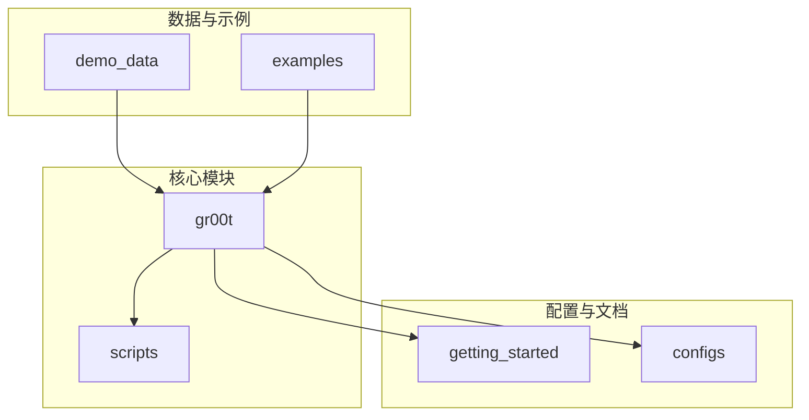
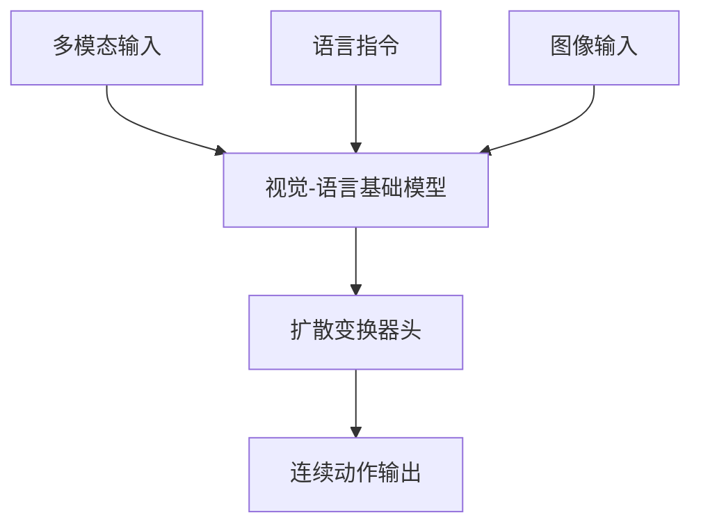
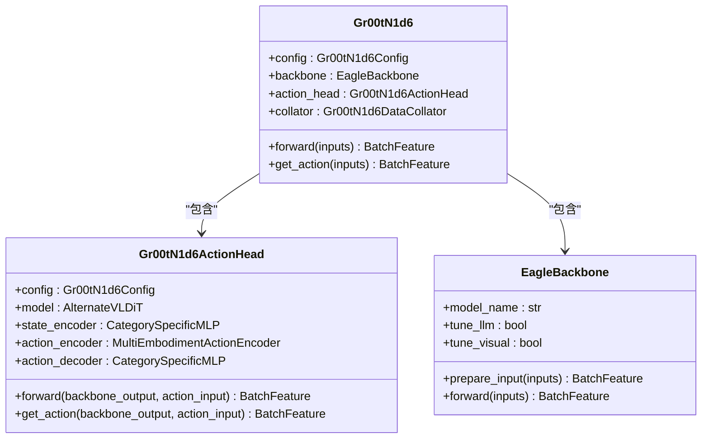
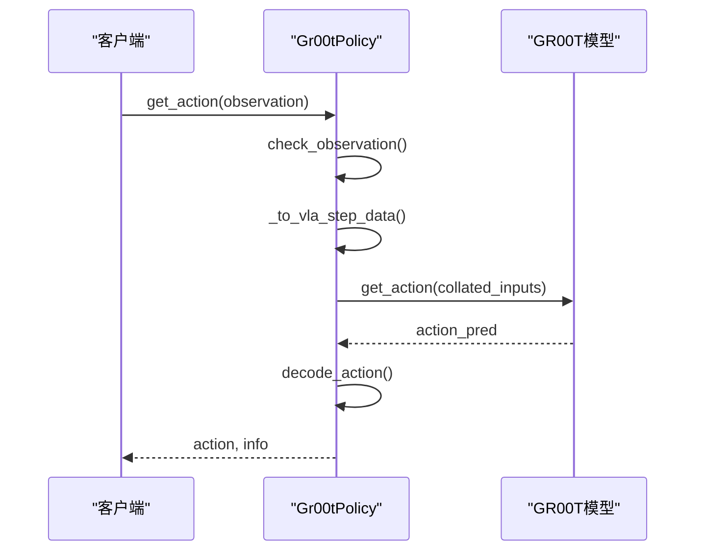
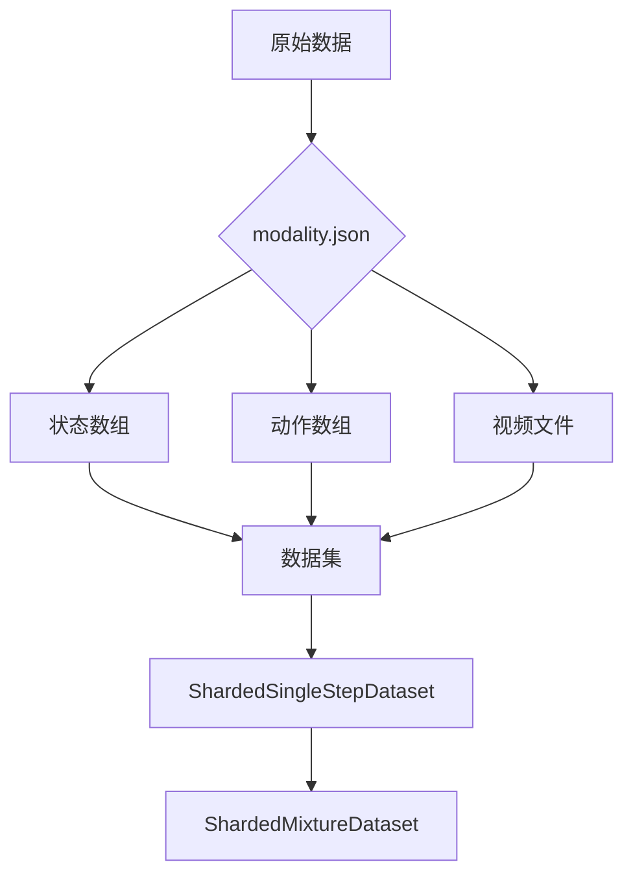
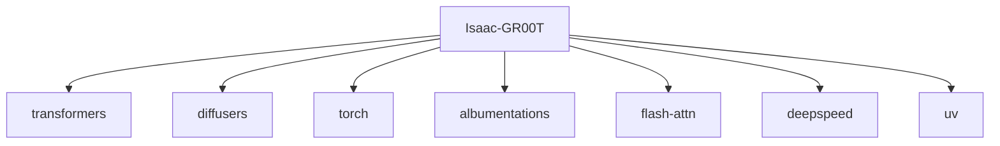

# 项目概述

<cite>
**本文档引用的文件**   
- [README.md](file://README.md)
- [pyproject.toml](file://pyproject.toml)
- [gr00t_n1d6.py](file://gr00t/model/gr00t_n1d6/gr00t_n1d6.py)
- [gr00t_policy.py](file://gr00t/policy/gr00t_policy.py)
- [factory.py](file://gr00t/data/dataset/factory.py)
- [gr00t_n1d6.py](file://gr00t/configs/model/gr00t_n1d6.py)
- [run_gr00t_server.py](file://gr00t/eval/run_gr00t_server.py)
- [launch_finetune.py](file://gr00t/experiment/launch_finetune.py)
- [policy.md](file://getting_started/policy.md)
- [data_preparation.md](file://getting_started/data_preparation.md)
- [modality.json](file://examples/LIBERO/modality.json)
- [interfaces.py](file://gr00t/data/interfaces.py)
- [server_client.py](file://gr00t/policy/server_client.py)
</cite>

## 目录
1. [引言](#引言)
2. [项目结构](#项目结构)
3. [核心组件](#核心组件)
4. [架构概述](#架构概述)
5. [详细组件分析](#详细组件分析)
6. [依赖分析](#依赖分析)
7. [性能考虑](#性能考虑)
8. [故障排除指南](#故障排除指南)
9. [结论](#结论)

## 引言
NVIDIA Isaac GR00T N1.6 是一个开放的视觉-语言-动作（VLA）模型，专为通用人形机器人技能设计。该跨实体模型接受多模态输入（包括语言和图像），以在多样化环境中执行操作任务。GR00T N1.6 在包含双臂、半人形和广泛人形数据集的多样化机器人数据混合体上进行训练，可通过后训练适应特定实体、任务和环境。本项目旨在为机器人研究人员和专业人士提供一个强大的基础模型，用于机器人控制、微调和部署。

## 项目结构
Isaac-GR00T 项目具有清晰的模块化结构，支持从数据准备到模型部署的完整工作流程。主要目录包括 `demo_data`（演示数据）、`docker`（容器化设置）、`examples`（各种机器人平台的示例）、`external_dependencies`（外部依赖）、`getting_started`（入门指南）、`gr00t`（核心模型和策略代码）、`scripts`（部署和评估脚本）等。

**图源**
- [README.md](file://README.md#L1-L388)

**本节源**
- [README.md](file://README.md#L1-L388)
- [pyproject.toml](file://pyproject.toml#L1-L100)

## 核心组件
项目的核心组件包括预训练的 VLA 模型、用于微调的配置系统、用于推理的策略 API 以及用于评估的服务器-客户端架构。模型架构结合了视觉-语言基础模型和去噪连续动作的扩散变换器头。用户可以使用提供的脚本验证预训练模型的零样本性能，或使用自定义数据对模型进行微调。

**本节源**
- [README.md](file://README.md#L26-L45)
- [gr00t_n1d6.py](file://gr00t/model/gr00t_n1d6/gr00t_n1d6.py#L1-L540)

## 架构概述
GR00T N1.6 的神经网络架构由一个视觉-语言基础模型和一个扩散变换器头组成，后者对连续动作进行去噪。该架构支持灵活的分辨率，并能以原始宽高比对图像进行编码，无需填充。模型使用 2 倍于 N1.5 的 DiT（32 层 vs 16 层），并移除了 N1.5 的后 VLM 4 层变换器适配器。

**图源**
- [README.md](file://README.md#L30-L34)

**本节源**
- [README.md](file://README.md#L30-L34)
- [gr00t_n1d6.py](file://gr00t/configs/model/gr00t_n1d6.py#L1-L164)

## 详细组件分析

### 模型组件分析
GR00T N1.6 模型由 `Gr00tN1d6` 类实现，该类继承自 HuggingFace 的 `PreTrainedModel`。它包含一个 `EagleBackbone` 用于视觉-语言编码，以及一个 `Gr00tN1d6ActionHead` 用于动作预测。动作头使用流匹配扩散策略，通过去噪过程生成动作。

#### 模型类图

**图源**
- [gr00t_n1d6.py](file://gr00t/model/gr00t_n1d6/gr00t_n1d6.py#L411-L540)
- [gr00t_n1d6.py](file://gr00t/model/gr00t_n1d6/gr00t_n1d6.py#L19-L120)

**本节源**
- [gr00t_n1d6.py](file://gr00t/model/gr00t_n1d6/gr00t_n1d6.py#L1-L540)

### 策略组件分析
`Gr00tPolicy` 类是推理的核心，负责加载模型、处理观察结果并生成动作。它期望观察结果为包含视频、状态和语言模态的嵌套字典，并返回准备执行的动作。`Gr00tSimPolicyWrapper` 提供了一个包装器，用于与现有的 GR00T 模拟环境兼容。

#### 策略序列图

**图源**
- [gr00t_policy.py](file://gr00t/policy/gr00t_policy.py#L46-L674)
- [policy.md](file://getting_started/policy.md#L1-L461)

**本节源**
- [gr00t_policy.py](file://gr00t/policy/gr00t_policy.py#L46-L674)
- [policy.md](file://getting_started/policy.md#L1-L461)

### 数据处理组件分析
数据处理由 `DatasetFactory` 和 `BaseProcessor` 类管理。`DatasetFactory` 负责构建训练数据集，而 `BaseProcessor` 负责将原始数据转换为模型输入。`modality.json` 文件定义了状态和动作模态的元数据，允许对连接的数组进行细粒度分割。

#### 数据处理流程图

**图源**
- [factory.py](file://gr00t/data/dataset/factory.py#L13-L79)
- [interfaces.py](file://gr00t/data/interfaces.py#L10-L128)
- [data_preparation.md](file://getting_started/data_preparation.md#L1-L156)

**本节源**
- [factory.py](file://gr00t/data/dataset/factory.py#L13-L79)
- [interfaces.py](file://gr00t/data/interfaces.py#L10-L128)
- [data_preparation.md](file://getting_started/data_preparation.md#L1-L156)

## 依赖分析
项目依赖于多个第三方库，如 `transformers`、`diffusers`、`torch` 等，这些在 `pyproject.toml` 文件中定义。微调和推理需要 CUDA 支持，推荐使用 RTX PRO 服务器、DGX 或 Jetson AGX Thor。项目使用 `uv` 进行快速、可重现的依赖管理。

**图源**
- [pyproject.toml](file://pyproject.toml#L1-L100)

**本节源**
- [pyproject.toml](file://pyproject.toml#L1-L100)
- [README.md](file://README.md#L100-L116)

## 性能考虑
GR00T-N1.6-3B 的推理时序（4 次去噪步骤，单视图）在不同设备上有所不同，例如 RTX 5090 上为 27.3 Hz，H100 上为 26.3 Hz，RTX 4090 上为 22.8 Hz，Thor 上为 9.5 Hz。微调建议使用 1 个 H100 节点或 L40 节点以获得最佳性能。用户可能会观察到跨运行的训练方差，即使使用相同的配置、种子和 dropout 设置。

**本节源**
- [README.md](file://README.md#L170-L178)
- [README.md](file://README.md#L231-L240)

## 故障排除指南
在开发新环境集成或调试推理循环时，可以使用 `ReplayPolicy` 来重放现有数据集中的记录动作。这有助于验证环境设置、观察格式和动作执行是否正确，而无需训练模型。此外，启用严格模式（`strict=True`）有助于在开发过程中捕获输入/输出验证错误。

**本节源**
- [policy.md](file://getting_started/policy.md#L276-L367)
- [run_gr00t_server.py](file://gr00t/eval/run_gr00t_server.py#L73-L88)

## 结论
Isaac-GR00T 项目提供了一个全面的框架，用于开发和部署通用人形机器人视觉-语言-动作模型。通过预训练模型、微调和部署，研究人员可以利用此框架实现机器人任务。项目强调了通过微调定制机器人行为的能力，并提供了详细的文档和示例来支持这一目标。