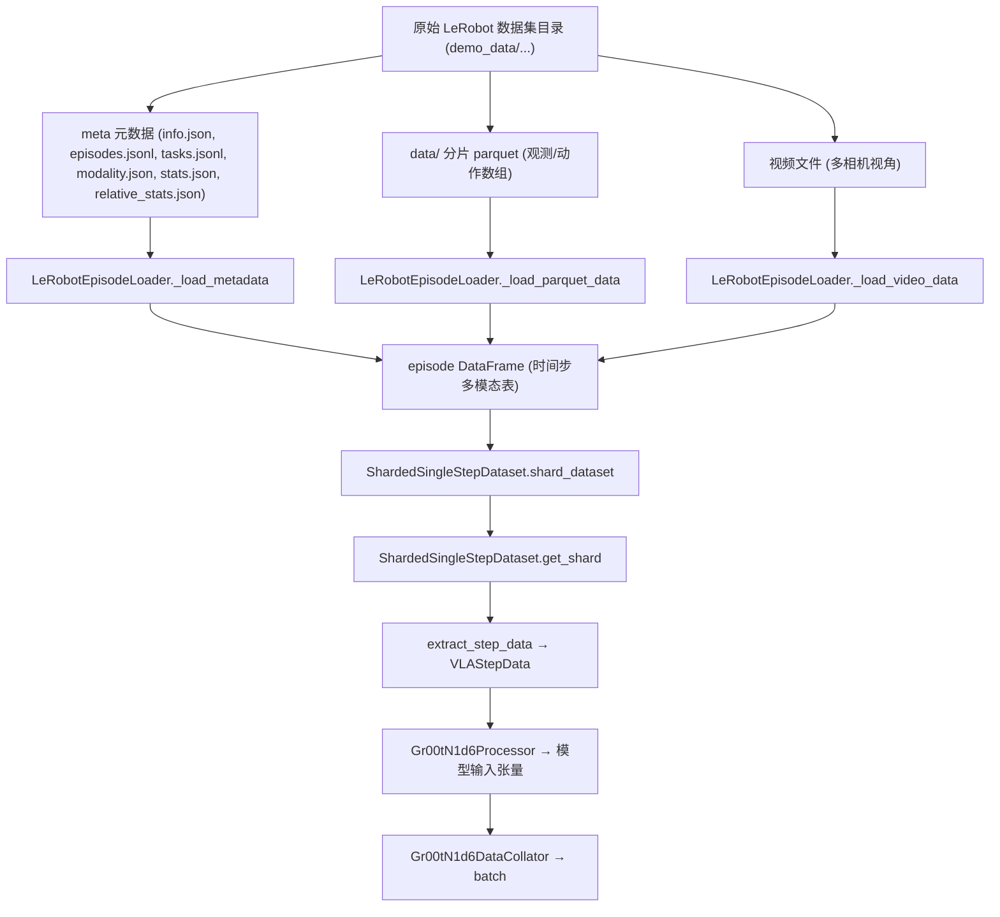

## 数据处理流水线总览（dataset → processor → dataloader）

本文说明 Isaac-GR00T 中，从磁盘上存储的 LeRobot 格式数据（`demo_data/`）和元数据（`info.json`、`modality.json`、`stats.json` 等），如何一步步经过 **dataset → processor → dataloader**，最终变成可直接送入 Gr00tN1d6 模型的 **训练 batch**。

### 总体数据流图



整体链路可以概括为：

1. **磁盘上的原始数据 + 元数据**  
   - Parquet: `demo_data/cube_to_bowl_5/data/chunk-000/episode_*.parquet`  
   - Meta: `demo_data/cube_to_bowl_5/meta/{info.json, episodes.jsonl, modality.json, stats.json, relative_stats.json, tasks.jsonl}`
2. **Episode 级加载**：`[LeRobotEpisodeLoader](file:///c:/Users/owen/Documents/VsCode/Isaac-GR00T/Isaac-GR00T/gr00t/data/dataset/lerobot_episode_loader.py)` 把单个 episode 加载为按时间步排列的 `pandas.DataFrame`。
3. **步级切片 + 分片（shard）**：`[ShardedSingleStepDataset](file:///c:/Users/owen/Documents/VsCode/Isaac-GR00T/Isaac-GR00T/gr00t/data/dataset/sharded_single_step_dataset.py)` 把 episode 打散成单步数据，并均匀划分到多个 shard 中。
4. **多数据集混合 + 统计合并**：`[DatasetFactory](file:///c:/Users/owen/Documents/VsCode/Isaac-GR00T/Isaac-GR00T/gr00t/data/dataset/factory.py)` + `[ShardedMixtureDataset](file:///c:/Users/owen/Documents/VsCode/Isaac-GR00T/Isaac-GR00T/gr00t/data/dataset/sharded_mixture_dataset.py)`，支持多数据集按权重混合，并合并统计量。
5. **Processor（Gr00tN1d6 专用）**：`[Gr00tN1d6Processor](file:///c:/Users/owen/Documents/VsCode/Isaac-GR00T/Isaac-GR00T/gr00t/model/gr00t_n1d6/processing_gr00t_n1d6.py)` 对单步的多模态数据做归一化、图像增强、文本正规化，并组织好输入张量和 `vlm_content`。
6. **DataCollator + DataLoader**：`[Gr00tN1d6DataCollator](file:///c:/Users/owen/Documents/VsCode/Isaac-GR00T/Isaac-GR00T/gr00t/model/gr00t_n1d6/processing_gr00t_n1d6.py)` 作为 `DataLoader` 的 `collate_fn`，把多个样本对齐打包成一个 PyTorch batch。

最终交给模型的 batch 结构是一个 `BatchFeature(data={"inputs": batch_dict})`，其中 `batch_dict` 包含：

- **视觉+语言**：`input_ids`、`pixel_values`、`attention_mask` 等（由 VLM processor 生成）
- **机器人状态/动作**：`state`、`action`、`action_mask`
- **具身 ID**：`embodiment_id`（用于选择对应 projector / 动作头）

---

## 1. 原始数据与元数据结构（demo_data）

以 `demo_data/cube_to_bowl_5` 为例，目录结构简化为：

- **数据文件**：
  - `data/chunk-000/episode_000000.parquet` 等：每个 parquet 存一条 episode 的逐帧数据
- **元数据 meta/**：
  - `info.json`
  - `episodes.jsonl`
  - `modality.json`
  - `stats.json`
  - `relative_stats.json`
  - `tasks.jsonl`

### 1.1 info.json：数据整体配置

文件：`demo_data/cube_to_bowl_5/meta/info.json`

- **`data_path`**: `"data/chunk-{episode_chunk:03d}/episode_{episode_index:06d}.parquet"`  
  用于根据 episode 索引拼出 parquet 路径。
- **`video_path`**: `"videos/chunk-{episode_chunk:03d}/{video_key}/episode_{episode_index:06d}.mp4"`  
  描述多相机视频的存储路径模板。
- **`features`**：原始数组的布局说明，例如：
  - `"action"`：6 维关节 + gripper 动作
  - `"observation.state"`：6 维关节 + gripper 状态
  - `"observation.images.front"` / `"observation.images.wrist"`：视频帧尺寸、编码格式

这些信息告诉 loader：

- **parquet 存储位置**：一个 episode 的表格数据在哪个 parquet 文件里；
- **列的 shape/dtype**：如何解释每一列；
- **视频文件布局**：视频在磁盘上的路径分布。

### 1.2 episodes.jsonl：每条轨迹的长度与任务信息

文件：`demo_data/cube_to_bowl_5/meta/episodes.jsonl`

每一行是一条 episode 的元信息，例如：

```json
{"episode_index": 0, "tasks": ["cube into yellow bowl"], "length": 568}
```

- **`episode_index`**：对应 parquet / 视频 文件中的 episode 索引；
- **`length`**：该 episode 的原始时间步长度；
- **`tasks`**：自然语言任务描述列表，用于语言模态或校验。

### 1.3 modality.json：从大数组切成“关节组”

文件：`demo_data/cube_to_bowl_5/meta/modality.json`

示例：

```json
"state": {
  "single_arm": {"start": 0, "end": 5},
  "gripper": {"start": 5, "end": 6}
},
"action": {
  "single_arm": {"start": 0, "end": 5},
  "gripper": {"start": 5, "end": 6}
},
"video": {
  "front": {"original_key": "observation.images.front"},
  "wrist": {"original_key": "observation.images.wrist"}
},
"annotation": {
  "human.task_description": {"original_key": "task_index"}
}
```

- **state / action**：告诉 loader 如何从 `observation.state` / `action` 这类大数组切出子向量：  
  - `single_arm` 对应前 5 维关节角；  
  - `gripper` 对应第 6 维 gripper；
- **video**：把 `observation.images.front` 映射为逻辑上的 `video.front` 视角；
- **annotation**：将 `task_index` 解释为 `human.task_description`，后续再映射成真正的文本指令。

### 1.4 stats.json & relative_stats.json：归一化所需统计量

文件：

- `stats.json`：
  - `"action"`：动作每一维的 mean/std/min/max/q01/q99
  - `"observation.state"`：状态每一维的统计量
- `relative_stats.json`：
  - 按关节组（如 `single_arm`）和时间 horizon 组织的 **相对动作统计**，用于相对动作表示下的归一化。

这些统计量会被上层的 **StateActionProcessor** 使用，完成状态/动作的归一化，保证不同数据集、不同具身之间的数值分布可控。

### 1.5 tasks.jsonl：任务索引到自然语言

文件：`demo_data/cube_to_bowl_5/meta/tasks.jsonl`

例如：

```json
{"task_index": 0, "task": "cube into yellow bowl"}
```

- **作用**：将 `parquet` / `episodes.jsonl` / `modality.json` 中使用的 `task_index` 映射为可读的自然语言指令；
- **在 loader 中**：用于生成 `language.annotation.human.task_description` 这类字符串列。

### 1.6 原始数据文件：parquet 与视频

- **Parquet 数据（`data_path` 模式）**  
  - 存放数值模态：state 数组、action 数组、任务 id 等。  
  - 通过 `[LeRobotEpisodeLoader._load_parquet_data](file:///c:/Users/owen/Documents/VsCode/Isaac-GR00T/Isaac-GR00T/gr00t/data/dataset/lerobot_episode_loader.py)` 读取：

    ```python
    chunk_idx = episode_index // self.chunk_size
    parquet_filename = self.data_path_pattern.format(
        episode_chunk=chunk_idx, episode_index=episode_index
    )
    parquet_path = self.dataset_path / parquet_filename
    original_df = pd.read_parquet(parquet_path)
    ```

- **视频文件（`video_path` 模式）**  
  - 按相机视角（如 `front`、`wrist`、`ego_view` 等）保存。  
  - 通过 `_load_video_data(episode_index, indices)` 解码：

    ```python
    video_filename = self.video_path_pattern.format(
        episode_chunk=chunk_idx, video_key=original_key, episode_index=episode_index
    )
    video_path = self.dataset_path / video_filename
    frames = get_frames_by_indices(str(video_path), indices, ...)
    ```

---

## 2. Episode 级加载：LeRobotEpisodeLoader

代码：`[LeRobotEpisodeLoader](file:///c:/Users/owen/Documents/VsCode/Isaac-GR00T/Isaac-GR00T/gr00t/data/dataset/lerobot_episode_loader.py)`

### 2.1 初始化：读取所有 meta 信息

构造函数：

```python
LeRobotEpisodeLoader(dataset_path, modality_configs, video_backend="torchcodec", ...)
```

内部主要做了：

1. **`_load_metadata()`**：
   - 读取 `info.json` → `self.info_meta`
   - 读取 `episodes.jsonl` → `self.episodes_metadata`
   - 读取 `tasks.jsonl` → `self.tasks_map`（`task_index` → 文本）
   - 读取 `modality.json` → `self.modality_meta`
   - 读取 `stats.json` & `relative_stats.json` → `self.stats`
2. 从 `info.json` 中提取：
   - `data_path` 模板 → 后续拼 parquet 路径
   - `video_path` 模板 → 后续按相机视角拼视频路径
   - `chunks_size`、`fps` 等基础参数
3. 预计算每条 episode 的原始长度：
   - `get_episode_lengths()` 读取 `self.episodes_metadata` 中的 `length` 字段。

### 2.2 从 meta + parquet 得到单条 episode 的 DataFrame

关键函数：`_load_parquet_data(episode_index)`：

1. 根据 `episode_index` 和 `chunks_size`，利用 `info.json` 中的 `data_path` 模板拼出 parquet 路径；
2. 读入原始 `DataFrame`：包含 `observation.state`、`action`、`task_index` 等列；
3. 处理 **语言模态**：
   - 若 `modality_configs["language"].modality_keys` 中包含 `annotation.xxx`：
     - 用 `modality.json` 的 `"annotation"` 段查 `original_key`（如 `task_index`）；
     - 利用 `self.tasks_map` 把 `task_index` 映射为任务描述文本；
     - 写入新列 `language.annotation.xxx`，内容是字符串。
4. 处理 **state/action 模态**：
   - 对 `modality_type in ["state", "action"]`：
     - 从 `modality.json[modality_type]` 中读出 `start` / `end` / `original_key`；
     - 调用 `_extract_joint_groups`：从原始数组列中 slice 出子向量；
     - 生成新列：`state.single_arm`、`state.gripper`、`action.single_arm`、`action.gripper` 等，每个单元是 `np.ndarray`。

返回的 `loaded_df` 是一个 **按时间步排列** 的 DataFrame：

- **行**：时间步 t
- **列**：
  - 数值模态：`state.*`、`action.*` 等（单元为 `np.ndarray`）
  - 语言模态：`language.xxx`（单元为字符串）

### 2.3 单个 episode DataFrame 的结构与 __getitem__ 流程

`LeRobotEpisodeLoader.__getitem__(idx)` 会在 `_load_parquet_data` 的基础上，进一步注入语言与视频：

```python
def __getitem__(self, idx: int) -> pd.DataFrame:
    episode_meta = self.episodes_metadata[idx]
    episode_id = episode_meta["episode_index"]
    nominal_length = episode_meta["length"]

    # 1. 加载 parquet 数值数据
    df = self._load_parquet_data(episode_id)

    # 2. 若配置 language，则用 meta 生成/替换逐帧文本
    if "language" in self.modality_configs:
        lang_key = self.modality_configs["language"].modality_keys[0]
        if lang_key in LANG_KEYS:  # "task" 或 "sub_task"
            new_languages = self.create_language_from_meta(episode_meta, len(df), lang_key)
            df["language." + lang_key] = new_languages

    # 3. 对齐 episode 长度
    actual_length = min(len(df), nominal_length)
    df = df.iloc[:actual_length]

    # 4. 同步解码视频帧并写入 video.xxx 列
    video_data = self._load_video_data(episode_id, np.arange(actual_length))
    for key in video_data.keys():
        df[f"video.{key}"] = [frame for frame in video_data[key]]

    return df
```

此时得到的 DataFrame 可以理解为：

- **行（index）**：时间步 `t = 0, 1, ..., T-1`；
- **列（columns）**：按照 `"模态.键"` 命名，例如：
  - `"state.single_arm"`：手臂状态向量，单元格是 `np.ndarray(shape=(state_dim,))`；
  - `"action.single_arm"`：手臂动作向量；
  - `"language.task"` 或 `"language.annotation.human.task_description"`：文本字符串；
  - `"video.front"` / `"video.wrist"`：某一视角的图像帧（`np.ndarray` 或 PIL Image）。

一个简化示意表：

| **t** | **state.single_arm**         | **action.single_arm**        | **language.task**          | **video.front** |
|------:|-----------------------------|------------------------------|----------------------------|-----------------|
| 0     | `[0.1, 0.2, 0.3, ...]`      | `[0.15, 0.25, 0.35, ...]`    | "cube into yellow bowl"   | Image / ndarray |
| 1     | `[0.12, 0.22, 0.32, ...]`   | `[0.17, 0.27, 0.37, ...]`    | "cube into yellow bowl"   | Image / ndarray |
| ...   | ...                         | ...                          | ...                        | ...             |

### 2.4 语言与视频模态构造细节

- **语言模态：`create_language_from_meta`**  
  - `LANG_KEYS = ["task", "sub_task"]`；
  - 如果配置的是 `"task"`：从 `episode_meta["tasks"]` 中随机选一个任务文本，扩展为长度 `nframes` 的同一字符串列表；
  - 如果是 `"sub_task"`：使用 `sub_tasks` 中记录的起止时间段，将子任务文字分配到时间轴上，并按动作 horizon 做平滑。

- **视频模态：`_load_video_data`**  
  - 根据 `episode_index` 和 `video_path` 模板构造视频文件路径；
  - 根据 `modality_configs["video"].modality_keys` 逐视角解码：

    ```python
    image_keys = self.modality_configs["video"].modality_keys
    for image_key in image_keys:
        original_key = self.modality_meta["video"][image_key].get(
            "original_key", f"observation.images.{image_key}"
        )
        video_filename = self.video_path_pattern.format(
            episode_chunk=chunk_idx, video_key=original_key, episode_index=episode_index
        )
        video_path = self.dataset_path / video_filename
        video_data[image_key] = get_frames_by_indices(
            str(video_path), indices, video_backend=self.video_backend, ...
        )
    ```

  - 在 `__getitem__` 中，将解码出的帧按时间步写入 `video.xxx` 列。

---

## 3. ModalityConfig 与关节组切片（dataset 视角）

`ModalityConfig` 定义在 `[ModalityConfig](file:///c:/Users/owen/Documents/VsCode/Isaac-GR00T/Isaac-GR00T/gr00t/data/types.py)`，是 dataset & processor 之间的共同约定：

- **`delta_indices`**：时间维度上相对于 base index 的偏移列表（如 `[0]` 或 `list(range(16))`）。
- **`modality_keys`**：该模态下要加载的键名列表（如 `"single_arm"`, `"gripper"`）。

在 **dataset 侧**：

- `LeRobotEpisodeLoader` 只用 `modality_keys` 决定“从原始大数组中切出哪些关节组/视角”，不关心 horizon；
- `_extract_joint_groups` 利用 `modality.json` 中的 `start/end/original_key` 切片：

  ```python
  def _extract_joint_groups(self, df, joint_groups, modality_type="state"):
      modality_info = self.modality_meta.get(modality_type, {})
      joint_data = pd.DataFrame()
      for group_name in joint_groups:
          group_info = modality_info[group_name]
          start_idx = group_info["start"]
          end_idx = group_info["end"]
          original_key = group_info.get("original_key", DEFAULT_COLUMN_NAMES[modality_type])
          if isinstance(df[original_key].iloc[0], np.ndarray):
              joint_data[group_name] = df[original_key].map(lambda x: x[start_idx:end_idx])
          else:
              joint_data[group_name] = df[original_key]
      return joint_data
  ```

在 **processor 侧**（见下文 Gr00tN1d6Processor）：

- 同一个 `ModalityConfig` 中的 `delta_indices` 才真正决定“以当前步为中心取多少帧/多少步的动作序列”。

这样 dataset 和 processor 通过同一份 `modality_configs`，分别约定了 **“取哪些键”** 和 **“如何在时间维度上取帧”**。

---

## 4. 步级切片与分片：ShardedSingleStepDataset

代码：`[ShardedSingleStepDataset](file:///c:/Users/owen/Documents/VsCode/Isaac-GR00T/Isaac-GR00T/gr00t/data/dataset/sharded_single_step_dataset.py)`

### 4.1 VLAStepData：单步多模态数据结构

定义在 `[VLAStepData](file:///c:/Users/owen/Documents/VsCode/Isaac-GR00T/Isaac-GR00T/gr00t/data/types.py)`：

- **`images`**: `dict[str, list[np.ndarray]]`，每个视角 → 多帧（用于 temporal stacking）；
- **`states`**: `dict[str, np.ndarray]`，每个关节组 → 状态数组；
- **`actions`**: `dict[str, np.ndarray]`，每个关节组 → 动作数组（通常是 horizon×dim）；
- **`text`**: 语言指令字符串；
- **`embodiment`**: 具身标签 `EmbodimentTag`。

这是 **dataset → processor** 之间约定的单步数据载体。

### 4.2 extract_step_data：从 episode DataFrame 抽取一个时间步

函数：`extract_step_data(episode_data, step_index, modality_configs, embodiment_tag, allow_padding=False)`：

1. 对每个模态（`video` / `state` / `action` / `language`）：
   - 根据 `ModalityConfig.delta_indices` 计算要采样的时间步索引，例如：
     - `delta_indices = [0]`：只取当前步；
     - `delta_indices = [0, 1, ..., 15]`：以当前步为起点，取 16 步动作序列；
   - 如果 `allow_padding=True`，越界索引会被 clamp 到合法范围。
2. 对每个 key，例如 `state.single_arm`：
   - 从 `episode_data[f"state.single_arm"]` 中按 `indices_to_load` 取出多个时间步；
   - 对 `state` / `action`：把多步堆叠成 `np.vstack(...)` 数组；
   - 对 `video` / `language`：保持 Python 列表形式。
3. 把得到的字典打包成一个 `VLAStepData`：
   - `images`：每个视角对应一个帧列表（`np.ndarray`，H×W×C）；
   - `states` / `actions`：关节组名 → ndarray；
   - `text`：从语言模态中取出的字符串；
   - `embodiment`：构造时传入的 `EmbodimentTag`。

### 4.3 ShardedSingleStepDataset：把所有时间步均匀划分到多个 shard

构造函数核心逻辑：

1. **创建 Episode Loader**：

   ```python
   self.episode_loader = LeRobotEpisodeLoader(dataset_path, modality_configs, ...)
   ```

2. **计算动作 horizon**：

   ```python
   action_delta_indices = modality_configs["action"].delta_indices
   self.action_horizon = max(action_delta_indices) - min(action_delta_indices) + 1
   ```

3. **按 episode 生成 shard**（`shard_dataset()`）：

- 打乱所有 `episode_index`；
- 对每条 episode：
  - 计算其 **有效长度**（考虑动作 horizon）：

    ```python
    original_length = self.episode_loader.get_episode_length(episode_index)
    effective_length = max(0, original_length - self.action_horizon + 1)
    ```

  - 把 episode 的时间步打散成多个子序列，并用贪心方式分配到不同 shard，尽量让每个 shard 的步数接近 `shard_size`；
- 最终得到：
  - `self.sharded_episodes[shard_id] = [(ep_idx, step_indices), ...]`；
  - `self.shard_lengths[shard_id]` 记录每个 shard 的步数。

4. **按 shard 取数据**：

- `__len__()` 返回 shard 数量；
- `get_shard(idx)`：
  - 依次遍历该 shard 中的 `(episode_index, step_indices)`：
    - 调用 `self.episode_loader[ep_idx]` 加载完整 episode DataFrame；
    - 对每个 `step_index` 调用 `get_datapoint(episode_data, step_index)`：

      ```python
      vla_step_data = extract_step_data(...)
      messages = [{"type": MessageType.EPISODE_STEP.value, "content": vla_step_data}]
      return self.processor(messages)  # 例如 Gr00tN1d6Processor
      ```

  - `get_shard` 的返回值是一个 **列表**，每个元素都是 Processor 处理后的“模型输入字典”（单样本级）。

到这里，dataset 层已经完成：

- 从原始 parquet+meta → 单步级别的 `VLAStepData`；
- 再由 Processor 转换成“模型输入格式”的样本字典；
- Dataset 对外暴露的接口就是这些 **已经过 Processor 的样本**。

---

## 5. 多数据集混合与统计合并：DatasetFactory & ShardedMixtureDataset

### 5.1 DatasetFactory：为配置的每个数据集构建 ShardedSingleStepDataset

代码：`[DatasetFactory](file:///c:/Users/owen/Documents/VsCode/Isaac-GR00T/Isaac-GR00T/gr00t/data/dataset/factory.py)`。

在训练脚本中，典型用法为：

```python
factory = DatasetFactory(config)
train_dataset, _ = factory.build(processor)
```

`build()` 内部流程：

1. 遍历 `config.data.datasets` 中配置的每个数据子集：
   - 对每个 `dataset_path`：
     1. 调用 `generate_stats(dataset_path)` + `generate_rel_stats(dataset_path, EmbodimentTag(...))`：  
        使用 `gr00t/data/stats.py` 生成 `stats.json` 和 `relative_stats.json`（如果不存在）；
     2. 构建一个 `ShardedSingleStepDataset`：
        - 使用对应 `embodiment_tag` 和 `modality_configs[...]`；
        - 配置 `video_backend`、`shard_size`、`episode_sampling_rate` 等；
   - 多个 `dataset_path` 形成一个列表 `datasets`。
2. 计算每个 `ShardedSingleStepDataset` 的长度，按长度和 `mix_ratio` 计算混合权重。
3. 汇总所有底层 `ShardedSingleStepDataset` + 权重，构建一个 `ShardedMixtureDataset`：

```python
ShardedMixtureDataset(
    datasets=all_datasets,
    weights=all_weights,
    processor=processor,
    seed=self.config.data.seed,
    training=True,
    num_shards_per_epoch=self.config.data.num_shards_per_epoch,
    override_pretraining_statistics=self.config.data.override_pretraining_statistics,
)
```

### 5.2 ShardedMixtureDataset：按权重在多个 ShardedDataset 间采样

代码：`[ShardedMixtureDataset](file:///c:/Users/owen/Documents/VsCode/Isaac-GR00T/Isaac-GR00T/gr00t/data/dataset/sharded_mixture_dataset.py)`。

**核心能力：**

1. **merge_statistics()**：
   - 按 `embodiment_tag` 分组，把同一具身下不同数据集的统计量按 `weights` 做加权合并：
     - 使用 `merge_statistics(...)` 计算加权 mean/std；
     - min/max/q01/q99 在各数据集间取全局 min/max（保守界）；
   - 调用 Processor 的 `set_statistics(...)`：

     ```python
     self.processor.set_statistics(self.global_stats, override=self.override_pretraining_statistics)
     ```

   - 同时把 Processor 下发给每个底层 `ShardedDataset`：

     ```python
     for ds in self.datasets:
         ds.set_processor(self.processor)
     ```

   这样整个 pipeline 中的归一化都基于 **融合后的统计量**，避免多数据集训练时归一化不一致。

2. **generate_shard_sampling_schedule()**：
   - 训练模式下，按 “权重 ÷ 平均 shard 长度” 归一化后随机采样 `(dataset_index, shard_index)` 对；
   - 评估模式下，遍历所有数据集的所有 shard；
   - 提供一个“全局 shard 采样计划”。

3. **filter_shard_sample_schedule()**：
   - 按 rank 和 DataLoader worker_id 划分 shard，支持分布式 + 多 worker 并行。

4. **迭代接口**：
   - `__iter__()` 内部按采样计划轮流从不同底层 `ShardedSingleStepDataset` 的 shard 中取出 datapoints；
   - 每个 datapoint 已经是 **processor 输出的单样本字典**。

---

## 6. Processor：Gr00tN1d6Processor

代码：`[Gr00tN1d6Processor](file:///c:/Users/owen/Documents/VsCode/Isaac-GR00T/Isaac-GR00T/gr00t/model/gr00t_n1d6/processing_gr00t_n1d6.py)`。

### 6.1 输入 / 输出约定

Processor 继承自 `[BaseProcessor](file:///c:/Users/owen/Documents/VsCode/Isaac-GR00T/Isaac-GR00T/gr00t/data/interfaces.py)`，`__call__` 的典型调用方式：

```python
messages = [{"type": MessageType.EPISODE_STEP.value, "content": vla_step_data}]
model_inputs = processor(messages)
```

- **输入**：单个 `VLAStepData`（包含 images/states/actions/text/embodiment）；
- **输出**：一个字典（单样本），包含：
  - `state`: 归一化并 padding 后的状态张量 `[T, max_state_dim]`；
  - `action`: 归一化并 padding 后的动作张量 `[max_action_horizon, max_action_dim]`（训练时存在）；
  - `action_mask`: 标记有效动作的 0/1 mask，同 shape；
  - `vlm_content`: 包含 `text`、`images`、`conversation` 的 VLM 输入结构；
  - `embodiment_id`: int，具身索引。

一个更贴近实现的返回值样例（对应 `Gr00tN1d6Processor.__call__`，以训练模式、存在动作为例）：

```python
model_inputs = {
    "state": Tensor[T, max_state_dim],                     # 归一化并按模态拼接后的状态，右侧 0-padding
    "action": Tensor[max_action_horizon, max_action_dim], # 归一化并拼接后的动作，时间和维度两侧 0-padding
    "action_mask": Tensor[max_action_horizon, max_action_dim],  # 0/1 mask，标记哪些位置是真实动作
    "vlm_content": {
        "text": str,                                      # （可正规化后的）语言指令
        "images": list[Tensor],                           # 经过图像增广/预处理后的多视角图像张量列表
        "conversation": list[dict],                       # 下游 VLM（例如对话式多模态模型）需要的对话格式输入
    },
    "embodiment_id": int                                  # 具身形态 ID，模型内部选择对应视觉/动作头
}
```

### 6.2 状态 / 动作归一化：StateActionProcessor

内部组合了 `[StateActionProcessor](file:///c:/Users/owen/Documents/VsCode/Isaac-GR00T/Isaac-GR00T/gr00t/data/state_action/state_action_processor.py)`：

1. **set_statistics(statistics, override)**：由 `ShardedMixtureDataset.merge_statistics()` 调用，设置每个具身的：
   - `state` / `action` / `relative_action` 的统计量；
   - 计算并缓存归一化参数（min/max/mean/std）。
2. **apply(state, action, embodiment_tag)**：在 `Gr00tN1d6Processor.__call__` 中被调用：
   - 对 `state` / `action` 逐关节组归一化；
   - 支持：min/max 到 [-1, 1]、mean/std 标准化、sin/cos 编码（可选）、绝对动作 ↔ 相对动作 转换（可选）。

### 6.3 拼接与 padding：统一不同具身的维度

在 `__call__` 中：

1. **动作拼接**：

   ```python
   action_keys = self.modality_configs[embodiment_tag.value]["action"].modality_keys
   normalized_actions = torch.cat(
       [torch.from_numpy(normalized_actions[key]) for key in action_keys], dim=-1
   )  # (action_horizon, action_dim)
   ```

   - 然后 padding 到统一的 `max_action_dim` 和 `max_action_horizon`，并构造 `action_mask` 标记有效部分。

2. **状态拼接**：

   ```python
   state_keys = self.modality_configs[embodiment_tag.value]["state"].modality_keys
   normalized_states = torch.cat(
       [torch.from_numpy(normalized_states[key]) for key in state_keys], dim=-1
   )  # (T, state_dim)
   ```

   - 只在特征维度上 padding 到 `max_state_dim`（时间维保持原长度）。

3. **embodiment_id 映射**：
   - 使用 `EMBODIMENT_TAG_TO_PROJECTOR_INDEX` 或传入的 `embodiment_id_mapping`，把字符串标签（如 `"gr1"`）映射为 int；
   - 模型根据这个 id 选用相应的视觉 projector 和动作头。

### 6.4 图像处理与 VLM 输入构建

1. **图像增强**：
   - 根据 `use_albumentations` 决定使用 Albumentations 或 `torchvision.transforms`；
   - 训练模式下（`self.training=True`）使用更强的随机增强；
   - 评估模式下只做 deterministic 预处理。
2. **多视角 / 时序堆叠**：
   - 从 `modality_configs[embodiment_tag]["video"].modality_keys` 读取需要的视角（如 `"front"`、`"wrist"`）；
   - 对每个视角：把一段时间内的帧经过预处理，堆叠成 `[T, 3, H, W]`；
   - 再在视角维度上 stack → `[T, V, 3, H, W]`，flatten 成 `[T*V, 3, H, W]`；
   - 转成 `numpy`，送入 `_apply_vlm_processing`。
3. **构建 `vlm_content`**：
   - 创建 Eagle 期望的 `conversation`：

     ```python
     conversation = [{
       "role": "user",
       "content": [
         {"type": "text", "text": language},
         {"type": "image", "image": pil_image_0},
         ...
       ],
     }]
     ```

   - 用 `self.processor.apply_chat_template(..., tokenize=False)` 生成纯文本 prompt；
   - 返回：

     ```python
     {"vlm_content": {"text": text, "images": pil_images, "conversation": conversation}}
     ```

这个 `vlm_content` 会在 DataCollator 中被进一步喂入 VLM 的 AutoProcessor，得到真正的 `input_ids`、`pixel_values` 等张量。

---

## 7. DataCollator & DataLoader：从单样本到 batch

### 7.1 Gr00tN1d6DataCollator：对齐并打包 batch

代码：`[Gr00tN1d6DataCollator](file:///c:/Users/owen/Documents/VsCode/Isaac-GR00T/Isaac-GR00T/gr00t/model/gr00t_n1d6/processing_gr00t_n1d6.py)`。

构造：

```python
collator = Gr00tN1d6DataCollator(model_name="nvidia/Eagle-Block2A-2B-v2", ...)
```

**关键逻辑（`__call__(features)`）：**

- **输入**：来自 Dataset 的样本列表，每个是 Processor 输出的字典，例如：

  ```python
  {
    "state": Tensor[T, max_state_dim],
    "action": Tensor[max_action_horizon, max_action_dim],
    "action_mask": Tensor[max_action_horizon, max_action_dim],
    "vlm_content": {"text": str, "images": [PIL.Image, ...], "conversation": [...]},
    "embodiment_id": int,
    ...
  }
  ```

- **步骤：**
  1. 收集所有样本的 key（考虑到有些样本可能没有 `action`）；
  2. 对 key == `"vlm_content"`：
     - 汇总所有样本的 `text` 和 `images`；
     - 对 Eagle：用 `self.processor.process_vision_info(...)` 解析 `conversation` 中的图像占位；
     - 调用 AutoProcessor：

       ```python
       vlm_inputs = self.processor(text=text_list, images=image_inputs, return_tensors="pt", padding=True)
       ```

     - 把 `vlm_inputs` 中的所有键（如 `input_ids`、`pixel_values`、`attention_mask`）加入 batch。
  3. 对其他数值 key（`state`、`action`、`action_mask`、`embodiment_id` 等）：
     - 用 `np.stack` 堆叠，再 `torch.from_numpy` 转为张量。

- **输出**：

  ```python
  BatchFeature(data={"inputs": batch_dict})
  ```

  其中 `batch_dict` 是所有对齐后的批量张量。

### 7.2 DataLoader：把 Dataset + Processor + Collator 串起来

典型使用方式：

```python
from torch.utils.data import DataLoader

processor = Gr00tN1d6Processor(...)
factory = DatasetFactory(config)
train_dataset, _ = factory.build(processor)

train_loader = DataLoader(
    train_dataset,
    batch_size=config.training.batch_size,
    collate_fn=processor.collator,  # 即 Gr00tN1d6DataCollator
    num_workers=config.data.num_workers,
)

for batch in train_loader:
    model_inputs = batch["inputs"]
    outputs = model(**model_inputs)
    ...
```

此时：

- **Dataset**：`ShardedMixtureDataset`，内部按 shard 提供 Processor 处理后的单步样本；
- **Processor**：`Gr00tN1d6Processor`，负责把 `VLAStepData` → 模型输入张量；
- **DataCollator**：`Gr00tN1d6DataCollator`，负责把单样本字典列表 → 统一批次张量；
- **DataLoader**：遍历 shard、调用 collator，最终形成训练 batch。

---

## 8. 端到端视角：从 demo_data 到模型训练 batch

以 `demo_data/cube_to_bowl_5` 为例，整个 pipeline 可以这样理解：

1. **磁盘上的数据**：
   - `data/chunk-000/episode_000000.parquet`：包含关节/状态/任务索引等；
   - `videos/chunk-000/{front,wrist}/episode_000000.mp4`：包含多视角视频；
   - `meta/` 中的各类 json 描述数据布局和统计。
2. **Episode 级加载**：
   - `LeRobotEpisodeLoader[0]` → 一个 DataFrame，列包括：
     - `state.single_arm`、`state.gripper`（根据 `modality.json` 从 `observation.state` 切出）；
     - `action.single_arm`、`action.gripper`（从 `action` 切出）；
     - `language.annotation.human.task_description` 或 `language.task`（用 `tasks.jsonl` / `episodes.jsonl` 映射任务文本）；
     - `video.front` / `video.wrist`（通过 `_load_video_data` 解码出的逐帧图像）。
3. **步级切片**：
   - `ShardedSingleStepDataset.get_datapoint(episode_data, step_index)`：
     - 使用 `ModalityConfig.delta_indices` 从 episode 中取出一段时间窗的状态/动作；
     - 把对应时间步的多视角视频帧和文本一起打包成一个 `VLAStepData`。
4. **Processor 处理**：
   - `Gr00tN1d6Processor.__call__([{"type": "episode_step", "content": vla_step_data}])`：
     - 用 `stats.json` / `relative_stats.json` 做状态/动作归一化；
     - 按配置拼接并 padding 到统一维度；
     - 对图像做裁剪/缩放/增强，组织成 `[T*V, C, H, W]`；
     - 生成 VLM 需要的 `vlm_content`（包含 text + images + conversation）；
     - 输出单样本的模型输入字典。
5. **ShardedMixtureDataset 混合**：
   - 如果配置了多个数据集（例如不同任务/具身），`ShardedMixtureDataset` 会按权重在不同 dataset 的 shard 之间采样；
   - 同时合并各个数据集的统计量，并更新 Processor 的归一化配置。
6. **DataCollator 打包 batch**：
   - `Gr00tN1d6DataCollator` 接收多个样本：
     - 调用 Eagle 的 AutoProcessor 对文本/图像做 tokenizer & feature extraction；
     - 对数值模态 (`state`/`action` 等) 简单堆叠；
     - 返回 `BatchFeature(data={"inputs": batch_dict})`。
7. **模型训练**：
   - 训练循环中使用 `DataLoader(train_dataset, collate_fn=processor.collator)` 迭代；
   - 每个 `batch_dict` 可直接用于 `model(**batch_dict)` 进行前向与反向计算。

通过以上步骤，`demo_data` 元数据、`gr00t/data` 下的数据加载与统计工具、以及 `gr00t/model/gr00t_n1d6` 下的 Processor & DataCollator 共同组成了一个完整的 **多模态训练数据 pipeline**：

- 从磁盘上的 Parquet / 视频 + json 元数据；
- 到 episode 级 DataFrame 和单步级 `VLAStepData`；
- 再到统一归一化、对齐维度的模型输入张量和训练 batch；

实现了 dataset → processor → dataloader 的端到端联通和可视化分析。

## 9. 常见问题 Q&A

**Q1：state 时刻的 video 图片帧是根据什么对齐出来的？会用 parquet 里的某个字段吗？**

- 在 `LeRobotEpisodeLoader.__getitem__` 里，先用 `_load_parquet_data` 读出一个按时间步排序的 DataFrame，行索引 t 表示时间步。
- 然后计算 `actual_length = min(len(df), nominal_length)`，再调用：

  ```python
  indices = np.arange(actual_length)
  video_data = self._load_video_data(episode_id, indices)
  for key in video_data.keys():
      df[f"video.{key}"] = [frame for frame in video_data[key]]
  ```

- `_load_video_data` 根据 `info.json["video_path"]` 模板和 `modality.json["video"][image_key].original_key` 拼出 mp4 路径，然后用 `get_frames_by_indices(video_path, indices, ...)` 从 mp4 里解码这些帧。
- 所以对齐规则很简单：**时间步索引 t 既是 DataFrame 行号，也是视频的帧号**，不再额外使用 parquet 某个字段进行对齐，默认数据集制作阶段已经保证了这两者一一对应。

**Q2：DataFrame 的每一行都已经包含图片帧了吗？还是只存了视频路径，训练时再去解码？**

- `parquet` 本身只存数值模态（`observation.state`、`action`、`task_index` 等），不直接存图片。
- 当 `LeRobotEpisodeLoader.__getitem__` 调用 `_load_video_data` 后，会把解码好的帧逐行塞入 DataFrame 的 `video.xxx` 列：
  - `df.loc[t, "video.front"]` 等单元格里放的是一帧图像（`np.ndarray` 或 PIL Image），而不是路径。
- 后续在 `ShardedSingleStepDataset.extract_step_data` 中，video 模态就是直接从这些 `video.xxx` 列里读帧，不再碰 mp4 文件。

**Q3：那原始 mp4 和 state/action 是如何做到对齐的？仓库里有这一步的代码吗？**

- 这个仓库本身**不负责**从“原始 mp4 + 原始控制日志”对齐生成 parquet，它是消费 **已经符合 LeRobot v2 规范** 的数据集。
- 真正的对齐和写 parquet 发生在 LeRobot 官方工具和具体环境的录制脚本中：采集时就通过时间戳等方式，把控制与相机帧对齐，并写成标准格式。
- 本仓库只提供了一个 `scripts/lerobot_conversion/convert_v3_to_v2.py`：
  - 处理已有的 **LeRobot v3.0 数据集**，根据 meta 中记录的索引和时间戳，把“合并的大 parquet / 大 mp4”切分回 v2.1 风格的 `episode_*.parquet` 和按 episode 切好的 mp4；
  - 不会重新估算 state/action 与帧的对应关系，只是利用已经存在的元数据做拆分。
- 因此，在我们当前的 loader 视角下，可以直接假设：**parquet 每一行和 mp4 每一帧已经在数据准备阶段对齐好**，我们只需用统一的时间步索引去取用即可。