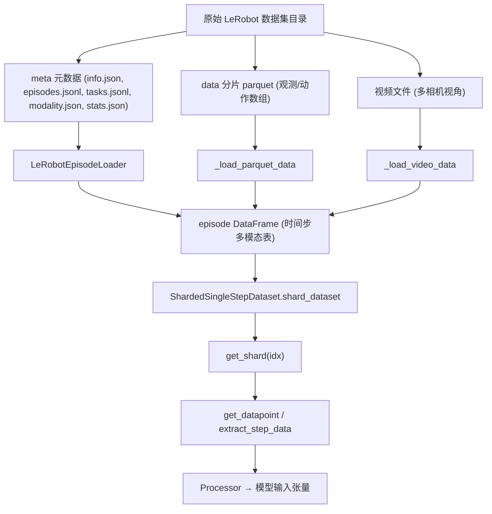

## LeRobot 数据集与加载流程说明



### 1. 数据整体结构

#### 1.1 元数据文件（`meta/` 目录）

对应代码：`gr00t/data/dataset/lerobot_episode_loader.py::_load_metadata`

- **`info.json`**  
  - **作用**: 描述整个数据集的基本配置与路径模式。  
  - **关键字段**：
    - `"data_path"`: parquet 数据文件的路径模板，例如 `"data/episode_{episode_chunk}_{episode_index}.parquet"`。
    - `"video_path"`: 视频文件路径模板，例如 `"videos/{episode_chunk}_{video_key}_{episode_index}.mp4"`。
    - `"chunks_size"`: 每个 parquet 文件中包含多少条 episode（用于计算 `episode_chunk`）。
    - `"features"`: 原始特征名到数组布局的配置（供视频/状态等键查找原始 key）。

- **`episodes.jsonl`**  
  - **作用**: 每行描述一条 episode 的元信息。  
  - **典型字段**：
    - `"episode_index"`: episode 的全局索引（用于定位 parquet / 视频）。
    - `"length"`: 该 episode 的原始时间步数量 `T`。
    - 其他：时间戳、任务 id 等。

- **`tasks.jsonl`**  
  - **作用**: 定义任务 id 到自然语言描述的映射。  
  - **在 loader 中的用法**：构建 `self.tasks_map[task_index] -> task_text`，供语言模态从 id 反查真实文本。

- **`modality.json`**  
  - **作用**: 描述各模态、各“关节组”在原始数组中的切片位置。  
  - **结构示意**（以 state 为例）：
    ```json
    {
      "state": {
        "left_arm": {"start": 0, "end": 7, "original_key": "observation.state"},
        "right_arm": {"start": 7, "end": 14, "original_key": "observation.state"},
        ...
      },
      "action": {
        "left_arm": {"start": 0, "end": 7, "original_key": "action"},
        ...
      },
      "video": {
        "ego_view": {"original_key": "observation.images.ego_view"},
        ...
      },
      "annotation": {
        "human.task_description": {"original_key": "annotation_index"}
      }
    }
    ```
  - **对应代码**：`_extract_joint_groups` 使用 `start/end/original_key` 从大数组列中切出子向量。

- **`stats.json` / `relative_stats.json`**  
  - **作用**: 保存按 joint group 切片后的统计量（max/min/q01/q99/mean/std），用于归一化。  
  - **对应代码**：`LeRobotEpisodeLoader.get_dataset_statistics` + `gr00t/data/stats.py` 中的统计脚本。

#### 1.2 原始数据文件

- **Parquet 数据（`data_path` 模式）**  
  - 存放数值模态：state 数组、action 数组、语言 id 等。  
  - 通过 `_load_parquet_data(episode_index)` 读取：
    ```python
    chunk_idx = episode_index // self.chunk_size
    parquet_filename = self.data_path_pattern.format(
        episode_chunk=chunk_idx, episode_index=episode_index
    )
    parquet_path = self.dataset_path / parquet_filename
    original_df = pd.read_parquet(parquet_path)
    ```

- **视频文件（`video_path` 模式）**  
  - 按相机视角（如 `ego_view`、`image_0` 等）保存。  
  - 通过 `_load_video_data(episode_index, indices)` 解码：
    ```python
    video_filename = self.video_path_pattern.format(
        episode_chunk=chunk_idx, video_key=original_key, episode_index=episode_index
    )
    video_path = self.dataset_path / video_filename
    frames = get_frames_by_indices(str(video_path), indices, ...)
    ```

---

### 2. 单个 episode DataFrame 长什么样？

对应代码：`LeRobotEpisodeLoader.__getitem__`、`_load_parquet_data`、`_load_video_data`

#### 2.1 行列含义

`__getitem__(idx)` 的返回值是一个 `pd.DataFrame`，可以理解为：

- **行（index）**：时间步 `t = 0, 1, ..., T-1`。
- **列（columns）**：按照 `"模态.键"` 命名，例如：
  - `"state.left_arm"`：左臂状态向量，单元格是 `np.ndarray(shape=(left_arm_dim,))`；
  - `"action.left_arm"`：左臂动作向量，同样是一个关节向量；
  - `"language.annotation.human.task_description"` 或 `"language.task"`：文本字符串；
  - `"video.ego_view"`：某一视角的图像帧（PIL Image）。

代码摘录：

```python
# gr00t/data/dataset/lerobot_episode_loader.py

def __getitem__(self, idx: int) -> pd.DataFrame:
    episode_meta = self.episodes_metadata[idx]
    episode_id = episode_meta["episode_index"]
    nominal_length = episode_meta["length"]

    # 1. 加载 parquet 数值数据
    df = self._load_parquet_data(episode_id)

    # 2. 若配置 language，则用 meta 生成/替换逐帧文本
    if "language" in self.modality_configs:
        lang_key = self.modality_configs["language"].modality_keys[0]
        if lang_key in LANG_KEYS:  # "task" 或 "sub_task"
            new_languages = self.create_language_from_meta(episode_meta, len(df), lang_key)
            df["language." + lang_key] = new_languages

    # 3. 对齐 episode 长度
    actual_length = min(len(df), nominal_length)
    df = df.iloc[:actual_length]

    # 4. 同步解码视频帧并写入 video.xxx 列
    video_data = self._load_video_data(episode_id, np.arange(actual_length))
    for key in video_data.keys():
        df[f"video.{key}"] = [frame for frame in video_data[key]]

    return df
```

#### 2.2 简化的数据样例（示意）

假设：
- 具身形态有 `left_arm` 状态/动作；
- 只有一个相机视角 `ego_view`；
- 语言模态是每步同一条任务描述。

则某个 episode DataFrame 可以抽象成：

| index (t) | state.left_arm            | action.left_arm           | language.task            | video.ego_view |
|----------:|---------------------------|---------------------------|--------------------------|----------------|
| 0         | `[0.1, 0.2, 0.3, ...]`    | `[0.15, 0.25, 0.35, ...]` | "pick up the bottle"    | Image(...)     |
| 1         | `[0.12, 0.22, 0.32, ...]` | `[0.17, 0.27, 0.37, ...]` | "pick up the bottle"    | Image(...)     |
| 2         | `[0.13, 0.21, 0.34, ...]` | `[0.18, 0.28, 0.36, ...]` | "pick up the bottle"    | Image(...)     |
| ...       | ...                       | ...                       | ...                      | ...            |

注意：
- `state.*` / `action.*` 列的每个单元格都是一个 numpy 向量。
- `video.*` 列的每个单元格是一帧图像（PIL Image）。
- 语言可以按 episode 固定，也可以按 sub_task 段落变化（`create_language_from_meta` 负责按 meta 扩展到逐帧）。

---

### 3. `ModalityConfig` 与关节组切片

对应代码：`_extract_joint_groups`、`_load_parquet_data`

#### 3.1 `ModalityConfig` 回顾

定义位置：`gr00t/data/types.py::ModalityConfig`

- **关键字段**：
  - `delta_indices`: 时间维度上相对于 base index 的偏移列表（例如 `[0]` 或 `list(range(30))`）。
  - `modality_keys`: 该模态下要加载的键名列表（例如 `"left_arm"`, `"right_arm"`）。

在 LeRobotEpisodeLoader 中，`modality_configs` 只在两个地方用：

- `_parse_and_validate_modality_configs`：检查合法性（语义约束）。
- `_load_parquet_data` / `_load_video_data` / `__getitem__`：
  - 用 `modality_keys` 确定要抽取哪些关节组或相机视角；
  - 对 state/action，通过 `_extract_joint_groups` + `modality.json` 的 `start/end` 做数组切片。

#### 3.2 关节组切片流程

```python
# 从原始 DataFrame 中抽取 state/action 的各个 joint group
def _extract_joint_groups(self, df: pd.DataFrame, joint_groups: list[str], modality_type: str = "state") -> pd.DataFrame:
    modality_info = self.modality_meta.get(modality_type, {})
    joint_data = pd.DataFrame()

    for group_name in joint_groups:
        group_info = modality_info[group_name]
        start_idx = group_info["start"]
        end_idx = group_info["end"]
        original_key = group_info.get("original_key", DEFAULT_COLUMN_NAMES[modality_type])
        # Slice the array data for this joint group
        if isinstance(df[original_key].iloc[0], np.ndarray):
            joint_data[group_name] = df[original_key].map(lambda x: x[start_idx:end_idx])
        else:
            joint_data[group_name] = df[original_key]  # for strings and scalars

    return joint_data
```

**直观理解**：

- 原始 parquet 里，`df["observation.state"]` 可能是 shape `(T,)` 的列，每个元素是一个长向量（例如 30 维）。
- `modality.json` 告诉你：
  - `left_arm`: 在 `observation.state` 的 `[0:7]` 区间；
  - `right_arm`: 在 `[7:14]` 区间；
- `_extract_joint_groups` 就是把这些切片出来，变成：

  ```python
  loaded_df["state.left_arm"]  # 每行是 7 维 ndarray
  loaded_df["state.right_arm"] # 每行是 7 维 ndarray
  ```

而 `_load_parquet_data` 会对 `modality_configs["state"].modality_keys` 里的所有 key 做这件事：

```python
for modality_type in ["state", "action"]:
    if modality_type not in self.modality_configs:
        continue
    joint_groups_df = self._extract_joint_groups(
        original_df, self.modality_configs[modality_type].modality_keys, modality_type
    )
    for joint_group in joint_groups_df.columns:
        loaded_df[f"{modality_type}.{joint_group}"] = joint_groups_df[joint_group]
```

---

### 4. 语言与视频加载

#### 4.1 语言模态：`create_language_from_meta`

对应代码：`create_language_from_meta` + `__getitem__` 中语言部分。

- `LANG_KEYS = ["task", "sub_task"]`
- 如果 `language` 模态配置的是 `"task"`：
  - 从 `episode_meta["tasks"]` 中随机选一个任务文本，拓展为长度 `nframes` 的同一字符串列表。
- 如果是 `"sub_task"`：
  - 使用 `sub_tasks` 中记录的起止时间段，将子任务文字分配到相应时间步附近（使用 `action_horizon` 做平滑），再随机选一条子任务文本作为每步的语言。

简化示意：

```python
if lang_key == "task":
    meta_language = random.choice(episode_meta["tasks"])
    new_languages = [meta_language] * nframes
elif lang_key == "sub_task":
    # 根据子任务时间范围，把子任务文本分布到时间轴上
    ...
```

最终在 `__getitem__` 中写入：

```python
if "language" in self.modality_configs:
    lang_key = self.modality_configs["language"].modality_keys[0]
    if lang_key in LANG_KEYS:
        new_languages = self.create_language_from_meta(episode_meta, len(df), lang_key)
        df["language." + lang_key] = new_languages
```

#### 4.2 视频模态：`_load_video_data`

- 根据 `episode_index` 和 `video_path` 模板构造视频文件路径；
- 根据 `modality_configs["video"].modality_keys` 逐视角解码：

```python
image_keys = self.modality_configs["video"].modality_keys
for image_key in image_keys:
    original_key = self.modality_meta["video"][image_key].get(
        "original_key", f"observation.images.{image_key}"
    )
    video_filename = self.video_path_pattern.format(
        episode_chunk=chunk_idx, video_key=original_key, episode_index=episode_index
    )
    video_path = self.dataset_path / video_filename
    video_data[image_key] = get_frames_by_indices(
        str(video_path), indices, video_backend=self.video_backend, ...
    )
```

- 在 `__getitem__` 中，把解码出来的帧塞回 DataFrame：

```python
for key in video_data.keys():
    df[f"video.{key}"] = [frame for frame in video_data[key]]
```

此时，每一行的 `video.key` 都是一帧图像。

---

### 5. 从 episode DataFrame 到单步样本（与 shard 的关系）

虽然 `LeRobotEpisodeLoader` 本身只负责 episode DataFrame，但在整个系统中，它通常与 `ShardedSingleStepDataset` 一起使用，将 episode 级数据切成单步训练样本。

对应文件：`gr00t/data/dataset/sharded_single_step_dataset.py`

#### 5.1 shard 规划：`ShardedSingleStepDataset.shard_dataset`

- 从 `LeRobotEpisodeLoader` 中读取所有 episode 的有效长度（考虑 action horizon）。
- 计算总步数 `total_steps` 和需要的 shard 数量 `num_shards`（用 `shard_size` 近似均分）。
- 对每个 episode：
  - 生成 `[0, 1, ..., T-1]` 的 step 索引数组；
  - 随机打乱后按 `num_splits` 做间隔切分（`step_indices[i::num_splits]`），得到多个子序列；
  - 按“当前最短的 shard 优先”的贪心策略，把子序列分配到 `sharded_episodes[shard_index]`。

结果：

```python
self.sharded_episodes  # List[List[(episode_index, step_indices_array)]]
self.shard_lengths     # 每个 shard 内的时间步总数
```

#### 5.2 从 shard 到单步 VLAStepData：`get_shard` + `get_datapoint` + `extract_step_data`

```python
def get_shard(self, idx: int) -> list:
    episodes = self.sharded_episodes[idx]
    datapoints = []
    for ep_idx, step_indices in episodes:
        episode_data = self.episode_loader[ep_idx]  # 调用 LeRobotEpisodeLoader.__getitem__
        for step_index in step_indices:
            datapoints.append(self.get_datapoint(episode_data, step_index))
    return datapoints
```

`get_datapoint` 会调用 `extract_step_data`：

```python
def extract_step_data(episode_data, step_index, modality_configs, embodiment_tag, allow_padding) -> VLAStepData:
    # 对每个模态，根据 delta_indices 计算要取的时间步索引
    indices_to_load = [step_index + delta for delta in config.delta_indices]
    ...
    # state/action: 将多帧堆成 (horizon, dim) 数组
    # video/language: 直接保留 list
    vla_step_data = VLAStepData(images=video_data, states=state_data, actions=action_data, text=text, embodiment=embodiment_tag)
    return vla_step_data
```

然后在 `get_datapoint` 中交给 Processor：

```python
messages = [{"type": MessageType.EPISODE_STEP.value, "content": vla_step_data}]
return self.processor(messages)  # 例如 Gr00tN1d6Processor
```

Processor 会进一步：
- 做状态/动作归一化与相对动作转换；
- 做图像增强与 VLM 输入构造；
- 拼装成模型 forward 需要的张量字典。

---

### 6. 小结

- **LeRobotEpisodeLoader**：围绕 `meta/ + parquet + 视频`，提供“按 episode 加载多模态 DataFrame”的能力，是所有下游 dataset 的基础。
- **DataFrame 结构**：一行一个时间步，一列一个“模态.键”，state/action 是向量，video 是图像，language 是文本。
- **ModalityConfig + modality.json**：共同决定“从原始大数组中切出哪些关节组/通道”，在时间维度上则由 `delta_indices` 控制在 Processor 中如何构造 horizon。
- **ShardedSingleStepDataset**：基于 `LeRobotEpisodeLoader` 的 episode DataFrame，对时间步做随机切分与分片，生成 shard 级、小而均衡的单步样本集合，最终通过 Processor 转成模型输入。
