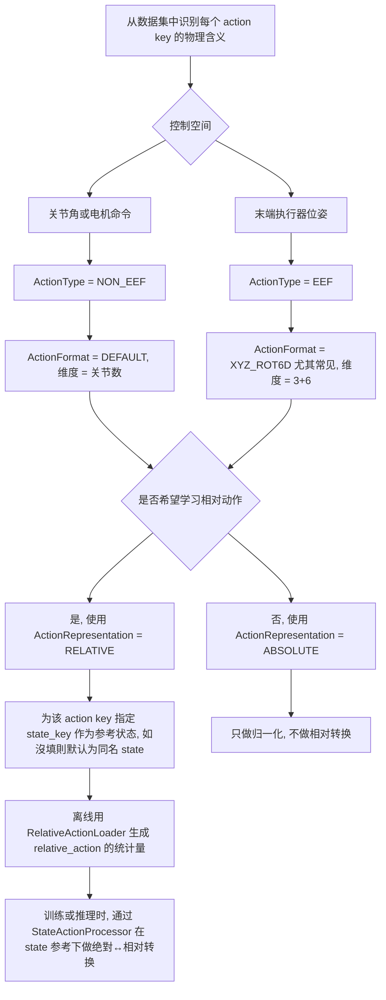

## Embodiment 配置说明

### 1. 整体决策流程图



### 2. 定义原则总表

#### 2.1 ActionType 和控制空间

| 决策点 | 选项 | 含义 (大白话) | 典型使用时机 |
| --- | --- | --- | --- |
| 控制空间 | NON_EEF | 在关节空间控制, 数组里每个维度就是一个关节或电机命令 | 直接下发关节角目标, 低层控制比较简单可控 |
| 控制空间 | EEF | 在末端执行器笛卡尔空间控制, 用位置加旋转表示一只手在空间中的位姿 | 更贴近日常语义, 抓取放置等任务更直观, 需要底层控制器或 IK 支持 |

#### 2.2 ActionFormat 和维度

| 决策点 | 选项 | 对应维度 | 含义 |
| --- | --- | --- | --- |
| 动作数值格式 | DEFAULT | 维度 = 该关节组的关节数量 | 对 NON_EEF, 就是一串关节角, 数几维看你有几个关节 |
| 动作数值格式 | XYZ_ROT6D | 9 维 (3 平移 + 6 旋转) | 对 EEF, 用 xyz 位置 + rot6d 表示末端位姿 |
| 动作数值格式 | XYZ_ROTVEC | 一般是 6 维 (3 平移 + 3 旋转向量) | 当前代码主要演示 XYZ_ROT6D, ROTVEC 可以按需扩展 |

#### 2.3 ActionRepresentation (绝对 vs 相对 vs 增量)

| 决策点 | 选项 | 行为 | 依赖条件 | 典型场景 |
| --- | --- | --- | --- | --- |
| 表示方式 | ABSOLUTE | 动作是绝对目标, 不做任何减法, 只做归一化 | 不需要当前 state | 网络直接预测目标关节角/位姿, 实现简单 |
| 表示方式 | RELATIVE | 在 use_relative_action 為真時, 会把动作转换成相对当前 state 的残差 | 必须有 state, 并且为该 action 配好 state_key | 希望动作分布以 0 为中心, 更稳定; 希望对不同初始位姿更平移不变 |
| 表示方式 | DELTA | 每一帧相对上一帧的增量, 对应 ActionChunk.delta_chunking | 需要参考帧, 目前框架中没大规模启用 | 需要把动作视作速度/增量序列时可用 |

#### 2.4 state_key 与参考状态

| 决策点 | 选项 | 含义 | 约定 |
| --- | --- | --- | --- |
| 相对动作参考 | state_key = None | 默认使用同名 state key 作参考, 例如 action.left_arm 使用 state.left_arm | 适合 state 和 action 一一对应的情况 |
| 相对动作参考 | state_key = 某个字符串 | 使用指定的 state 名作为参考, 例如 torso 使用 trunk_qpos | 适合一个动作 key 需要参考另一个具体的 state 时 |

#### 2.5 delta_indices 与 horizon

| 决策点 | 字段 | 含义 | 说明 |
| --- | --- | --- | --- |
| 时间窗 | delta_indices (state) | 给定当前时间索引 t, 实际取到的 state 时间步是 t 加这些偏移 | 例如 [0] 表示只取当前帧; [-3, 0] 可以表示取过去三帧到当前 |
| 时间窗 | delta_indices (action) | 给定当前时间索引 t, 实际取到的 future action 序列是 t 加这些偏移 | 例如 range(16) 表示 horizon = 16, 但和每一步的维度 D 无关 |

#### 2.6 mean_std_embedding_keys 与归一化策略

| 决策点 | 场景 | 行为 | 典型用法 |
| --- | --- | --- | --- |
| 归一化策略 | mean_std_embedding_keys 为 None 或空 | 所有 key 使用 min/max 或分位数归一化到 [-1, 1] | 适合有明确上下界的状态/动作, 如关节角、归一化坐标 |
| 归一化策略 | mean_std_embedding_keys 指定了部分 key | 指定的 key 用 (x-mean)/std 标准化, 其它 key 继续用 min/max | 适合“更像高斯分布”或数值跨度较大的量, 如相对动作、速度、中心化的位姿 |

- **本质**: `mean_std_embedding_keys` 是一份白名单, 告诉 `StateActionProcessor`「这些字段按 mean/std 来搞, 其余字段按 min/max 或分位数来搞」。
- **相对动作配合**: 如果你对某个关节组使用 `ActionRepresentation.RELATIVE`, 可以在统计相对动作 (`relative_action`) 时也让该 key 进入 `mean_std_embedding_keys`, 让模型看到的是“均值 0、方差 1 的相对位移”。

#### 2.7 离散动作 (如夹爪 0/1) 在 ABSOLUTE 下的处理

- **训练数据侧**: 数据集中夹爪可以是 0/1 等离散值, 但在进入 Processor 前会先根据 stats.json 里的 min/max 或 mean/std 转成连续值 (例如映射到 [-1, 1] 空间)。
- **模型预测侧**: 模型回归的永远是连续值, 经过 `unapply_action()` 反归一化后, 夹爪值可能是 0.01、0.3、0.99 等浮点数, 框架不会自动帮你四舍五入或阈值化到 0/1。
- **下游控制侧**: 如何使用这些连续值由你自己约定, 常见做法有:
  - 将其视作 [0, 1] 的模拟量, 再映射到具体电机命令或开合度 (例如 `angle = clamp(g,0,1) * max_angle`);
  - 若环境只接受 0/1, 在发送前加一层阈值规则 (例如 `g > 0.5` 视为闭合, 否则视为张开);
  - 由真实机器人 SDK 或仿真环境在内部做二值化。

> 换句话说, **ABSOLUTE 并不意味着“整数动作”, 只是“不做相对/增量转换”**; 是否把 0.99 强制变成 1, 是推理后处理阶段的工程选择。

### 3. 当前已有 Embodiment 配置一览

> 下表只总结配置文件里显式约定的语义; 具体每个 key 的维度 dim 来自统计文件 stats.json / relative_stats.json。

#### 3.1 unitree_g1

- state 配置

| key | 含义 (直观理解) |
| --- | --- |
| left_leg | 左侧腿部关节状态 |
| right_leg | 右侧腿部关节状态 |
| waist | 腰部关节状态 |
| left_arm | 左臂关节状态 |
| right_arm | 右臂关节状态 |
| left_hand | 左手关节/夹爪状态 |
| right_hand | 右手关节/夹爪状态 |

- action 配置

| key | rep | type | format | state_key | horizon 说明 |
| --- | --- | --- | --- | --- | --- |
| left_arm | RELATIVE | NON_EEF | DEFAULT | 默认同名 left_arm | delta_indices = range(30), horizon = 30 |
| right_arm | RELATIVE | NON_EEF | DEFAULT | 默认同名 right_arm | 同上 |
| left_hand | ABSOLUTE | NON_EEF | DEFAULT | 默认同名 left_hand | 同上, 注释里说明是二值信号 |
| right_hand | ABSOLUTE | NON_EEF | DEFAULT | 默认同名 right_hand | 同上 |
| waist | ABSOLUTE | NON_EEF | DEFAULT | 默认同名 waist | 同上 |
| base_height_command | ABSOLUTE | NON_EEF | DEFAULT | 默认同名 base_height_command | 同上 |
| navigate_command | ABSOLUTE | NON_EEF | DEFAULT | 默认同名 navigate_command | 同上 |

> 直觉: 手臂用相对动作 (残差关节角), 腰和底盘指令用绝对值, 夹爪是类似开关的绝对控制。

#### 3.2 libero_panda

- state 配置

| key | 含义 |
| --- | --- |
| x, y, z | 末端位置 (笛卡尔坐标) |
| roll, pitch, yaw | 末端姿态 (欧拉角) |
| gripper | 夹爪开合状态 |

- action 配置

libero_panda 在 action 侧只指定了 modality_keys 与 delta_indices, 没有显式 action_configs。

| key | rep / type / format | 说明 |
| --- | --- | --- |
| x, y, z, roll, pitch, yaw, gripper | 未指定, 由 StateActionProcessor 仅做归一化, 不做绝對↔相对转换 | 视作通用连续动作向量, 具体物理意义由底层环境解释 |

> 实际上, 你可以后续给这些 key 增加 ActionConfig, 决定是否使用相对动作以及参考的 state_key。

#### 3.3 oxe_widowx

- state 配置

| key | 含义 |
| --- | --- |
| x, y, z | 末端位置 |
| roll, pitch, yaw | 末端姿态 |
| pad | 触摸板或其他附加状态 |
| gripper | 夹爪状态 |

- action 配置

同样未配置 action_configs, 只指定了 action 的 keys 和 horizon。

| key | rep / type / format | 说明 |
| --- | --- | --- |
| x, y, z, roll, pitch, yaw, gripper | 未指定, 只做归一化 | mean_std_embedding_keys 指定 x,y,z,roll,pitch,yaw 用 mean/std 归一化 |

#### 3.4 oxe_google

- state 配置

| key | 含义 |
| --- | --- |
| x, y, z | 末端位置 |
| rx, ry, rz, rw | 四元数表示的末端姿态 |
| gripper | 夹爪状态 |

- action 配置

| key | rep / type / format | 说明 |
| --- | --- | --- |
| x, y, z, roll, pitch, yaw, gripper | 未显式指定, 只做归一化 | mean_std_embedding_keys 指定 xyz+roll/pitch/yaw 走 mean/std |

#### 3.5 behavior_r1_pro

- state 配置

| key | 含义 | 维度 (来自注释) |
| --- | --- | --- |
| robot_pos | 机器人在环境中的位置 | 3 |
| robot_ori_cos | 机器人朝向的 cos 编码 | 3 |
| robot_ori_sin | 机器人朝向的 sin 编码 | 3 |
| robot_2d_ori | 2D 朝向 | 1 |
| robot_2d_ori_cos | 2D 朝向 cos | 1 |
| robot_2d_ori_sin | 2D 朝向 sin | 1 |
| robot_lin_vel | 线速度 | 3 |
| robot_ang_vel | 角速度 | 3 |
| arm_left_qpos | 左臂关节角 | 7 |
| arm_left_qpos_sin | 左臂关节角 sin | 7 |
| arm_left_qpos_cos | 左臂关节角 cos | 7 |
| eef_left_pos | 左末端位置 | 3 |
| eef_left_quat | 左末端姿态 (四元数) | 4 |
| gripper_left_qpos | 左夹爪关节 | 2 |
| arm_right_qpos | 右臂关节角 | 7 |
| arm_right_qpos_sin | 右臂关节角 sin | 7 |
| arm_right_qpos_cos | 右臂关节角 cos | 7 |
| eef_right_pos | 右末端位置 | 3 |
| eef_right_quat | 右末端姿态 (四元数) | 4 |
| gripper_right_qpos | 右夹爪关节 | 2 |
| trunk_qpos | 躯干关节 | 4 |

- action 配置

| key | rep | type | format | state_key | 直觉含义 |
| --- | --- | --- | --- | --- | --- |
| base | ABSOLUTE | NON_EEF | DEFAULT | 默认 base | 控制底座移动的一串指令, 视为绝对命令 |
| torso | RELATIVE | NON_EEF | DEFAULT | trunk_qpos | 躯干关节的相对动作, 相对于 trunk_qpos |
| left_arm | RELATIVE | NON_EEF | DEFAULT | arm_left_qpos | 左臂关节相对动作, 相对于当前 arm_left_qpos |
| left_gripper | ABSOLUTE | NON_EEF | DEFAULT | 默认 left_gripper | 左夹爪绝对控制 |
| right_arm | RELATIVE | NON_EEF | DEFAULT | arm_right_qpos | 右臂关节相对动作 |
| right_gripper | ABSOLUTE | NON_EEF | DEFAULT | 默认 right_gripper | 右夹爪绝对控制 |

> 这里可以清楚看到: 大多数大关节用 RELATIVE, 夹爪和底座用 ABSOLUTE。

### 4. 新本体示例: 2 自由度手臂 + 简易夹爪

假设有一个非常简单的新机器人:

- 两个旋转关节, 比如 shoulder 和 elbow, 共 2 维关节角;
- 一个由两块小板组成的简易夹爪, 用 1 维开合度表示 (0 = 完全张开, 1 = 完全闭合);
- 不考虑末端 EEF 位姿, 只在关节空间控制。

#### 4.1 设计原则

- 控制空间: 全部使用 NON_EEF, 直接在关节空间控制;
- 动作格式: DEFAULT, 维度就是关节数;
- 表示方式:
  - 手臂 2 维 joint 用 RELATIVE, 即预测相对于当前关节角的残差, 便于网络学习;
  - 夹爪 1 维用 ABSOLUTE, 因为通常更像一个开关或归一化后的标量;
- 参考状态:
  - 手臂相对动作使用 state.single_arm 作参考;
  - 夹爪绝对动作默认同名 state.gripper, 不需要相对计算。

#### 4.2 对应的 embodiment_config 示例

以下是可以添加到 embodiment_configs.py 中 MODALITY_CONFIGS 的一个示例配置片段 (仅供参考):

```python
from gr00t.data.types import ModalityConfig, ActionConfig, ActionRepresentation, ActionType, ActionFormat

MODALITY_CONFIGS["toy_2dof_gripper"] = {
    "video": ModalityConfig(
        delta_indices=[0],
        modality_keys=["front"],  # 单个前视相机, 可按实际情况调整
    ),
    "state": ModalityConfig(
        delta_indices=[0],
        modality_keys=[
            "single_arm",  # shape = (T, 2), 对应两个关节角
            "gripper",     # shape = (T, 1), 对应夹爪开合度
        ],
    ),
    "action": ModalityConfig(
        delta_indices=list(range(0, 8)),  # 例如 horizon = 8
        modality_keys=[
            "single_arm",  # 动作中手臂关节的目标轨迹, shape = (T, 2)
            "gripper",     # 动作中夹爪目标, shape = (T, 1)
        ],
        action_configs=[
            ActionConfig(
                rep=ActionRepresentation.RELATIVE,  # 手臂用相对动作
                type=ActionType.NON_EEF,
                format=ActionFormat.DEFAULT,
                state_key="single_arm",           # 参考 state.single_arm
            ),
            ActionConfig(
                rep=ActionRepresentation.ABSOLUTE,  # 夹爪用绝对动作
                type=ActionType.NON_EEF,
                format=ActionFormat.DEFAULT,
                # state_key 默认同名 gripper
            ),
        ],
    ),
    "language": ModalityConfig(
        delta_indices=[0],
        modality_keys=["annotation.human.task_description"],
    ),
}
```

这个示例体现了前面总结的几个关键点:

- 用 NON_EEF + DEFAULT 表示纯关节空间控制;
- 手臂关节选择 RELATIVE, 并且指定 state_key, 便于生成相对动作统计 relative_action;
- 夹爪保持 ABSOLUTE, 实际使用时可以把它映射到 0 到 1 之间或具体电机命令;
- delta_indices 控制 horizon, 可按需要改成 16, 32 等更多步。
