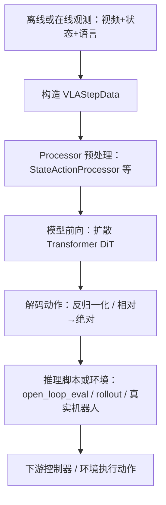
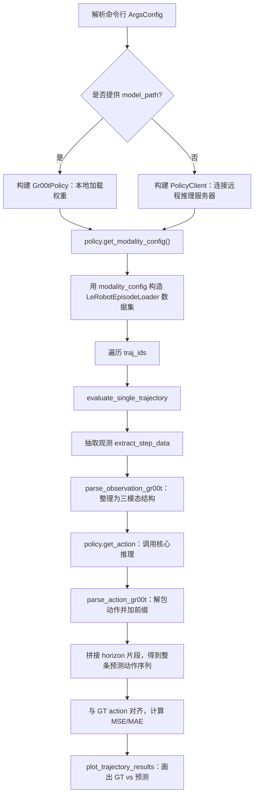
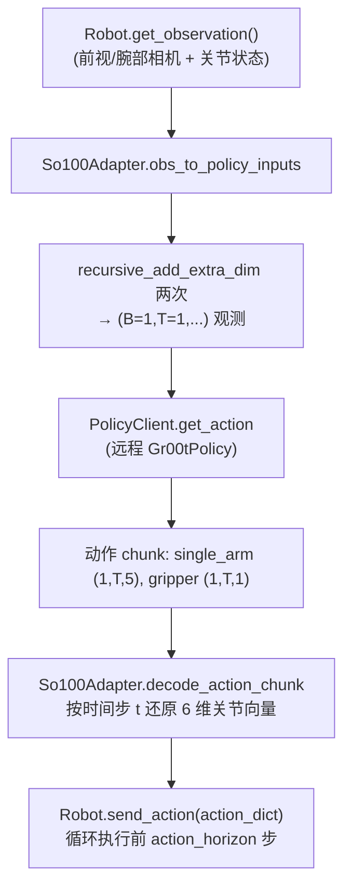

## Gr00t 推理整体架构与流程

### 0. 本文在解读什么？

- **解读对象代码**: `gr00t/eval/open_loop_eval.py`（离线 open-loop 推理评估脚本）。
- **脚本主要用途**: 在已有 LeRobot 轨迹数据上，用训练好的 Gr00t 模型做推理，和数据集里的真实动作做对比，计算 MSE/MAE 并画图。
- **你可以从这篇文档得到什么**:
  - 一眼看懂 Gr00t 推理链路的结构（观测 → Processor → 模型 → 解码动作）。
  - 按“目标→关键步骤”的顺序，理解 `open_loop_eval.py` 每个阶段在干什么。
  - 需要细节时，再翻到后面的展开说明。

### 1. 高层推理架构图

- **输入侧**: 来自数据集（open-loop）或仿真/真实机器人（closed-loop）的观测 `observation`。
- **中间**: 通过 Processor 按 embodiment_config 和统计参数, 把观测映射到模型输入空间, 再由 DiT 预测规范化动作序列。
- **输出侧**: 由 Processor 反归一化并做相对→绝对转换, 交给推理脚本或环境做后处理与执行。

### 2. open_loop_eval.py 推理流程图（离线单机评估）

`gr00t/eval/open_loop_eval.py` 是一个 **最基础、结构清晰** 的推理评估脚本，非常适合看推理原理。

### 3. open_loop_eval.py 核心源码解读（先说目标，再看关键步骤）

#### 3.1 入口配置 ArgsConfig（目标：把“要评什么”说清楚）

- **ArgsConfig**: 描述推理评估所需的全部超参数：
  - **host / port**: 若不用本地模型, 就通过 `PolicyClient(host, port)` 连远程推理服务器；
  - **steps / traj_ids / action_horizon**: 评估多少步、哪些 episode、每次推理预测多少未来动作；
  - **dataset_path / embodiment_tag**: 指明要读的 LeRobot 数据集与具身标签；
  - **model_path**: 本地 checkpoint 路径，提供则本地加载 `Gr00tPolicy`, 否则走远程；
  - **modality_keys**: 可选，只画指定 action key；缺省时画所有动作维度。

#### 3.2 main(args): 构建 policy + 数据集 + 调度评估（目标：准备好“谁来推理”和“在哪些数据上推理”）

- **选择 policy 来源**：
  - 若 `args.model_path` 不为 None:
    - 从路径里解析 `checkpoint-<step>` 信息（可用于日志标注 global_step）；
    - 构建 `Gr00tPolicy(embodiment_tag, model_path, device)`，内部会：
      - 加载模型和 AutoProcessor；
      - 从 checkpoint 恢复 modality_configs 和统计参数；
      - 准备好 `get_action()` 推理接口。
  - 否则:
    - 构建 `PolicyClient(host, port)`，通过 ZeroMQ RPC 调用远程 `PolicyServer` 的 `get_action`。

- **构建数据集**：
  - 调用 `policy.get_modality_config()` 拿到当前模型/服务器支持的 **state / action / video / language 配置**；
  - 用这个配置实例化 `LeRobotEpisodeLoader(dataset_path, modality_configs=modality, ...)`；
  - 这一步保证 **数据字段与模型预期完全对齐**，避免 key 名/时间窗不一致。

- **遍历轨迹评估**：
  - 对 `args.traj_ids` 中的每个 `traj_id`：
    - 调用 `evaluate_single_trajectory(policy, dataset, traj_id, ...)`；
    - 收集每条轨迹的 MSE / MAE，最后在所有轨迹上取平均并打印。

#### 3.3 evaluate_single_trajectory(...): 单条 episode 的推理主循环（目标：在一条轨迹上跑完“多次观测→多次动作预测→和 GT 对齐”）

- **载入该 episode**：
  - `traj = loader[traj_id]` 返回一个 pandas.DataFrame, 每行是一帧，一列对应一个 `state.xxx` 或 `action.xxx` 向量。
  - `actual_steps = min(steps, traj_length)` 确保不会超出 episode 长度。

- **确定 state_keys / action_keys**：
  - `state_keys = loader.modality_configs["state"].modality_keys`；
  - `action_keys` 默认取配置里的所有 action key, 也可以由 `modality_keys` 覆盖；
  - 这些 key 决定了后面如何拼接各个关节/末端的动作向量。

- **推理循环（按 horizon 滑动）**：
  - `for step_count in range(0, actual_steps, action_horizon):`
    - 每隔 `action_horizon` 步抽一次观测点 `step_count`；
    - 调用 `extract_step_data(traj, step_count, modality_configs_without_action, embodiment_tag)`：
      - 其中 `modality_configs_without_action` 只保留 state/video/language, 不用动作配置；
      - 返回 `data_point`, 内含：
        - `data_point.states`: dict[key -> np.ndarray[(T_state, D)]]；
        - `data_point.images`: dict[key -> list[np.ndarray]]；
        - `data_point.text`: 当前时间附近的语言指令。

  - **构造 observation**：
    - 先把 `data_point` 打平成类似：
      - `obs['state.<k>'] = np.ndarray[(T,D)]`
      - `obs['video.<k>'] = np.ndarray[(T,H,W,C)]`
      - `obs[language_key] = text`
    - 再调用 `parse_observation_gr00t(obs, loader.modality_configs)`：
      - 遍历 modality_configs["video"/"state"/"language"].modality_keys；
      - 对 video/state: 去掉前缀, 添加 batch 维度 `(B=1, T, ...)`；
      - 对 language: 包两层 list, 形状变为 `[["instruction"]]`，即 `(B=1, T=1)`；
      - 输出结构刚好满足 `Gr00tPolicy.check_observation()` 的要求。

  - **调用 policy.get_action(parsed_obs)**：
    - 对本地 `Gr00tPolicy`:
      1. 将 observation 打包成 `VLAStepData`；
      2. 调用 AutoProcessor 做预处理（归一化/时间窗、语言 token 化等）；
      3. 把处理后的 batch 喂进 DiT 模型，输出规范化 action_pred；
      4. 调用 Processor.decode_action 反归一化与相对→绝对转换，得到物理单位的动作；
    - 对 `PolicyClient`:
      - 把相同格式的 observation 序列化发到远端 server, server 内部同样用 `Gr00tPolicy` 处理；
    - 统一返回：
      - `_action_chunk`: dict[key -> np.ndarray[(B, T_action, D)]]，这里 B=1；
      - `info`: 目前未用, 预留统计/调试信息。

  - **解包动作用于评估**：
    - `action_chunk = parse_action_gr00t(_action_chunk)`：
      - 去掉 batch 维度, 恢复 DataFrame 风格 key：`{"action.left_arm": (T,D), ...}`。
    - 对 j in `[0, action_horizon)`：
      - 对每个 action key 取第 j 步, 用 `np.atleast_1d` 保证是一维；
      - 按 action_keys 指定的顺序依次 `np.concatenate` 在一起；
      - 得到当前时间步的完整动作向量 concat_pred_action, push 到 `pred_action_across_time` 列表。

- **对齐 GT / 预测并计算指标**：
  - 定义内部函数 `extract_state_joints(traj, columns)`：
    - 对每个列名（如 `state.left_arm` 或 `action.left_arm`）把 episode 中每一行的向量 `vstack` 起来；
    - 再对多列做 `concatenate(axis=-1)`，得到 `(T_all, D_total)`。
  - `state_joints_across_time`：把所有 state 列拼接在一起，用于画“关节随时间变化”。
  - `gt_action_across_time`：把所有 action 列拼成 GT 动作序列, 截断到 `actual_steps`。
  - `pred_action_across_time`：把之前累积的 concat_pred_action 堆成数组, 同样截断到 `actual_steps`；
  - 检查形状一致后：
    - 计算 **MSE**: `mean((gt - pred)^2)`；
    - 计算 **MAE**: `mean(|gt - pred|)`；
    - 打印日志, 并调用 `plot_trajectory_results` 画图。

### 4. 推理核心步骤的概念总结

#### 4.1 观察构造与对齐 (Observation Packing)

**目标**: 把“数据集 / 机器人输出的扁平字段”整理成 `Gr00tPolicy` 期望的三模态结构, 且形状对齐。

- **open_loop_eval.py 中的 observation 形状示例**（单条样本, 未加 batch 维度前）:
  - 从 `LeRobotEpisodeLoader` 取出的 data_point:
    - `data_point.states[k]` ~ `np.ndarray[(T_state, D)]`
    - `data_point.images[k]` ~ `list[np.ndarray[(H, W, C)]]` 长度 = `T_video`
    - `data_point.text` ~ `str`
  - 打平成 `obs` 之后:
    - `obs['state.left_arm']` ~ `(T_state, D_left)`
    - `obs['video.front']`   ~ `(T_video, H, W, C)`
    - `obs[language_key]`    ~ `str`
  - 经过 `parse_observation_gr00t` 整形后传给 policy:
    - `obs_for_policy['state'][key]`   ~ `np.ndarray[(B=1, T_state, D)]`
    - `obs_for_policy['video'][key]`   ~ `np.ndarray[(B=1, T_video, H, W, C)]`
    - `obs_for_policy['language'][k]`  ~ `list[list[str]]` 形如 `[["instruction"]]` (B=1, T=1)

- **eval_so100.py 中的 observation 形状示例**（真实机器人单帧观测）:
  - 机器人返回的原始 obs（见代码中的注释示例）:
    - `obs['front']` / `obs['wrist']` ~ `np.ndarray[(H, W, 3)]`
    - 每个关节位姿，如 `obs['shoulder_pan.pos']` ~ `float`
    - `obs['lang']` ~ `str`
  - 经 `So100Adapter.obs_to_policy_inputs` + 两次 `recursive_add_extra_dim` 后:
    - `model_obs['video']['front']` / `['wrist']` ~ `(1, 1, H, W, 3)`
    - `model_obs['state']['single_arm']` ~ `(1, 1, 5)`
    - `model_obs['state']['gripper']`    ~ `(1, 1, 1)`
    - `model_obs['language']['annotation.human.task_description']` ~ `[[lang_str]]`

#### 4.2 Processor 与 ActionConfig 在推理中的作用

**目标**: 说明模型输出的 `normalized_action` 如何在 Processor 中被“解码”成物理动作, 以及 RELATIVE/ABSOLUTE 配置起什么作用。

- **动作解码的典型形状**:
  - 模型头输出: `normalized_action` ~ `np.ndarray[(B, T_action, D_total)]`；
  - Processor 内部拆成各个 action key 后:
    - `action[key]` ~ `(B, T_action, D_key)`；
  - 在 `eval_so100.py` 中通过 `PolicyClient.get_action` 拿到的 `action_chunk`:
    - `action_chunk['single_arm']` ~ `(1, T_action, 5)`
    - `action_chunk['gripper']`    ~ `(1, T_action, 1)`

- **open_loop_eval.py 中用于评估的展开方式**:
  - 对于每个 `step_count` 调一次 `policy.get_action(parsed_obs)`，得到一个 `action_chunk`；
  - 取其中第 j 步 `action_chunk[key][0][j]`，用 `np.concatenate` 沿最后一维拼成完整动作向量:
    - `concat_pred_action` ~ `np.ndarray[(D_all,)]`；
  - 随着 `step_count` 与 j 迭代, 将所有 `concat_pred_action` 堆成:
    - `pred_action_across_time` ~ `np.ndarray[(actual_steps, D_all)]`；
  - 与 GT 动作:
    - `gt_action_across_time`   ~ `np.ndarray[(actual_steps, D_all)]` 对齐后计算 MSE/MAE。

- **eval_so100.py 中用于真实控制的展开方式**:
  - 一次 `policy.get_action(obs)` 就代表当前观测下未来一段 horizon 的关节轨迹:
    - 返回 `actions: List[Dict[str, float]]`，长度 = horizon；
  - 在 eval 循环中取前 `cfg.action_horizon` 步依次下发:
    - `robot.send_action(action_dict)`，其中 `action_dict` 的 key 与 SO100 的关节名一一对应。

#### 4.3 open-loop vs. closed-loop

- **open-loop (本脚本)**:
  - 使用数据集里真实的状态和动作作为“时间线基准”；
  - 模型每次看到的 state 是数据里的真实 state, **不会被自己预测的动作反作用**；
  - 适合做离线精度评估（MSE/MAE）、检查统计/归一化是否合理。

- **closed-loop (真实控制/仿真)**:
  - 模型输出动作直接送入仿真或机器人, 下一步 state 由环境根据动作更新；
  - 需要在控制环里考虑延迟、夹爪阈值化、动作裁剪、碰撞等实际问题；
  - 代码可以参考 `gr00t/eval/rollout_policy.py` 和真实机器人脚本 `gr00t/eval/real_robot/SO100/eval_so100.py`。

### 6. SO100 真实机器人 closed-loop 推理流程概览

**解读对象代码**: `gr00t/eval/real_robot/SO100/eval_so100.py`

- **整体目标**: 在 SO100 / SO101 机器人上, 用语言指令驱动 Gr00t 策略, 实时生成一段关节命令序列并下发执行, 完整跑完一条任务。
- **核心角色**:
  - `Robot` / `RobotConfig`（来自 LeRobot）: 负责与真实硬件交互 (`get_observation` / `send_action`)；
  - `PolicyClient` + 远程 `Gr00tPolicy` Server: 负责根据观测和语言指令预测动作 chunk；
  - `So100Adapter`: 在**机器人观测 ↔ Gr00t 输入**、**Gr00t 输出动作 ↔ 机器人关节命令**之间做数据结构和形状适配。

- **数据流小结**:
  - 观测: 相机 `(H,W,3)` + 6 维关节/夹爪标量 + 语言指令 → 整理成 `(1,1,...)` 的三模态输入；
  - 策略输出: 两个分支的动作张量 `(1, T, 5)` 和 `(1, T, 1)` → 拼成 6 维关节命令, 列表长度 = horizon；
  - 控制循环: 每次观测→预测一串动作→按指定 horizon 下发, 形成 closed-loop 控制。