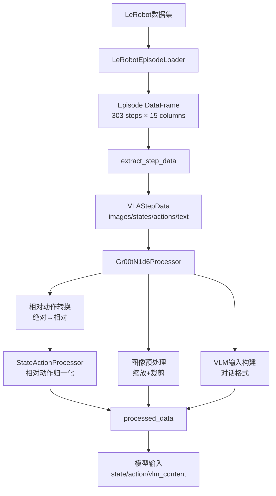

# GR00T 数据处理 Pipeline 完整流程分析

## 概述

本文档详细解析从 LeRobot 格式数据集加载到模型输入准备的完整数据处理流程，涵盖数据加载、特征提取、归一化和多模态输入构建等核心步骤。

---

## 1. 数据集配置与加载

### 1.1 数据集元数据: modality.json

`modality.json` 定义了原始数据集中各模态数据的**存储结构**和**字段映射关系**，是 LeRobot 格式数据集的核心元数据文件。

**文件路径**: `demo_data/svla_so101_pickplace/meta/modality.json`

```json
{
    "state": {
        "shoulder_pan.pos": {"start": 0, "end": 1},
        "shoulder_lift.pos": {"start": 1, "end": 2},
        "elbow_flex.pos": {"start": 2, "end": 3},
        "wrist_flex.pos": {"start": 3, "end": 4},
        "wrist_roll.pos": {"start": 4, "end": 5},
        "gripper.pos": {"start": 5, "end": 6}
    },
    "action": {
        "shoulder_pan.pos": {"start": 0, "end": 1},
        "shoulder_lift.pos": {"start": 1, "end": 2},
        "elbow_flex.pos": {"start": 2, "end": 3},
        "wrist_flex.pos": {"start": 3, "end": 4},
        "wrist_roll.pos": {"start": 4, "end": 5},
        "gripper.pos": {"start": 5, "end": 6}
    },
    "video": {
        "up": {"original_key": "observation.images.up"},
        "side": {"original_key": "observation.images.side"}
    },
    "annotation": {
        "human.action.task_description": {
            "original_key": "task_index"
        }
    }
}
```

#### 1.1.1 State/Action 模态的数组切片

**作用**: 描述如何从 Parquet 文件的大数组中切出各个关节的数据。

**原始存储**: Parquet 中 `observation.state` 和 `action` 列是长度为6的数组
```python
parquet_data['observation.state'] = [值1, 值2, 值3, 值4, 值5, 值6]  # shape: (6,)
```

**切片映射**:
```python
# 从 observation.state 数组中切片
shoulder_pan_value = observation_state[0:1]   # 索引0
shoulder_lift_value = observation_state[1:2]  # 索引1
elbow_flex_value = observation_state[2:3]     # 索引2
wrist_flex_value = observation_state[3:4]     # 索引3
wrist_roll_value = observation_state[4:5]     # 索引4
gripper_value = observation_state[5:6]        # 索引5
```

**数据流向**:
```
Parquet文件: observation.state → [v0, v1, v2, v3, v4, v5]
                                    ↓ modality.json定义切片规则
DataFrame列:
  - state.shoulder_pan.pos   ← [v0]  (start:0, end:1)
  - state.shoulder_lift.pos  ← [v1]  (start:1, end:2)
  - state.elbow_flex.pos     ← [v2]  (start:2, end:3)
  - state.wrist_flex.pos     ← [v3]  (start:3, end:4)
  - state.wrist_roll.pos     ← [v4]  (start:4, end:5)
  - state.gripper.pos        ← [v5]  (start:5, end:6)
```

#### 1.1.2 Video 模态的文件映射

**作用**: 指定视频文件的命名规则，用于定位对应的视频文件。

**原始命名**: 视频文件按 `original_key` 命名
```
data/chunk-000/
  ├── episode_000000_observation.images.up.mp4
  └── episode_000000_observation.images.side.mp4
```

**映射关系**:
```python
# modality.json 中定义
"video": {
    "up": {"original_key": "observation.images.up"},     # 视频文件后缀
    "side": {"original_key": "observation.images.side"}  # 视频文件后缀
}

# 加载时根据 original_key 构造文件路径
video_filename = f"episode_{episode_id:06d}_{original_key}.mp4"
# 例如: episode_000000_observation.images.up.mp4
```

#### 1.1.3 Annotation 模态的索引映射

**作用**: 将 Parquet 中的任务索引 (task_index) 映射到可读文本。

**原始存储**: Parquet 中存储的是数字索引
```python
parquet_data['task_index'] = 0  # 整数索引
```

**映射过程**:
```python
# 1. 从 modality.json 获取 original_key
original_key = "task_index"  # annotation.human.action.task_description 对应的原始列名

# 2. 从 Parquet 读取索引值
task_idx = parquet_data[original_key]  # 例如: 0

# 3. 从 tasks.jsonl 查找对应文本
task_text = tasks_map[task_idx]  # "pink lego brick into the transparent box"

# 4. 写入 DataFrame
df['language.annotation.human.action.task_description'] = task_text
```

#### 1.1.4 modality.json 与 ModalityConfig 的关系

**两者区别**:

| 项目 | modality.json | ModalityConfig (代码中) |
|------|---------------|-------------------------|
| **作用** | 描述原始数据存储格式 | 定义训练样本采样规则 |
| **内容** | 数组索引、文件命名 | 时间窗口、关节选择 |
| **位置** | 数据集meta目录 | Python配置代码 |
| **修改** | 数据预处理时确定 | 训练时按需调整 |

**协同工作流程**:
```python
# Step 1: modality.json 定义如何拆解原始数据
modality_json = {
    "state": {
        "shoulder_pan.pos": {"start": 0, "end": 1},  # 从数组索引0切出
        ...
    }
}

# Step 2: LeRobotEpisodeLoader 根据 modality.json 加载 DataFrame
loader = LeRobotEpisodeLoader(path, modality_configs)
episode_df = loader[0]  # 列名: state.shoulder_pan.pos, ...

# Step 3: ModalityConfig 定义从 DataFrame 中采样哪些列和时间步
modality_config = {
    "state": ModalityConfig(
        modality_keys=["shoulder_pan.pos", "shoulder_lift.pos", ...],  # 选择关节
        delta_indices=[0]  # 只采样当前时刻
    )
}

# Step 4: extract_step_data 根据 ModalityConfig 提取样本
vla_data = extract_step_data(episode_df, step_index=100, modality_configs)
```

---

### 1.2 训练样本配置: ModalityConfig

```python
modality_config = {
    "video": ModalityConfig(
        delta_indices=[0],
        modality_keys=["up", "side"],
    ),
    "state": ModalityConfig(
        delta_indices=[0],
        modality_keys=[
            "shoulder_pan.pos", "shoulder_lift.pos", "elbow_flex.pos",
            "wrist_flex.pos", "wrist_roll.pos", "gripper.pos"
        ],
    ),
    "action": ModalityConfig(
        delta_indices=list(range(0, 16)),  # 16步action horizon
        modality_keys=[
            "shoulder_pan.pos", "shoulder_lift.pos", "elbow_flex.pos",
            "wrist_flex.pos", "wrist_roll.pos", "gripper.pos"
        ],
        action_configs=[ActionConfig(rep=RELATIVE, type=NON_EEF, format=DEFAULT)] * 6
    ),
    "language": ModalityConfig(
        delta_indices=[0],
        modality_keys=["annotation.human.action.task_description"],
    ),
}
```

**配置说明**：
- **video**: 2个视角（up/side），单帧采样
- **state**: 6个关节位置，单步状态
- **action**: 6个关节位置，16步预测horizon，使用相对动作表示
- **language**: 任务描述文本

### 1.3 数据集加载

```python
# 注册新本体到全局配置
register_modality_config(modality_config, EmbodimentTag.NEW_EMBODIMENT)

# 生成相对动作统计量
generate_rel_stats('./demo_data/svla_so101_pickplace', EmbodimentTag.NEW_EMBODIMENT)

# 加载数据集，可以per episode读取
lerobot_episode_loader = LeRobotEpisodeLoader(
    './demo_data/svla_so101_pickplace',
    modality_config,
    video_backend='decord'
)
```

**输出示例**：
```
Number of episodes: 50
```

### 1.4 Episode DataFrame 结构

```python
episode0_df = lerobot_episode_loader[0]
```

**DataFrame 列结构** (303 rows × 15 columns)：
- `language.annotation.human.action.task_description`: 任务描述文本
- `state.shoulder_pan.pos`, `state.shoulder_lift.pos`, ... : 6个关节状态
- `action.shoulder_pan.pos`, `action.shoulder_lift.pos`, ... : 6个关节动作
- `video.up`, `video.side`: 2个视角的视频帧数组

---

## 2. 步级数据提取 (VLAStepData)

### 2.1 提取单步样本

```python
vla_step_data = extract_step_data(
    episode_data=episode0_df,
    step_index=100,
    modality_configs=modality_config,
    embodiment_tag=EmbodimentTag.NEW_EMBODIMENT
)
```

**功能**：从 episode DataFrame 中提取第100步的多模态数据，根据 `delta_indices` 构建时间窗口。

### 2.2 VLAStepData 输出结构

```python
VLAStepData(
    images={
        'up': [array(shape=(256,340,3), dtype=uint8)],    # 1帧(delta_indices=[0])
        'side': [array(shape=(256,340,3), dtype=uint8)]   # 1帧
    },
    states={
        'shoulder_pan.pos': array(shape=(1,1), dtype=float32),   # 1步状态
        'shoulder_lift.pos': array(shape=(1,1), dtype=float32),
        'elbow_flex.pos': array(shape=(1,1), dtype=float32),
        'wrist_flex.pos': array(shape=(1,1), dtype=float32),
        'wrist_roll.pos': array(shape=(1,1), dtype=float32),
        'gripper.pos': array(shape=(1,1), dtype=float32)
    },
    actions={
        'shoulder_pan.pos': array(shape=(16,1), dtype=float32),  # 16步action
        'shoulder_lift.pos': array(shape=(16,1), dtype=float32),
        'elbow_flex.pos': array(shape=(16,1), dtype=float32),
        'wrist_flex.pos': array(shape=(16,1), dtype=float32),
        'wrist_roll.pos': array(shape=(16,1), dtype=float32),
        'gripper.pos': array(shape=(16,1), dtype=float32)
    },
    text='pink lego brick into the transparent box',
    embodiment=<EmbodimentTag.NEW_EMBODIMENT: 'new_embodiment'>
)
```

**关键点**：
- **图像**: 每个视角1帧 RGB 图像 (delta_indices=[0])
- **状态**: 每个关节1个时间步 (delta_indices=[0])
- **动作**: 每个关节16个时间步 (delta_indices=[0..15])，用于预测未来16步
- **文本**: 语言指令描述任务目标

---

## 3. Processor 处理 (模型输入构建)

### 3.1 Processor 初始化

```python
processor = Gr00tN1d6Processor(
    modality_configs={EmbodimentTag.NEW_EMBODIMENT.value: modality_config},
    statistics={EmbodimentTag.NEW_EMBODIMENT.value: statistics},
    image_crop_size=None,           # 使用默认缩放策略
    image_target_size=None,
    shortest_image_edge=512,        # 最短边缩放到512
    crop_fraction=0.95,             # 中心裁剪95%
    use_relative_action=True,       # 启用相对动作转换
    max_action_horizon=16,
    max_state_dim=29,               # padding到统一维度
    max_action_dim=29
)
```

**核心功能**：
1. 相对动作转换 (absolute → relative)
2. 状态/动作归一化 (使用 statistics)
3. 图像预处理 (缩放、裁剪、增强)
4. 多模态特征对齐与padding

### 3.2 处理流程

```python
messages = [{"type": MessageType.EPISODE_STEP.value, "content": vla_step_data}]
processed_data = processor(messages)
```

**处理步骤**：

#### 步骤1: 相对动作转换 + 归一化

**处理顺序**（重要！）：
1. **先计算相对动作**: `action_relative = action_absolute - state[-1]`
   - 以当前状态的最后一帧为参考系
   - 将绝对动作转为相对动作

2. **再归一化**: 使用 `StateActionProcessor.apply()` 归一化到 [-1, 1]
   - 使用 `relative_stats.json` 中的相对动作统计量
   - 公式: `normalized = (action_relative - min) / (max - min) * 2 - 1`

**为什么要先计算相对再归一化？**
- 归一化统计量是基于**相对动作**计算的（`relative_stats.json`）
- 相对动作的分布更稳定，不受初始位置影响
- 归一化效果更好，模型训练更收敛

#### 步骤2: 动作拼接与Padding
- 拼接所有关节: `[shoulder_pan, shoulder_lift, ..., gripper]` → `(16, 6)`
- Padding到 `max_action_dim`: `(16, 6)` → `(16, 29)`
- Padding到 `max_action_horizon`: `(16, 29)` → `(16, 29)` (已达上限)
- 生成 `action_mask`: 标记有效区域为1，padding区域为0

#### 步骤3: 状态拼接与Padding
- 拼接所有关节: `[shoulder_pan, ..., gripper]` → `(1, 6)`
- Padding到 `max_state_dim`: `(1, 6)` → `(1, 29)`

#### 步骤4: 图像预处理
- 缩放最短边到512像素
- 中心裁剪95%区域
- 转换为Tensor: `(H, W, 3)` → `(3, H, W)`

#### 步骤5: VLM输入构建
- 构造对话格式: `<|im_start|>user\n{text}<image-1><image-2><|im_end|>`
- 保留PIL图像供后续tokenization

---

## 4. 最终输出结构

### 4.1 processed_data 字典

```python
{
    'state': tensor(shape=(1, 29), dtype=bfloat16),
    'action': tensor(shape=(16, 29), dtype=bfloat16),
    'action_mask': tensor(shape=(16, 29), dtype=bfloat16),
    'vlm_content': {
        'text': '<|im_start|>system\n...<|im_start|>user\npink lego brick...<image-1><image-2><|im_end|>\n',
        'images': [PIL.Image(340x256), PIL.Image(340x256)],
        'conversation': [{'role': 'user', 'content': [...]}]
    },
    'embodiment_id': 10
}
```

### 4.2 实际输出样例

#### State (归一化后)
```python
tensor([[ 0.1034, -0.9860,  0.6591,  0.2651,  0.2114, -0.8678,  # 前6维有效
          0.0000,  0.0000,  0.0000, ..., 0.0000]])  # 后23维padding
```
- **维度**: (1, 29)
- **有效维度**: 前6维 (6个关节状态)
- **padding**: 后23维全0

#### Action (归一化相对动作)
```python
tensor([
    [ 0.1345, -0.6012,  0.2887,  0.2397,  0.2174, -0.1710, 0.0, ..., 0.0],  # t=0
    [ 0.1410, -0.4953,  0.2134,  0.2397,  0.2295, -0.0351, 0.0, ..., 0.0],  # t=1
    ...
    [ 0.1726,  0.2072, -0.0460, -0.3608,  0.2215,  0.2553, 0.0, ..., 0.0]   # t=15
])
```
- **维度**: (16, 29)
- **有效维度**: 前6维 (6个关节动作)
- **时间步**: 16步 action horizon

#### Action Mask
```python
tensor([
    [1., 1., 1., 1., 1., 1., 0., 0., ..., 0.],  # 前6维有效
    [1., 1., 1., 1., 1., 1., 0., 0., ..., 0.],
    ...
    [1., 1., 1., 1., 1., 1., 0., 0., ..., 0.]
])
```
- **维度**: (16, 29)
- **1**: 有效动作维度
- **0**: padding区域

#### VLM Content
```python
{
    'text': '<|im_start|>system\nYou are a helpful assistant.<|im_end|>\n'
            '<|im_start|>user\npink lego brick into the transparent box'
            '<image-1><image-2><|im_end|>\n',
    'images': [
        PIL.Image(mode=RGB, size=(340, 256)),  # up视角
        PIL.Image(mode=RGB, size=(340, 256))   # side视角
    ],
    'conversation': [{'role': 'user', 'content': [...]}]
}
```

---

## 5. 数据流总结



---

## 6. 关键配置对照表

| 配置项 | 原始值 | 处理后维度 | 说明 |
|--------|--------|-----------|------|
| **State** |
| delta_indices | [0] | (1, 6) → (1, 29) | 单步状态，padding到29维 |
| modality_keys | 6个关节 | 前6维有效 | 剩余23维为0 |
| **Action** |
| delta_indices | [0..15] | (16, 6) → (16, 29) | 16步horizon，padding到29维 |
| modality_keys | 6个关节 | 前6维有效 | 相对动作表示 |
| **Video** |
| delta_indices | [0] | 2张PIL图像 | 缩放到340×256 |
| modality_keys | ["up", "side"] | 2个视角 | 对话格式嵌入 |
| **Language** |
| delta_indices | [0] | 单条文本 | 转换为对话模板 |

---

## 7. 典型应用场景

### 7.1 训练时
- **输入**: `processed_data` (包含action GT)
- **输出**: 模型预测action，计算loss
- **action_mask**: 用于屏蔽padding区域的loss

### 7.2 推理时
- **输入**: `processed_data` (不含action)
- **输出**: 模型生成16步action预测
- **解码**: `processor.decode_action()` 反归一化+相对→绝对

---

## 8. 常见问题与注意事项

### 8.1 键类型对齐
❌ **错误**:
```python
modality_configs={EmbodimentTag.NEW_EMBODIMENT: ...}  # 枚举对象
```

✅ **正确**:
```python
modality_configs={EmbodimentTag.NEW_EMBODIMENT.value: ...}  # 字符串 'new_embodiment'
```

### 8.2 相对动作处理顺序（重要！）

**训练时处理步骤**：
```python
# Step 1: 先计算相对动作
action_relative = action_absolute - state[-1]

# Step 2: 再归一化（使用相对动作统计量）
action_normalized = (action_relative - mean) / std
```

**推理时反向步骤**：
```python
# Step 1: 先反归一化
action_relative = action_normalized * std + mean

# Step 2: 再转回绝对动作
action_absolute = action_relative + state[-1]
```

**关键要求**：
- `use_relative_action=True`
- `action_configs` 中设置 `rep=ActionRepresentation.RELATIVE`
- 必须提供 `state` 作为参考系

### 8.3 视频后端选择
- **Windows**: 推荐 `decord` (兼容性好)
- **Linux**: 推荐 `torchcodec` (性能优)
- **通用**: `pyav` 或 `ffmpeg` (稳定但较慢)

---

## 9. 性能优化建议

1. **批处理**: 使用 `DataLoader` + `collator` 批量处理多个样本
2. **缓存统计量**: `statistics` 在 processor 初始化时一次性加载
3. **图像预处理**: 训练时使用 `albumentations` 增强，推理时关闭
4. **相对动作**: 缓存相对动作统计 (`relative_stats.json`)，避免重复计算

---

**文档版本**: v1.0  
**更新时间**: 2026-01-20  
**测试代码**: `lerobot_hf/test_dataset.py`
