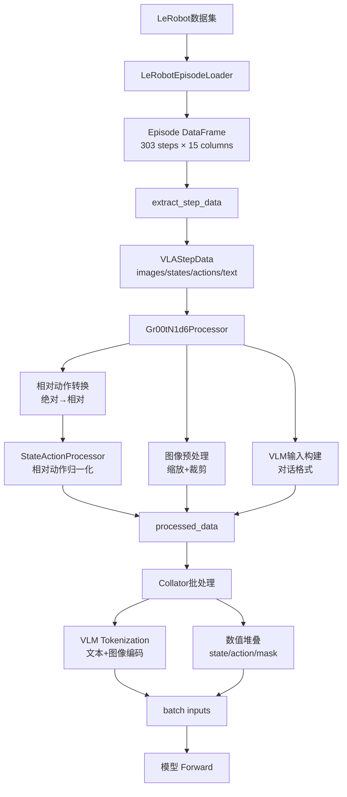
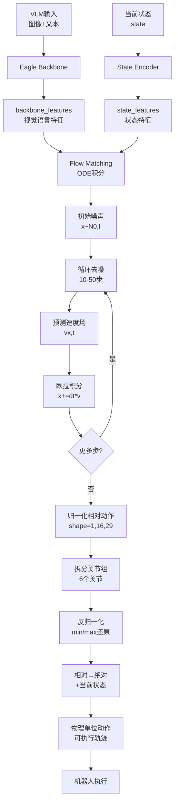

# GR00T 数据处理 Pipeline 完整流程分析

## 概述

本文档详细解析从 LeRobot 格式数据集加载到模型输入准备的完整数据处理流程，涵盖数据加载、特征提取、归一化和多模态输入构建等核心步骤。

---

## 1. 数据集配置与加载

### 1.1 数据集元数据: modality.json

`modality.json` 定义了原始数据集中各模态数据的**存储结构**和**字段映射关系**，是 LeRobot 格式数据集的核心元数据文件。

**文件路径**: `demo_data/svla_so101_pickplace/meta/modality.json`

```json
{
    "state": {
        "shoulder_pan.pos": {"start": 0, "end": 1},
        "shoulder_lift.pos": {"start": 1, "end": 2},
        "elbow_flex.pos": {"start": 2, "end": 3},
        "wrist_flex.pos": {"start": 3, "end": 4},
        "wrist_roll.pos": {"start": 4, "end": 5},
        "gripper.pos": {"start": 5, "end": 6}
    },
    "action": {
        "shoulder_pan.pos": {"start": 0, "end": 1},
        "shoulder_lift.pos": {"start": 1, "end": 2},
        "elbow_flex.pos": {"start": 2, "end": 3},
        "wrist_flex.pos": {"start": 3, "end": 4},
        "wrist_roll.pos": {"start": 4, "end": 5},
        "gripper.pos": {"start": 5, "end": 6}
    },
    "video": {
        "up": {"original_key": "observation.images.up"},
        "side": {"original_key": "observation.images.side"}
    },
    "annotation": {
        "human.action.task_description": {
            "original_key": "task_index"
        }
    }
}
```

#### 1.1.1 State/Action 模态的数组切片

**作用**: 描述如何从 Parquet 文件的大数组中切出各个关节的数据。

**原始存储**: Parquet 中 `observation.state` 和 `action` 列是长度为6的数组
```python
parquet_data['observation.state'] = [值1, 值2, 值3, 值4, 值5, 值6]  # shape: (6,)
```

**切片映射**:
```python
# 从 observation.state 数组中切片
shoulder_pan_value = observation_state[0:1]   # 索引0
shoulder_lift_value = observation_state[1:2]  # 索引1
elbow_flex_value = observation_state[2:3]     # 索引2
wrist_flex_value = observation_state[3:4]     # 索引3
wrist_roll_value = observation_state[4:5]     # 索引4
gripper_value = observation_state[5:6]        # 索引5
```

**数据流向**:
```
Parquet文件: observation.state → [v0, v1, v2, v3, v4, v5]
                                    ↓ modality.json定义切片规则
DataFrame列:
  - state.shoulder_pan.pos   ← [v0]  (start:0, end:1)
  - state.shoulder_lift.pos  ← [v1]  (start:1, end:2)
  - state.elbow_flex.pos     ← [v2]  (start:2, end:3)
  - state.wrist_flex.pos     ← [v3]  (start:3, end:4)
  - state.wrist_roll.pos     ← [v4]  (start:4, end:5)
  - state.gripper.pos        ← [v5]  (start:5, end:6)
```

#### 1.1.2 Video 模态的文件映射

**作用**: 指定视频文件的命名规则，用于定位对应的视频文件。

**原始命名**: 视频文件按 `original_key` 命名
```
data/chunk-000/
  ├── episode_000000_observation.images.up.mp4
  └── episode_000000_observation.images.side.mp4
```

**映射关系**:
```python
# modality.json 中定义
"video": {
    "up": {"original_key": "observation.images.up"},     # 视频文件后缀
    "side": {"original_key": "observation.images.side"}  # 视频文件后缀
}

# 加载时根据 original_key 构造文件路径
video_filename = f"episode_{episode_id:06d}_{original_key}.mp4"
# 例如: episode_000000_observation.images.up.mp4
```

#### 1.1.3 Annotation 模态的索引映射

**作用**: 将 Parquet 中的任务索引 (task_index) 映射到可读文本。

**原始存储**: Parquet 中存储的是数字索引
```python
parquet_data['task_index'] = 0  # 整数索引
```

**映射过程**:
```python
# 1. 从 modality.json 获取 original_key
original_key = "task_index"  # annotation.human.action.task_description 对应的原始列名

# 2. 从 Parquet 读取索引值
task_idx = parquet_data[original_key]  # 例如: 0

# 3. 从 tasks.jsonl 查找对应文本
task_text = tasks_map[task_idx]  # "pink lego brick into the transparent box"

# 4. 写入 DataFrame
df['language.annotation.human.action.task_description'] = task_text
```

#### 1.1.4 modality.json 与 ModalityConfig 的关系

**两者区别**:

| 项目 | modality.json | ModalityConfig (代码中) |
|------|---------------|-------------------------|
| **作用** | 描述原始数据存储格式 | 定义训练样本采样规则 |
| **内容** | 数组索引、文件命名 | 时间窗口、关节选择 |
| **位置** | 数据集meta目录 | Python配置代码 |
| **修改** | 数据预处理时确定 | 训练时按需调整 |

**协同工作流程**:
```python
# Step 1: modality.json 定义如何拆解原始数据
modality_json = {
    "state": {
        "shoulder_pan.pos": {"start": 0, "end": 1},  # 从数组索引0切出
        ...
    }
}

# Step 2: LeRobotEpisodeLoader 根据 modality.json 加载 DataFrame
loader = LeRobotEpisodeLoader(path, modality_configs)
episode_df = loader[0]  # 列名: state.shoulder_pan.pos, ...

# Step 3: ModalityConfig 定义从 DataFrame 中采样哪些列和时间步
modality_config = {
    "state": ModalityConfig(
        modality_keys=["shoulder_pan.pos", "shoulder_lift.pos", ...],  # 选择关节
        delta_indices=[0]  # 只采样当前时刻
    )
}

# Step 4: extract_step_data 根据 ModalityConfig 提取样本
vla_data = extract_step_data(episode_df, step_index=100, modality_configs)
```

---

### 1.2 训练样本配置: ModalityConfig

```python
modality_config = {
    "video": ModalityConfig(
        delta_indices=[0],
        modality_keys=["up", "side"],
    ),
    "state": ModalityConfig(
        delta_indices=[0],
        modality_keys=[
            "shoulder_pan.pos", "shoulder_lift.pos", "elbow_flex.pos",
            "wrist_flex.pos", "wrist_roll.pos", "gripper.pos"
        ],
    ),
    "action": ModalityConfig(
        delta_indices=list(range(0, 16)),  # 16步action horizon
        modality_keys=[
            "shoulder_pan.pos", "shoulder_lift.pos", "elbow_flex.pos",
            "wrist_flex.pos", "wrist_roll.pos", "gripper.pos"
        ],
        action_configs=[ActionConfig(rep=RELATIVE, type=NON_EEF, format=DEFAULT)] * 6
    ),
    "language": ModalityConfig(
        delta_indices=[0],
        modality_keys=["annotation.human.action.task_description"],
    ),
}
```

**配置说明**：
- **video**: 2个视角（up/side），单帧采样
- **state**: 6个关节位置，单步状态
- **action**: 6个关节位置，16步预测horizon，使用相对动作表示
- **language**: 任务描述文本

### 1.3 数据集加载

```python
# 注册新本体到全局配置
register_modality_config(modality_config, EmbodimentTag.NEW_EMBODIMENT)

# 生成相对动作统计量
generate_rel_stats('./demo_data/svla_so101_pickplace', EmbodimentTag.NEW_EMBODIMENT)

# 加载数据集，可以per episode读取
lerobot_episode_loader = LeRobotEpisodeLoader(
    './demo_data/svla_so101_pickplace',
    modality_config,
    video_backend='decord'
)
```

**输出示例**：
```
Number of episodes: 50
```

### 1.4 Episode DataFrame 结构

```python
episode0_df = lerobot_episode_loader[0]
```

**DataFrame 列结构** (303 rows × 15 columns)：
- `language.annotation.human.action.task_description`: 任务描述文本
- `state.shoulder_pan.pos`, `state.shoulder_lift.pos`, ... : 6个关节状态
- `action.shoulder_pan.pos`, `action.shoulder_lift.pos`, ... : 6个关节动作
- `video.up`, `video.side`: 2个视角的视频帧数组

---

## 2. 步级数据提取 (VLAStepData)

### 2.1 提取单步样本

```python
vla_step_data = extract_step_data(
    episode_data=episode0_df,
    step_index=100,
    modality_configs=modality_config,
    embodiment_tag=EmbodimentTag.NEW_EMBODIMENT
)
```

**功能**：从 episode DataFrame 中提取第100步的多模态数据，根据 `delta_indices` 构建时间窗口。

### 2.2 VLAStepData 输出结构

```python
VLAStepData(
    images={
        'up': [array(shape=(256,340,3), dtype=uint8)],    # 1帧(delta_indices=[0])
        'side': [array(shape=(256,340,3), dtype=uint8)]   # 1帧
    },
    states={
        'shoulder_pan.pos': array(shape=(1,1), dtype=float32),   # 1步状态
        'shoulder_lift.pos': array(shape=(1,1), dtype=float32),
        'elbow_flex.pos': array(shape=(1,1), dtype=float32),
        'wrist_flex.pos': array(shape=(1,1), dtype=float32),
        'wrist_roll.pos': array(shape=(1,1), dtype=float32),
        'gripper.pos': array(shape=(1,1), dtype=float32)
    },
    actions={
        'shoulder_pan.pos': array(shape=(16,1), dtype=float32),  # 16步action
        'shoulder_lift.pos': array(shape=(16,1), dtype=float32),
        'elbow_flex.pos': array(shape=(16,1), dtype=float32),
        'wrist_flex.pos': array(shape=(16,1), dtype=float32),
        'wrist_roll.pos': array(shape=(16,1), dtype=float32),
        'gripper.pos': array(shape=(16,1), dtype=float32)
    },
    text='pink lego brick into the transparent box',
    embodiment=<EmbodimentTag.NEW_EMBODIMENT: 'new_embodiment'>
)
```

**关键点**：
- **图像**: 每个视角1帧 RGB 图像 (delta_indices=[0])
- **状态**: 每个关节1个时间步 (delta_indices=[0])
- **动作**: 每个关节16个时间步 (delta_indices=[0..15])，用于预测未来16步
- **文本**: 语言指令描述任务目标

---

## 3. Processor 处理 (模型输入构建)

### 3.1 Processor 初始化

```python
processor = Gr00tN1d6Processor(
    modality_configs={EmbodimentTag.NEW_EMBODIMENT.value: modality_config},
    statistics={EmbodimentTag.NEW_EMBODIMENT.value: statistics},
    image_crop_size=None,           # 使用默认缩放策略
    image_target_size=None,
    shortest_image_edge=512,        # 最短边缩放到512
    crop_fraction=0.95,             # 中心裁剪95%
    use_relative_action=True,       # 启用相对动作转换
    max_action_horizon=16,
    max_state_dim=29,               # padding到统一维度
    max_action_dim=29
)
```

**核心功能**：
1. 相对动作转换 (absolute → relative)
2. 状态/动作归一化 (使用 statistics)
3. 图像预处理 (缩放、裁剪、增强)
4. 多模态特征对齐与padding

### 3.2 处理流程

```python
messages = [{"type": MessageType.EPISODE_STEP.value, "content": vla_step_data}]
processed_data = processor(messages)
```

**处理步骤**：

#### 步骤1: 相对动作转换 + 归一化

**处理顺序**（重要！）：
1. **先计算相对动作**: `action_relative = action_absolute - state[-1]`
   - 以当前状态的最后一帧为参考系
   - 将绝对动作转为相对动作

2. **再归一化**: 使用 `StateActionProcessor.apply()` 归一化到 [-1, 1]
   - 使用 `relative_stats.json` 中的相对动作统计量
   - 公式: `normalized = (action_relative - min) / (max - min) * 2 - 1`

**为什么要先计算相对再归一化？**
- 归一化统计量是基于**相对动作**计算的（`relative_stats.json`）
- 相对动作的分布更稳定，不受初始位置影响
- 归一化效果更好，模型训练更收敛

#### 步骤2: 动作拼接与Padding
- 拼接所有关节: `[shoulder_pan, shoulder_lift, ..., gripper]` → `(16, 6)`
- Padding到 `max_action_dim`: `(16, 6)` → `(16, 29)`
- Padding到 `max_action_horizon`: `(16, 29)` → `(16, 29)` (已达上限)
- 生成 `action_mask`: 标记有效区域为1，padding区域为0

#### 步骤3: 状态拼接与Padding
- 拼接所有关节: `[shoulder_pan, ..., gripper]` → `(1, 6)`
- Padding到 `max_state_dim`: `(1, 6)` → `(1, 29)`

#### 步骤4: 图像预处理
- 缩放最短边到512像素
- 中心裁剪95%区域
- 转换为Tensor: `(H, W, 3)` → `(3, H, W)`

#### 步骤5: VLM输入构建
- 构造对话格式: `<|im_start|>user\n{text}<image-1><image-2><|im_end|>`
- 保留PIL图像供后续tokenization

---

## 4. 最终输出结构

### 4.1 processed_data 字典

```python
{
    'state': tensor(shape=(1, 29), dtype=bfloat16),
    'action': tensor(shape=(16, 29), dtype=bfloat16),
    'action_mask': tensor(shape=(16, 29), dtype=bfloat16),
    'vlm_content': {
        'text': '<|im_start|>system\n...<|im_start|>user\npink lego brick...<image-1><image-2><|im_end|>\n',
        'images': [PIL.Image(340x256), PIL.Image(340x256)],
        'conversation': [{'role': 'user', 'content': [...]}]
    },
    'embodiment_id': 10
}
```

### 4.2 实际输出样例

#### State (归一化后)
```python
tensor([[ 0.1034, -0.9860,  0.6591,  0.2651,  0.2114, -0.8678,  # 前6维有效
          0.0000,  0.0000,  0.0000, ..., 0.0000]])  # 后23维padding
```
- **维度**: (1, 29)
- **有效维度**: 前6维 (6个关节状态)
- **padding**: 后23维全0

#### Action (归一化相对动作)
```python
tensor([
    [ 0.1345, -0.6012,  0.2887,  0.2397,  0.2174, -0.1710, 0.0, ..., 0.0],  # t=0
    [ 0.1410, -0.4953,  0.2134,  0.2397,  0.2295, -0.0351, 0.0, ..., 0.0],  # t=1
    ...
    [ 0.1726,  0.2072, -0.0460, -0.3608,  0.2215,  0.2553, 0.0, ..., 0.0]   # t=15
])
```
- **维度**: (16, 29)
- **有效维度**: 前6维 (6个关节动作)
- **时间步**: 16步 action horizon

#### Action Mask
```python
tensor([
    [1., 1., 1., 1., 1., 1., 0., 0., ..., 0.],  # 前6维有效
    [1., 1., 1., 1., 1., 1., 0., 0., ..., 0.],
    ...
    [1., 1., 1., 1., 1., 1., 0., 0., ..., 0.]
])
```
- **维度**: (16, 29)
- **1**: 有效动作维度
- **0**: padding区域

#### VLM Content
```python
{
    'text': '<|im_start|>system\nYou are a helpful assistant.<|im_end|>\n'
            '<|im_start|>user\npink lego brick into the transparent box'
            '<image-1><image-2><|im_end|>\n',
    'images': [
        PIL.Image(mode=RGB, size=(340, 256)),  # up视角
        PIL.Image(mode=RGB, size=(340, 256))   # side视角
    ],
    'conversation': [{'role': 'user', 'content': [...]}]
}
```

---

## 5. Collator 批处理

### 5.1 Collator 的作用

**目标**: 将多个 `processed_data` 样本组装成模型可直接输入的 batch 格式。

```python
batch = processor.collator([processed_data1, processed_data2, ...])
```

**DataCollator 是 DataLoader 和模型之间的桥梁**，负责：
1. 将列表形式的样本转换为批量张量
2. 对不同模态使用不同的拼接策略
3. 确保 batch 内所有样本的张量维度对齐

### 5.2 Collator 处理流程

#### 步骤1: 收集所有样本的 key

```python
keys = list(set().union(*(elem.keys() for elem in features)))
```

**处理可选字段**: 不同样本可能包含不同的 key（如训练时有 action，推理时没有）

#### 步骤2: VLM 内容特殊处理

对于 `vlm_content` 字段，需要特殊处理：

```python
if key == "vlm_content":
    # 1. 收集所有样本的文本和图像
    text_list = [v["text"] for v in values]
    image_inputs, _ = processor.process_vision_info([v["conversation"] for v in values])
    
    # 2. 调用 VLM processor 进行 tokenization
    vlm_inputs = processor(
        text=text_list, 
        images=image_inputs, 
        return_tensors="pt", 
        padding=True
    )
    
    # 3. 将 VLM 输出的所有字段加入 batch
    for k, v in vlm_inputs.items():
        batch[k] = v
```

**VLM Processor 输出**:
- `input_ids`: 文本 token 序列
- `attention_mask`: 文本注意力掩码
- `pixel_values`: 图像预处理后的张量（列表格式，每个视角一个）
- `image_sizes`: 原始图像尺寸

**关键操作**:
- **Tokenization**: 将文本转换为 token IDs
- **Padding**: 统一序列长度（左侧 padding，兼容 Flash Attention）
- **图像编码**: 调用 Eagle backbone 的 image processor

#### 步骤3: 数值模态直接堆叠

对于 `state`, `action`, `action_mask`, `embodiment_id` 等数值字段：

```python
else:
    batch[key] = torch.from_numpy(np.stack(values))
```

**堆叠逻辑**:
- 输入: `[array[D], array[D], ...]` (batch_size 个)
- `np.stack`: 堆叠成 `[B, D]`
- `torch.from_numpy`: 转为 PyTorch 张量

**示例**: batch_size=4, state_dim=29
- 输入: 4个 shape=(1, 29) 的 array
- 输出: shape=(4, 1, 29) 的 Tensor

### 5.3 Collator 输出结构

基于运行 `test_dataset.py` 的实际输出：

```python
batch = {
    'inputs': {
        # === VLM 文本输入 ===
        'input_ids': torch.Size([1, 254]),           # (B, seq_len) Token IDs
        'attention_mask': torch.Size([1, 254]),      # (B, seq_len) Attention掩码
        
        # === VLM 图像输入 ===
        'pixel_values': [                            # List of tensors (每个视角一个)
            torch.Size([1, 3, 252, 336]),            # (B, C, H, W) 视角1
            torch.Size([1, 3, 252, 336])             # (B, C, H, W) 视角2
        ],
        'image_sizes': torch.Size([2, 2]),           # (num_images, 2) [[H1,W1], [H2,W2]]
        
        # === 状态/动作 ===
        'state': torch.Size([1, 1, 29]),             # (B, T, D) 归一化状态
        'action': torch.Size([1, 16, 29]),           # (B, T, D) 归一化相对动作
        'action_mask': torch.Size([1, 16, 29]),      # (B, T, D) 有效维度标记
        
        # === 本体标识 ===
        'embodiment_id': torch.Size([1]),            # (B,) 本体ID
    }
}
```

### 5.4 关键字段详解

#### VLM 文本字段

| 字段 | 形状 | Dtype | 说明 |
|------|------|-------|------|
| `input_ids` | (B, seq_len) | int64 | Tokenized 文本ID序列 |
| `attention_mask` | (B, seq_len) | int64 | 标记有效token(1)和padding(0) |

**序列构成** (本例 seq_len=254):
```
<|im_start|>system\nYou are a helpful assistant.<|im_end|>\n
<|im_start|>user\npink lego brick into the transparent box
<image-1><image-2><|im_end|>\n
```

#### VLM 图像字段

| 字段 | 形状 | Dtype | 说明 |
|------|------|-------|------|
| `pixel_values` | List[Tensor] | float32 | 每个视角一个张量 |
| `image_sizes` | (num_images, 2) | int64 | 原始图像尺寸 |

**pixel_values 为何是列表？**
- 不同视角的图像可能经过不同的预处理
- Eagle backbone 需要独立处理每个视角
- 保留灵活性以支持动态数量的视角

**图像预处理** (由 Eagle processor 完成):
- 原始尺寸: 340×256
- 预处理后: 336×252
- 通道顺序: RGB (3 channels)

#### 状态/动作字段

| 字段 | 形状 | Dtype | 说明 |
|------|------|-------|------|
| `state` | (B, T_state, D) | float32 | 当前归一化状态 |
| `action` | (B, T_action, D) | float32 | 未来归一化相对动作 |
| `action_mask` | (B, T_action, D) | float32 | 标记有效维度(1.0)和padding(0.0) |

**维度说明**:
- `B`: Batch size (本例=1)
- `T_state`: 状态时间步 (本例=1，单步状态)
- `T_action`: Action horizon (本例=16，预测未来16步)
- `D`: 统一维度 (本例=29，实际6维+23维padding)

#### 本体标识

| 字段 | 形状 | Dtype | 说明 |
|------|------|-------|------|
| `embodiment_id` | (B,) | int32 | 本体类型ID，用于多本体训练 |

**本体ID映射**:
```python
EmbodimentTag.NEW_EMBODIMENT → embodiment_id = 10
```

### 5.5 Collator 与 Processor 的分工

| 组件 | 职责 | 输入 | 输出 |
|------|------|------|------|
| **Processor** | 单样本预处理 | VLAStepData (原始数据) | processed_data (单样本) |
| **Collator** | Batch 组装 | List[processed_data] | batch (批量张量) |

**关键区别**:
- **Processor**: 处理单个样本，负责归一化、相对动作转换、图像变换
- **Collator**: 处理多个样本，负责 padding、堆叠、VLM tokenization

---

## 6. 数据流总结



---

## 7. 关键配置对照表

| 配置项 | 原始值 | 处理后维度 | 说明 |
|--------|--------|-----------|------|
| **State** |
| delta_indices | [0] | (1, 6) → (1, 29) | 单步状态，padding到29维 |
| modality_keys | 6个关节 | 前6维有效 | 剩余23维为0 |
| **Action** |
| delta_indices | [0..15] | (16, 6) → (16, 29) | 16步horizon，padding到29维 |
| modality_keys | 6个关节 | 前6维有效 | 相对动作表示 |
| **Video** |
| delta_indices | [0] | 2张PIL图像 | 缩放到340×256 |
| modality_keys | ["up", "side"] | 2个视角 | 对话格式嵌入 |
| **Language** |
| delta_indices | [0] | 单条文本 | 转换为对话模板 |

---

## 8. 典型应用场景

### 8.1 训练时
- **输入**: `processed_data` (包含action GT)
- **输出**: 模型预测action，计算loss
- **action_mask**: 用于屏蔽padding区域的loss

### 8.2 推理时
- **输入**: `processed_data` (不含action)
- **输出**: 模型生成16步action预测
- **解码**: `processor.decode_action()` 反归一化+相对→绝对

---

## 9. 常见问题与注意事项

### 9.1 键类型对齐
❌ **错误**:
```python
modality_configs={EmbodimentTag.NEW_EMBODIMENT: ...}  # 枚举对象
```

✅ **正确**:
```python
modality_configs={EmbodimentTag.NEW_EMBODIMENT.value: ...}  # 字符串 'new_embodiment'
```

### 9.2 相对动作处理顺序（重要！）

**训练时处理步骤**：
```python
# Step 1: 先计算相对动作
action_relative = action_absolute - state[-1]

# Step 2: 再归一化（使用相对动作统计量）
action_normalized = (action_relative - mean) / std
```

**推理时反向步骤**：
```python
# Step 1: 先反归一化
action_relative = action_normalized * std + mean

# Step 2: 再转回绝对动作
action_absolute = action_relative + state[-1]
```

**关键要求**：
- `use_relative_action=True`
- `action_configs` 中设置 `rep=ActionRepresentation.RELATIVE`
- 必须提供 `state` 作为参考系

### 9.3 视频后端选择
- **Windows**: 推荐 `decord` (兼容性好)
- **Linux**: 推荐 `torchcodec` (性能优)
- **通用**: `pyav` 或 `ffmpeg` (稳定但较慢)

---

## 10. 性能优化建议

1. **批处理**: 使用 `DataLoader` + `collator` 批量处理多个样本
2. **缓存统计量**: `statistics` 在 processor 初始化时一次性加载
3. **图像预处理**: 训练时使用 `albumentations` 增强，推理时关闭
4. **相对动作**: 缓存相对动作统计 (`relative_stats.json`)，避免重复计算

---

**文档版本**: v1.1  
**更新时间**: 2026-01-20  
**测试代码**: `lerobot_hf/test_dataset.py`

---

## 11. 模型推理：Flow Matching 动作生成

### 11.1 Flow Matching 原理

**Flow Matching** 是一种基于 ODE（常微分方程）的生成模型，训练时学习从噪声到数据的"速度场"。

#### 核心思想

1. **训练阶段**：学习速度场 `v(x, t)`
   - 输入：带噪声的动作 `x_t` 和时间步 `t`
   - 输出：速度场（表示如何从噪声流向真实动作）

2. **推理阶段**：通过 ODE 积分生成动作
   - ODE 方程：`dx/dt = v(x, t)`
   - 初始条件：`x(0) = noise ~ N(0, I)`
   - 终点：`x(1) = action`（真实动作）

#### 欧拉积分法

采用一阶欧拉法数值求解 ODE：

```python
x_{n+1} = x_n + dt · v(x_n, t_n)
```

其中 `dt = 1 / num_inference_timesteps`

**推理步数的影响**:
- 步数越多：积分越精确，动作质量越好，但速度越慢
- 步数越少：速度快，但可能欠拟合
- 典型值：训练时 1000 步，推理时 10-50 步

### 11.2 推理流程详解

代码位置：[`gr00t_n1d6.py#L478-597`](file:///c:/Users/owen/Documents/VsCode/Isaac-GR00T/Isaac-GR00T/gr00t/model/gr00t_n1d6/gr00t_n1d6.py#L478-L597)

```python
@torch.no_grad()
def get_action_with_features(
    self,
    backbone_features: torch.Tensor,      # VLM 输出的视觉语言特征
    state_features: torch.Tensor,         # 编码后的状态特征
    embodiment_id: torch.Tensor,          # 本体 ID
    backbone_output: BatchFeature,        # VLM 完整输出（含 mask）
) -> BatchFeature:
```

#### 步骤1: 初始化为高斯噪声

```python
# x(0) ~ N(0, I)
actions = torch.randn(
    size=(batch_size, action_horizon, action_dim),
    dtype=torch.bfloat16,
    device='cuda'
)
```

**输出示例**:
```python
actions: torch.Size([1, 16, 29])  # (B, T, D)
# 初始值为随机噪声，均值≈0，标准差≈1
```

#### 步骤2: 设置积分参数

```python
dt = 1.0 / num_inference_timesteps  # 例如：1/10 = 0.1
```

**时间轴**:
```
t=0.0 → t=0.1 → t=0.2 → ... → t=0.9 → t=1.0
(噪声)                                  (真实动作)
```

#### 步骤3: 迭代去噪（核心循环）

```python
for t in range(num_inference_timesteps):  # 例如：t = 0, 1, 2, ..., 9
    # 3.1 计算连续时间
    t_cont = t / float(num_inference_timesteps)  # 0.0, 0.1, 0.2, ..., 0.9
    t_discretized = int(t_cont * num_timestep_buckets)  # 映射到 bucket 索引
    
    # 3.2 编码当前动作 + 时间步
    timesteps_tensor = torch.full((batch_size,), t_discretized)
    action_features = self.action_encoder(actions, timesteps_tensor, embodiment_id)
    # action_features: [B, 16, 512]  (假设 embedding_dim=512)
    
    # 3.3 添加位置编码
    if self.config.add_pos_embed:
        pos_embs = self.position_embedding(pos_ids).unsqueeze(0)
        action_features = action_features + pos_embs
    
    # 3.4 拼接状态和动作特征
    sa_embs = torch.cat((state_features, action_features), dim=1)
    # sa_embs: [B, 1+16, 512] = [B, 17, 512]
    
    # 3.5 通过 DiT 预测速度场
    model_output = self.model(
        hidden_states=sa_embs,
        encoder_hidden_states=backbone_features,  # VLM 特征
        timestep=timesteps_tensor,
    )
    # model_output: [B, 17, 512]
    
    # 3.6 解码为速度场
    pred = self.action_decoder(model_output, embodiment_id)
    # pred: [B, 17, 29]
    
    # 3.7 提取动作部分的速度场
    pred_velocity = pred[:, -action_horizon:]  # 取后 16 步
    # pred_velocity: [B, 16, 29]
    
    # 3.8 欧拉积分更新
    actions = actions + dt * pred_velocity
    # 沿着速度场方向移动一小步
```

**每次迭代的变化**:

| 迭代 | 时间 t | 动作状态 | 说明 |
|------|--------|----------|------|
| 0 | 0.0 | 纯噪声 | 随机初始化 |
| 1 | 0.1 | 噪声+轻微结构 | 开始去噪 |
| 5 | 0.5 | 半结构化 | 动作轮廓显现 |
| 9 | 0.9 | 接近真实 | 几乎完全去噪 |

#### 步骤4: 返回最终动作

```python
return BatchFeature(data={
    "action_pred": actions,           # [B, 16, 29] 归一化相对动作
    "backbone_features": vl_embeds,
    "state_features": state_features,
})
```

### 11.3 推理输出样例

假设 `num_inference_timesteps=10`, `action_horizon=16`, `action_dim=29`:

```python
# 输入
backbone_features: torch.Size([1, 1024, 512])  # VLM 输出
state_features: torch.Size([1, 1, 512])        # 编码后状态
embodiment_id: torch.Size([1])                 # 值=10

# 输出
action_pred: torch.Size([1, 16, 29])           # 归一化相对动作
# 值范围：[-1, 1] 左右（取决于归一化方式）
# 前6维有效，后23维为 padding（接近0）

# 实际数值示例
action_pred[0, :3, :6]:  # 前3个时间步，前6个关节
tensor([
    [ 0.1234, -0.5678,  0.2345,  0.1111, -0.3333,  0.4567],  # t=0
    [ 0.1345, -0.4567,  0.1234,  0.2222, -0.2222,  0.3456],  # t=1
    [ 0.1456, -0.3456,  0.0123,  0.3333, -0.1111,  0.2345],  # t=2
], dtype=torch.bfloat16)
```

---

## 12. 动作解码：从归一化到物理单位

### 12.1 decode_action 的作用

**目标**: 将模型输出的归一化相对动作，转换为机器人可执行的绝对动作（物理单位）。

代码位置：[`processing_gr00t_n1d6.py#L351-377`](file:///c:/Users/owen/Documents/VsCode/Isaac-GR00T/Isaac-GR00T/gr00t/model/gr00t_n1d6/processing_gr00t_n1d6.py#L351-L377)

```python
def decode_action(
    self,
    action: np.ndarray,                    # [B, 16, 29] 归一化相对动作
    embodiment_tag: EmbodimentTag,         # 本体标签
    state: dict[str, np.ndarray] | None,   # 当前状态（用于还原绝对动作）
) -> dict[str, np.ndarray]:
```

### 12.2 解码流程详解

#### 步骤1: 拆分动作维度

从统一维度的动作张量中，按关节组拆分：

```python
# 输入
action: np.ndarray  # shape=(1, 16, 29)

# 拆分逻辑
out_dict = {}
start_idx = 0
joint_groups = ["shoulder_pan.pos", "shoulder_lift.pos", ..., "gripper.pos"]

for key in joint_groups:
    joint_dim = 1  # 每个关节 1 维
    out_dict[key] = action[..., :action_horizon, start_idx:start_idx+joint_dim]
    start_idx += joint_dim

# 输出
out_dict = {
    "shoulder_pan.pos": array([[[-0.1234], [-0.1345], ..., [-0.1726]]]),  # (1, 16, 1)
    "shoulder_lift.pos": array([[[ 0.5678], [ 0.4567], ..., [-0.2072]]]),  # (1, 16, 1)
    "elbow_flex.pos":    array([[[-0.2345], [-0.1234], ..., [ 0.0460]]]),  # (1, 16, 1)
    "wrist_flex.pos":    array([[[-0.1111], [-0.2222], ..., [ 0.3608]]]),  # (1, 16, 1)
    "wrist_roll.pos":    array([[[ 0.3333], [ 0.2222], ..., [-0.2215]]]),  # (1, 16, 1)
    "gripper.pos":       array([[[-0.4567], [-0.3456], ..., [-0.2553]]]),  # (1, 16, 1)
}
```

**拆分后的结构**:
- 每个关节独立存储
- shape: `(B, action_horizon, joint_dim)`
- 仍然是归一化空间，仍然是相对动作

#### 步骤2: 调用 StateActionProcessor 反处理

代码位置：[`gr00t_policy.py#L496-501`](file:///c:/Users/owen/Documents/VsCode/Isaac-GR00T/Isaac-GR00T/gr00t/policy/gr00t_policy.py#L496-L501)

```python
# 准备状态数据（用于还原绝对动作）
batched_states = {}
for k in modality_configs["state"].modality_keys:
    batched_states[k] = np.stack([s[k] for s in states], axis=0)

# batched_states 示例
batched_states = {
    "shoulder_pan.pos": array([[[1.2345]]]),   # (B, T_state, D) = (1, 1, 1)
    "shoulder_lift.pos": array([[[-0.8765]]]),
    "elbow_flex.pos":    array([[[0.4321]]]),
    "wrist_flex.pos":    array([[[0.1234]]]),
    "wrist_roll.pos":    array([[[0.5678]]]),
    "gripper.pos":       array([[[0.0123]]]),
}

# 调用反归一化 + 相对→绝对
unnormalized_action = self.processor.decode_action(
    normalized_action.cpu().numpy(),  # [1, 16, 29]
    self.embodiment_tag,
    batched_states
)
```

**StateActionProcessor.unapply_action 内部流程**:

参考文档第3.2节，反向操作分两步：

```python
# Step 1: 反归一化（使用相对动作统计量）
action_relative = (normalized_action + 1) / 2 * (max - min) + min

# Step 2: 相对动作转绝对动作
action_absolute = action_relative + state[-1]  # 加上当前状态
```

### 12.3 解码输出样例

#### 输入

```python
# 归一化相对动作（来自模型）
normalized_action: np.ndarray
  shape: (1, 16, 29)
  dtype: float32
  range: [-1, 1] 左右
  前6维有效，后23维padding

# 当前状态（来自环境）
batched_states: dict
  "shoulder_pan.pos": array([[[1.2345]]])  # 弧度
  "shoulder_lift.pos": array([[[-0.8765]]])
  ...
```

#### 输出

```python
unnormalized_action: dict = {
    "shoulder_pan.pos": array([
        [[1.3579], [1.4813], [1.6047], ..., [1.9823]],  # (1, 16, 1)
    ], dtype=float32),
    "shoulder_lift.pos": array([
        [[-0.3087], [-0.2198], [-0.1309], ..., [0.1352]],
    ], dtype=float32),
    "elbow_flex.pos": array([
        [[0.1976], [0.3087], [0.4198], ..., [0.9087]],
    ], dtype=float32),
    "wrist_flex.pos": array([
        [[0.2468], [0.3702], [0.4936], ..., [0.8638]],
    ], dtype=float32),
    "wrist_roll.pos": array([
        [[0.9011], [1.0245], [1.1479], ..., [1.5255]],
    ], dtype=float32),
    "gripper.pos": array([
        [[-0.4444], [-0.3333], [-0.2222], ..., [0.2444]],
    ], dtype=float32),
}
```

**关键特征**:
- **单位**: 物理单位（弧度 rad, 或米 m）
- **绝对值**: 可直接发送给机器人执行
- **时间序列**: 16步未来轨迹
- **维度**: 每个关节独立，shape=(1, 16, 1)

### 12.4 完整推理流程总结



### 12.5 关键数值对比

| 阶段 | 形状 | 值域 | 单位 | 说明 |
|------|------|------|------|------|
| **模型输出** | (1, 16, 29) | [-1, 1] | 无 | 归一化相对动作 |
| **反归一化** | (1, 16, 6) | 依赖统计量 | 无 | 相对动作（物理尺度） |
| **绝对动作** | (1, 16, 6) | 依赖状态 | rad/m | 可执行的轨迹 |

**示例数值变化**:

```python
# 模型输出（归一化相对）
normalized: 0.1234

# 反归一化（相对，物理尺度）
relative = (0.1234 + 1) / 2 * (1.5 - (-1.5)) + (-1.5)
         = 0.6234 * 3.0 - 1.5
         = 0.3702  # 弧度差

# 转绝对（当前状态=1.2345）
absolute = 0.3702 + 1.2345
         = 1.6047  # 绝对关节角（弧度）
```

---

**文档版本**: v1.2  
**更新时间**: 2026-01-20  
**测试代码**: `lerobot_hf/test_dataset.py`
