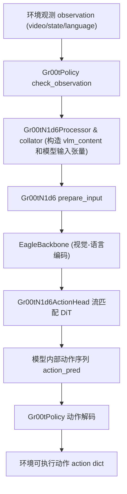
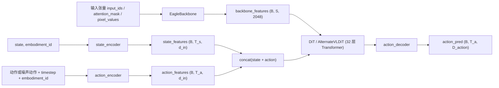

## 架构总览图

### 1. 高层数据流（Policy → Processor → Model → Actions）



### 2. 模型内部结构（Backbone + Action Head）



---

## GR00T N1.6 模型总览

GR00T N1.6 在代码中由 `Gr00tN1d6` 类实现（`gr00t/model/gr00t_n1d6/gr00t_n1d6.py`），是一个视觉-语言-动作（VLA）模型，用于从多模态观测预测未来一段时间的动作序列。

- **整体结构**：
  - **视觉-语言骨干（Backbone）**：`EagleBackbone`，封装 NVIDIA Eagle VLM，用于将图像和指令文本编码为一串 token 表示。
  - **动作头（Action Head）**：`Gr00tN1d6ActionHead`，基于 DiT/AlternateVLDiT 的流匹配（flow matching）扩散策略，从 backbone 表征 + 机器人状态推断动作轨迹的速度场，并迭代积分得到动作序列。
  - **数据处理器（Processor/Collator）**：`Gr00tN1d6DataCollator` 与 `Gr00tN1d6Processor`（`gr00t/model/gr00t_n1d6/processing_gr00t_n1d6.py`），将原始视频/状态/文本转成模型需要的张量格式。
  
  - **Processor 单样本输出格式（训练模式，存在动作）**：
  
    ```python
    model_inputs = {
        "state": Tensor[T, max_state_dim],                     # 归一化并按模态拼接后的状态，右侧 0-padding
        "action": Tensor[max_action_horizon, max_action_dim], # 归一化并拼接后的动作，时间和维度两侧 0-padding
        "action_mask": Tensor[max_action_horizon, max_action_dim],  # 0/1 mask，标记哪些位置是真实动作
        "vlm_content": {
            "text": str,                                      # （可正规化后的）语言指令
            "images": list[Tensor],                           # 经过图像增广/预处理后的多视角图像张量列表
            "conversation": list[dict],                       # 下游 VLM（例如对话式多模态模型）需要的对话格式输入
        },
        "embodiment_id": int                                  # 具身形态 ID，模型内部选择对应视觉/动作头
    }
    ```

- **关键超参（见 `gr00t/configs/model/gr00t_n1d6.py`）**：
  - `backbone_embedding_dim = 2048`：视觉-语言 token 的特征维度。
  - `max_state_dim = 29`：状态拼接后最大维度（按 embodiment 截取）。
  - `max_action_dim = 29`：动作向量最大维度。
  - `action_horizon = 16`：每次预测的未来动作步长 \(T_{action}\)。
  - `hidden_size = 1024`、`input_embedding_dim = 1536`：动作头内部表征维度。
  - `num_layers = 32`、`num_attention_heads = 32`（在 `diffusion_model_cfg` 中）：DiT 层数与头数。
  - `num_inference_timesteps = 4`、`num_timestep_buckets = 1000`：流匹配推理中时间步与离散桶数。

---

## 整体数据流与模块关系

这一节从 **Policy 级 API 输入** 到 **动作序列输出** 描述完整调用链，并给出形状关系。

### 1. Policy 层（`Gr00tPolicy`）

代码位置：`gr00t/policy/gr00t_policy.py`

- **输入（环境侧观测）**：参见 `getting_started/policy.md` 中说明，观测结构为：

```python
observation = {
    "video": {
        "camera_name": np.ndarray,  # (B, T_v, H, W, 3), uint8
        # ... 多个相机
    },
    "state": {
        "state_name": np.ndarray,   # (B, T_s, D_state), float32
        # ... 多个状态流
    },
    "language": {
        "task": [[str]],            # (B, 1)，每个样本一条指令
    },
}
```

- **Gr00tPolicy 主要步骤**（`Gr00tPolicy.get_action`）：
  1. `check_observation()`：严格校验 video/state/language 的 dtype、维度、时间长度是否与 `modality_configs` 一致（`gr00t_policy.py` 中 144–260 行）。
  2. `_unbatch_observation()`：按 batch 维拆成多条单样本观测（便于处理器逐条构造 `VLAStepData`）。
  3. `_to_vla_step_data()`：把单条观测转换为 `VLAStepData`（`gr00t.data.types`），包含 `images`、`states`、`text`、`embodiment` 等。
  4. 使用 `AutoProcessor`（实际是 `Gr00tN1d6Processor`）将 `VLAStepData` 序列化为模型输入张量。
  5. 调用 `self.model.get_action(model_inputs)`，其中 `self.model` 即 `Gr00tN1d6`。
  6. 将模型输出的归一化动作解码回物理单位，并按照 `modality_configs[embodiment]` 拆分成多路动作流。

- **Policy 层输出**：

```python
action = {
    "action_name": np.ndarray,  # (B, T_a, D_action), float32 物理单位
    # ... 每路 action key
}
info = {}  # 预留信息
```

其中 \(T_a\) 等于配置中的 `action_horizon`（缺省 16）。

### 2. 模型主体 `Gr00tN1d6`

代码位置：`gr00t/model/gr00t_n1d6/gr00t_n1d6.py`

- **类结构**：
  - `Gr00tN1d6(PreTrainedModel)`：
    - `backbone: EagleBackbone`
    - `action_head: Gr00tN1d6ActionHead`
    - `collator: Gr00tN1d6DataCollator`

- **前向接口**：
  - `forward(inputs: dict) -> BatchFeature`：训练/评估时使用，返回包含 `loss` 等字段的 `BatchFeature`。
  - `get_action(inputs: dict) -> BatchFeature`：推理时使用，返回包含 `action_pred` 的 `BatchFeature`。

- **`Gr00tN1d6.prepare_input` 的关键逻辑**：
  - 如果 `inputs` 中有 `"vlm_content"`（来自 Processor），
    - 使用 `self.collator([...])` 将其转换为 `{"inputs": {...}}`，并合并进 `inputs`（第 464–480 行）。
  - `backbone_inputs = self.backbone.prepare_input(inputs)`：
    - 选择 `input_ids`、`attention_mask`、`pixel_values` 等键（见 `EagleBackbone.forward`）。
  - `action_inputs = self.action_head.prepare_input(inputs)`：
    - 保留动作头需要的 `state`、`action`、`embodiment_id`、`action_mask` 等键。
  - 使用 `tree.map_structure` 将所有张量移到统一的 `device`/`dtype`（bfloat16），保持与配置一致。

### 3. Backbone：Eagle VLM 编码

代码位置：`gr00t/model/modules/eagle_backbone.py`

- **职责**：
  - 基于 Eagle VLM，将视频（编码为 `pixel_values`）和文本（编码为 `input_ids`）联合编码为一串 token hidden states，包含图像 token 与非图像 token。

- **输入张量**（`EagleBackbone.forward`）：

```python
vl_input = {
    "input_ids": LongTensor[B, S],
    "attention_mask": LongTensor[B, S],
    "pixel_values": FloatTensor[B, T_v, C, H, W] 或 Eagle 要求的格式
}
```

- **输出张量**：

```python
BatchFeature(
    data={
        "backbone_features": Tensor[B, S, D_b],      # D_b = backbone_embedding_dim = 2048
        "backbone_attention_mask": BoolTensor[B, S],
        "image_mask": BoolTensor[B, S],             # True 表示 image token
    }
)
```

这些字段会传递给 `Gr00tN1d6ActionHead`，作为视觉-语言条件信息。

### 4. 动作头：流匹配扩散策略

代码位置：`gr00t/model/gr00t_n1d6/gr00t_n1d6.py` 中 `Gr00tN1d6ActionHead`

#### 4.1 子模块划分

- `state_encoder: CategorySpecificMLP`
  - 代码位置：`gr00t/model/modules/embodiment_conditioned_mlp.py`
  - 输入：`state`（拼接后的机器人状态，维度上限 `max_state_dim`）和 `embodiment_id`。
  - 输出：状态特征 `state_features`，形状约为 (B, T_s, d_in) 或 (B, 1, d_in)，其中 `d_in = input_embedding_dim`。

- `action_encoder: MultiEmbodimentActionEncoder`
  - 同文件 `embodiment_conditioned_mlp.py`。
  - 输入：动作轨迹 `actions`（或噪声动作）、时间步 `timestep`、`embodiment_id`。
  - 输出：动作 token 序列 `action_features`，形状 (B, T_a, d_in)。

- `model: DiT 或 AlternateVLDiT`
  - 代码位置：`gr00t/model/modules/dit.py`。
  - 输入：
    - `hidden_states`: SA 序列（state + action） (B, T_sa, D_inner)。
    - `encoder_hidden_states`: VLM token 序列 (B, S, D_inner)，来自 backbone。
    - `timestep`: 整数时间步（训练时为离散桶；推理时为 0..N-1）。
    - `encoder_attention_mask` / `image_mask` / `backbone_attention_mask`：用于 AlternateVLDiT 在图像 token / 非图像 token 间交替注意。
  - 输出：预测的动作相关 velocity token 表征，形状 (B, T_sa, D_inner)。

- `action_decoder: CategorySpecificMLP`
  - 将 DiT 输出映射回动作空间，形状 (B, T_a, D_action)，其中 D_action ≤ max_action_dim。

#### 4.2 训练前向（`Gr00tN1d6ActionHead.forward`）

训练时 `forward(backbone_output, action_input)` 的核心逻辑（见 148–256 行）：

1. **处理 backbone 输出**：
   - `backbone_features = vlln(backbone_output["backbone_features"])`：可选 LayerNorm。
2. **嵌入状态**：
   - `state_features = state_encoder(action_input.state, embodiment_id)`。
3. **状态 dropout 与噪声（可选）**：
   - 按 `state_dropout_prob` 随机将部分样本替换为 `mask_token`。
   - 在训练模式下，可以加高斯噪声，增强鲁棒性。
4. **构造 noisy trajectory（流匹配）**：
   - 采样 t ~ Beta(α, β)，并缩放到 [0, s]。
   - `noisy_trajectory = (1 - t) * noise + t * actions`。
   - `velocity = actions - noise` 作为目标速度场。
5. **动作编码 + 位置编码**：
   - `action_features = action_encoder(noisy_trajectory, t_discretized, embodiment_id)`。
   - 如配置开启 `add_pos_embed`，再加上 learnable position embedding。
6. **融合 state + action**：
   - `sa_embs = concat(state_features, action_features, dim=1)`。
7. **跨模态 DiT 编码**：
   - 如果 `use_alternate_vl_dit` 为 True，调用 `AlternateVLDiT`，交替关注图像 token / 非图像 token；否则使用普通 `DiT`。
8. **动作解码 + loss**：
   - `pred = action_decoder(model_output, embodiment_id)`，取最后 \(T_a\) 个时间步作为动作部分：`pred_actions = pred[:, -T_a:]`。
   - 使用 `action_mask` 逐维加权，计算 `MSE(pred_actions, velocity)`，归一化后得到标量 `loss`。

**训练输出**：

```python
{
    "loss": Tensor[],
    "action_loss": Tensor[B, T_a, D_action],
    "action_mask": Tensor[B, T_a, D_action],
    "backbone_features": Tensor[B, S, D_b],
    "state_features": Tensor[B, T_s, d_in],
}
```

#### 4.3 推理前向（`Gr00tN1d6ActionHead.get_action`）

推理时采用显式流匹配积分（见 288–365 行）：

1. 使用 `_encode_features` 从 backbone 输出和 `state` 得到：

```python
backbone_features: Tensor[B, S, D_b]
state_features:    Tensor[B, T_s, d_in]
```

2. 初始化动作为高斯噪声：

```python
actions ~ N(0, I), shape = (B, action_horizon, action_dim)
```

3. 在 `num_inference_timesteps` 个时间步内迭代：
   - 将当前时间 t 映射到离散桶 `t_discretized`。
   - `action_features = action_encoder(actions, t_discretized, embodiment_id)`。
   -（可选）加位置编码并与 `state_features` 拼接为 `sa_embs`。
   - 通过 DiT/AlternateVLDiT 得到 `pred_velocity`（取最后 `action_horizon` 段）。
   - 使用欧拉积分更新：

$$
\text{actions} \leftarrow \text{actions} + \Delta t \cdot \text{pred\_velocity}
$$

4. 返回 `BatchFeature(data={"action_pred": actions, ...})`，其中：

```python
action_pred: Tensor[B, action_horizon, action_dim]
```

---

## 端到端架构图

### 1. 高层数据流（Policy → Processor → Model → Actions）


### 2. 模型内部结构（Backbone + Action Head）


---

## 模型级输入输出接口与形状

### 1. `Gr00tN1d6.forward`（训练/评估）

调用路径示例（训练 pipeline，见 `gr00t/model/base/model_pipeline.py`）：

```python
from gr00t.model.gr00t_n1d6.gr00t_n1d6 import Gr00tN1d6
from gr00t.configs.model.gr00t_n1d6 import Gr00tN1d6Config

cfg = Gr00tN1d6Config()
model = Gr00tN1d6(cfg)

# inputs 由 Dataset + Processor + DataCollator 构造
outputs = model.forward(inputs)
loss = outputs["loss"]
```

- **输入 `inputs: dict`**（关键字段，形状为近似概念，具体由 `modality.json` 和 Processor 决定）：
  - VLM 相关：
    - `input_ids: LongTensor[B, S]`
    - `attention_mask: LongTensor[B, S]`
    - `pixel_values: FloatTensor[B, T_v, C, H, W]` 或 Eagle 要求的布局
  - 动作头相关：
    - `state: FloatTensor[B, T_s, D_state]`，其中 D_state ≤ max_state_dim。
    - `action: FloatTensor[B, T_a, D_action]`，其中 T_a = action_horizon。
    - `embodiment_id: LongTensor[B]`，embodiment 索引（最多 `max_num_embodiments = 32`）。
    - `action_mask: FloatTensor[B, T_a, D_action]`，用于 mask 无效维度。

- **输出 `BatchFeature`**：包含上文训练前向中列出的 `loss`、`action_loss` 等字段。

### 2. `Gr00tN1d6.get_action`（推理）

在推理中，`inputs` 通常来自 Processor，字段与训练类似但不包含 `action`/`action_mask`：

- **输入**：
  - `input_ids, attention_mask, pixel_values`：同上。
  - `state: FloatTensor[B, T_s, D_state]`。
  - `embodiment_id: LongTensor[B]`。

- **输出**：

```python
outputs = model.get_action(model_inputs)

# 关键字段
outputs["action_pred"]  # Tensor[B, action_horizon, action_dim]
```

在 `Gr00tPolicy` 中，这个 `action_pred` 会被再映射为物理单位动作（按 `modality_configs[embodiment]` 的切片规则拆分多路动作流）。

---

## 典型输入输出样例（从 Policy 角度）

以下例子展示从环境观测到最终动作的最小工作链路，对应代码集中于：
- `gr00t/policy/gr00t_policy.py`
- `getting_started/policy.md`
- `gr00t/model/gr00t_n1d6/gr00t_n1d6.py`

```python
import numpy as np
from gr00t.policy import Gr00tPolicy
from gr00t.data.embodiment_tags import EmbodimentTag

# 1. 构造观测（示意形状）
B, T_v, T_s = 2, 4, 4
H, W, C = 256, 256, 3
D_state = 29

observation = {
    "video": {
        "front_cam": np.zeros((B, T_v, H, W, C), dtype=np.uint8),
    },
    "state": {
        "proprio": np.zeros((B, T_s, D_state), dtype=np.float32),
    },
    "language": {
        "task": [["pick the cube and place it in the bowl"] for _ in range(B)],
    },
}

# 2. 创建 Policy 并推理
policy = Gr00tPolicy(
    model_path="/path/to/checkpoint",
    embodiment_tag=EmbodimentTag.NEW_EMBODIMENT,
    device="cuda:0",
    strict=True,
)

action, info = policy.get_action(observation)

# 3. 动作结构（示意）
for name, arr in action.items():
    # arr.shape -> (B, T_a, D_action_i)
    print(name, arr.shape)
```

- 若使用底层模型接口，可以直接操作 `Gr00tN1d6.get_action`，但通常推荐通过 `Gr00tPolicy` 来屏蔽模态映射与解码细节。

---

## 总结：如何快速记住 GR00T N1.6 的架构

- **一句话版本**：
  - 「Eagle VLM 做视觉+语言编码，DiT 风格动作头在流匹配框架下，从 VLM token + 机器人状态出发，生成多步动作轨迹。」

- **关键拆分**：
  - **输入侧**：视频帧序列（多相机）、状态时间序列、自然语言任务指令 → Processor → Eagle VLM 输入张量 + 状态/动作张量。
  - **骨干**：Eagle VLM 输出 (B, S, 2048) token 表征 + mask。
  - **动作头**：状态编码 + 动作编码 + 32 层 DiT（交替关注图像/非图像 token）+ action MLP 解码。
  - **训练**：基于 noisy trajectory 和 velocity 的流匹配 MSE loss；
  - **推理**：从高斯噪声动作出发，迭代 4 步欧拉积分得到最终动作序列。

掌握上述分层和张量形状，你可以很快在代码中定位到相应模块，并对接新的数据模态或 embodiment。