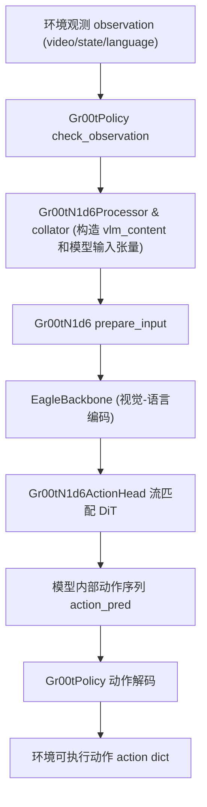
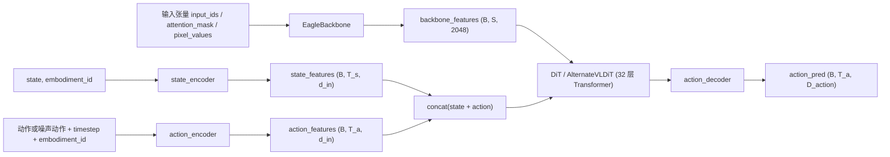
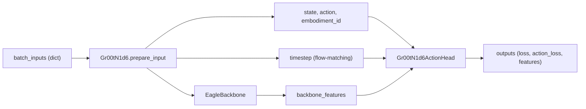
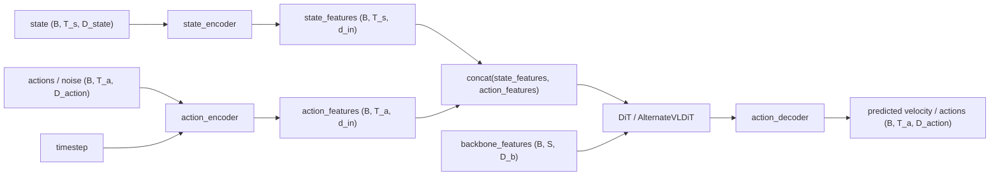
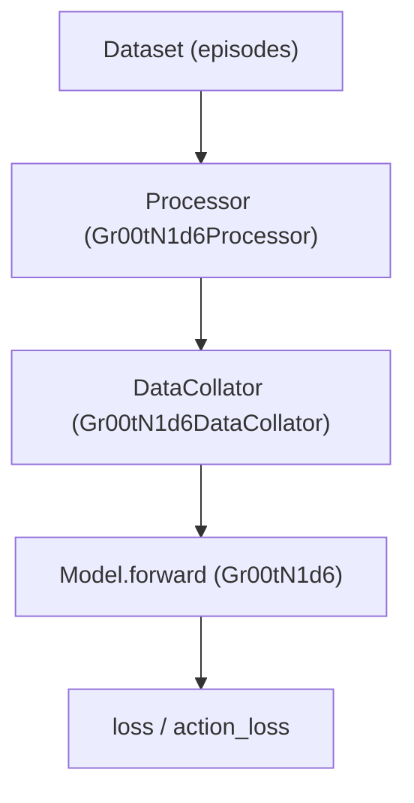

# GR00T N1.6 模型架构文档

## 快速导航

- [模型结构与数据流](#架构总览图)
  - [架构总览图](#架构总览图)
    - [1. 高层数据流（Policy → Processor → Model → Actions）](#架构总览图)
    - [2. 模型内部结构（Backbone + Action Head）](#架构总览图)
  - [GR00T N1.6 模型总览](#gr00t-n16-模型总览)
  - [数据流与模块关系](#数据流与模块关系)
    - [1. 模型主体 `Gr00tN1d6`](#数据流与模块关系)
    - [2. Backbone：Eagle VLM 编码](#数据流与模块关系)
    - [3. 动作头：流匹配扩散策略](#数据流与模块关系)
      - [3.1 子模块划分](#数据流与模块关系)
      - [3.2 训练前向（`Gr00tN1d6ActionHead.forward`)](#数据流与模块关系)
      - [3.3 推理前向（`Gr00tN1d6ActionHead.get_action`)](#数据流与模块关系)
- [推理 Demo 流程](#推理-demo-流程从观测到动作)
  - [1. 极简推理步骤](#推理-demo-流程从观测到动作)
  - [2. 高层数据流（Policy → Processor → Model → Actions）](#推理-demo-流程从观测到动作)
  - [3. 模型内部结构（Backbone + Action Head）](#推理-demo-流程从观测到动作)
  - [4. 输入输出样例（从 Policy 角度）](#推理-demo-流程从观测到动作)
    - [4.1 完整示例代码](#推理-demo-流程从观测到动作)
    - [4.2 Policy 层输入输出与形状](#推理-demo-流程从观测到动作)
    - [4.3 内部数据流详解](#推理-demo-流程从观测到动作)
    - [4.4 直接使用底层模型接口](#推理-demo-流程从观测到动作)
- [训练 Demo 流程](#训练-demo-流程从数据到-loss)
  - [1. 训练数据流架构图](#训练-demo-流程从数据到-loss)
  - [2. 极简训练步骤](#训练-demo-流程从数据到-loss)
  - [3. 最小训练代码示例](#训练-demo-流程从数据到-loss)
  - [4. 训练输入输出形状速览](#训练-demo-流程从数据到-loss)
- [推理与训练细节](#关键设计点详解)
  - [关键设计点详解](#关键设计点详解)
    - [1. 为什么采用“流匹配（Flow Matching）”而不是普通 Diffusion？](#关键设计点详解)
    - [2. 什么是 "AlternateVLDiT"？](#关键设计点详解)
    - [3. 什么是 "Embodiment-Conditioned" 网络？](#关键设计点详解)
    - [4. 为什么需要 `action_mask`？](#关键设计点详解)
    - [5. 状态编码器中的 "state dropout" 是什么？](#关键设计点详解)
    - [6. 推理时的 "4 步欧拉积分" 具体是怎么做的？](#关键设计点详解)
  - [模型级输入输出接口与形状](#模型级输入输出接口与形状)
    - [1. `Gr00tN1d6.forward`（训练/评估）](#模型级输入输出接口与形状)
    - [2. `Gr00tN1d6.get_action`（推理）](#模型级输入输出接口与形状)
- [总结](#总结如何快速记住-gr00t-n16-的架构)
  - [一句话版本](#总结如何快速记住-gr00t-n16-的架构)
  - [关键拆分：四层架构](#总结如何快速记住-gr00t-n16-的架构)
  - [核心设计点回顾](#总结如何快速记住-gr00t-n16-的架构)
  - [形状速查表](#总结如何快速记住-gr00t-n16-的架构)
  - [快速定位代码](#总结如何快速记住-gr00t-n16-的架构)
  - [学习路径建议](#总结如何快速记住-gr00t-n16-的架构)

---

## 架构总览图

### 1. 高层数据流（Policy → Processor → Model → Actions）



### 2. 模型内部结构（Backbone + Action Head）



---

## GR00T N1.6 模型总览

GR00T N1.6 在代码中由 `Gr00tN1d6` 类实现（`gr00t/model/gr00t_n1d6/gr00t_n1d6.py`），是一个视觉-语言-动作（VLA）模型，用于从多模态观测预测未来一段时间的动作序列。

- **整体结构**：
  - **视觉-语言骨干（Backbone）**：`EagleBackbone`，封装 NVIDIA Eagle VLM，用于将图像和指令文本编码为一串 token 表示。
  - **动作头（Action Head）**：`Gr00tN1d6ActionHead`，基于 DiT/AlternateVLDiT 的流匹配（flow matching）扩散策略，从 backbone 表征 + 机器人状态推断动作轨迹的速度场，并迭代积分得到动作序列。
  - **数据处理器（Processor/Collator）**：`Gr00tN1d6DataCollator` 与 `Gr00tN1d6Processor`（`gr00t/model/gr00t_n1d6/processing_gr00t_n1d6.py`），将原始视频/状态/文本转成模型需要的张量格式。
  
  - **Processor 单样本输出格式（训练模式，存在动作）**：
  
    ```python
    model_inputs = {
        "state": Tensor[T, max_state_dim],                     # 归一化并按模态拼接后的状态，右侧 0-padding
        "action": Tensor[max_action_horizon, max_action_dim], # 归一化并拼接后的动作，时间和维度两侧 0-padding
        "action_mask": Tensor[max_action_horizon, max_action_dim],  # 0/1 mask，标记哪些位置是真实动作
        "vlm_content": {
            "text": str,                                      # （可正规化后的）语言指令
            "images": list[Tensor],                           # 经过图像增广/预处理后的多视角图像张量列表
            "conversation": list[dict],                       # 下游 VLM（例如对话式多模态模型）需要的对话格式输入
        },
        "embodiment_id": int                                  # 具身形态 ID，模型内部选择对应视觉/动作头
    }
    ```

  - **Collator 批处理后的样例输入（训练模式）**：

    ```python
    batch_inputs = {
        # VLM 相关
        "input_ids": LongTensor[B, S],              # 文本 token 索引
        "attention_mask": LongTensor[B, S],         # 1=有效 token, 0=padding
        "pixel_values": FloatTensor[B, T_v, C, H, W],  # 视频帧

        # 动作头相关
        "state": FloatTensor[B, T_s, max_state_dim],        # 归一化状态，右侧 padding
        "action": FloatTensor[B, T_a, max_action_dim],      # 归一化动作，padding 到统一维度
        "action_mask": FloatTensor[B, T_a, max_action_dim], # 1=真实动作, 0=padding
        "embodiment_id": LongTensor[B],                     # 每个样本的具身形态 ID
    }
    ```

- **关键超参（见 `gr00t/configs/model/gr00t_n1d6.py`）**：
  - `backbone_embedding_dim = 2048`：视觉-语言 token 的特征维度。
  - `max_state_dim = 29`：状态拼接后最大维度（按 embodiment 截取）。
  - `max_action_dim = 29`：动作向量最大维度。
  - `action_horizon = 16`：每次预测的未来动作步长 \(T_{action}\)。
  - `hidden_size = 1024`、`input_embedding_dim = 1536`：动作头内部表征维度。
  - `num_layers = 32`、`num_attention_heads = 32`（在 `diffusion_model_cfg` 中）：DiT 层数与头数。
  - `num_inference_timesteps = 4`、`num_timestep_buckets = 1000`：流匹配推理中时间步与离散桶数。

- **`model.forward` 输出样例（训练/评估）**：

  ```python
  outputs = model.forward(batch_inputs)

  # 典型内容（BatchFeature.data）
  outputs = {
      "loss": Tensor[],                          # 标量 loss
      "action_loss": Tensor[B, T_a, D_action],   # 逐步/逐维 loss
      "action_mask": Tensor[B, T_a, D_action],   # 与输入 action_mask 对齐
      "backbone_features": Tensor[B, S, 2048],   # VLM 特征
      "state_features": Tensor[B, T_s, 1536],    # state 特征
  }
  ```

---

## 数据流与模块关系

这一节主要作为 **训练 Demo** 的详细解释，重点从模型输入到 loss 描述数据流与模块关系。
同时，Policy 层的数据流已在前面的“推理 Demo 流程”中说明，这里不再赘述。



### 1. 模型主体 `Gr00tN1d6`

代码位置：[`gr00t/model/gr00t_n1d6/gr00t_n1d6.py`](file:///c:/Users/owen/Documents/VsCode/Isaac-GR00T/Isaac-GR00T/gr00t/model/gr00t_n1d6/gr00t_n1d6.py)

#### 类结构

`Gr00tN1d6(PreTrainedModel)` 继承自 Hugging Face 的 `PreTrainedModel`，包含三个主要模块：

```python
class Gr00tN1d6(PreTrainedModel):
    def __init__(self, config: Gr00tN1d6Config):
        self.backbone = EagleBackbone(config.vlm_config)  # 视觉-语言编码器
        self.action_head = Gr00tN1d6ActionHead(config)     # 动作头（DiT 流匹配）
        self.collator = Gr00tN1d6DataCollator(...)         # 数据拼接器
```

#### 前向接口

- **`forward(inputs: dict) -> BatchFeature`**：
  - 用于 **训练/评估**，输入包含 `state`、`action`、`action_mask`、`vlm_content` 等；
  - 返回包含 `loss`、`action_loss` 等字段的 `BatchFeature`。

- **`get_action(inputs: dict) -> BatchFeature`**：
  - 用于 **推理**，输入不包含 `action`/`action_mask`；
  - 返回包含 `action_pred` 的 `BatchFeature`。

#### `Gr00tN1d6.prepare_input` 的关键逻辑

这是整个模型的“数据整理中心”，负责把各种来源的输入整合成统一格式（见 [L464–480](file:///c:/Users/owen/Documents/VsCode/Isaac-GR00T/Isaac-GR00T/gr00t/model/gr00t_n1d6/gr00t_n1d6.py#L464-L480)）：

1. **处理 `vlm_content`**：
   - 如果 `inputs` 中有 `"vlm_content"`（来自 Processor），使用 `self.collator([...])` 将其转换为 `{"inputs": {...}}`，并合并进 `inputs`。
   - 这一步会生成 `input_ids`、`attention_mask`、`pixel_values` 等 Eagle VLM 需要的字段。

2. **准备 backbone 输入**：
   ```python
   backbone_inputs = self.backbone.prepare_input(inputs)
   # 选择 input_ids、attention_mask、pixel_values 等键
   ```

3. **准备 action_head 输入**：
   ```python
   action_inputs = self.action_head.prepare_input(inputs)
   # 保留 state、action、embodiment_id、action_mask 等键
   ```

4. **统一设备和类型**：
   - 使用 `tree.map_structure` 将所有张量移到统一的 `device`（例如 `cuda:0`）和 `dtype`（例如 `bfloat16`）。

**大白话总结**：
- `prepare_input` 就像一个“分拣员”：
  - 把 Processor 给的 `vlm_content`（图像、文本）分给 backbone；
  - 把状态、动作分给 action_head；
  - 最后把所有数据移到 GPU 上，准备计算。

### 2. Backbone：Eagle VLM 编码

代码位置：[`gr00t/model/modules/eagle_backbone.py`](file:///c:/Users/owen/Documents/VsCode/Isaac-GR00T/Isaac-GR00T/gr00t/model/modules/eagle_backbone.py)

#### 职责

- 基于 **NVIDIA Eagle VLM**，将视频（编码为 `pixel_values`）和文本（编码为 `input_ids`）联合编码为一串 token hidden states。
- 输出的 token 包含 **图像 token** 和 **非图像 token（文本 token）**。

#### 输入张量

`EagleBackbone.forward` 接收：

```python
vl_input = {
    "input_ids": LongTensor[B, S],              # 文本 token 索引
    "attention_mask": LongTensor[B, S],         # 有效 token 标记
    "pixel_values": FloatTensor[B, T_v, C, H, W]  # 视频帧（或 Eagle 要求的格式）
}
```

**关键点说明**：
- `S`：序列长度，包含文本 token + 图像占位符（例如 `<image>`）；
- `T_v`：视频帧数（例如 4 帧）；
- Eagle VLM 内部会将每帧图像编码为多个 token（例如每帧 576 个 token），替换掉占位符。

#### 输出张量

```python
BatchFeature(
    data={
        "backbone_features": Tensor[B, S, D_b],      # D_b = backbone_embedding_dim = 2048
        "backbone_attention_mask": BoolTensor[B, S],  # 有效 token 标记
        "image_mask": BoolTensor[B, S],             # True 表示 image token
    }
)
```

**关键点说明**：
- `backbone_features`：每个 token 的特征向量，维度 2048；
- `image_mask`：用于区分哪些 token 是来自图像，哪些是文本，后续 AlternateVLDiT 需要这个信息来交替关注。

**大白话总结**：
- Backbone 就是一个“理解器”：
  - 输入：多帧图像 + 一句话（例如“把魔方放进碗里”）；
  - 输出：一串 token，每个 token 都包含了视觉和语言的语义信息；
  - 这些 token 会传给动作头，帮助它决定该做什么动作。

### 3. 动作头：流匹配扩散策略

代码位置：[`gr00t/model/gr00t_n1d6/gr00t_n1d6.py`](file:///c:/Users/owen/Documents/VsCode/Isaac-GR00T/Isaac-GR00T/gr00t/model/gr00t_n1d6/gr00t_n1d6.py) 中 `Gr00tN1d6ActionHead`



#### 3.1 子模块划分

动作头由四个主要子模块组成：

##### (1) `state_encoder: CategorySpecificMLP`

- **代码位置**：[`gr00t/model/modules/embodiment_conditioned_mlp.py`](file:///c:/Users/owen/Documents/VsCode/Isaac-GR00T/Isaac-GR00T/gr00t/model/modules/embodiment_conditioned_mlp.py)
- **输入**：
  - `state`：拼接后的机器人状态，形状 `(B, T_s, D_state)`，其中 `D_state ≤ max_state_dim = 29`；
  - `embodiment_id`：整数，指定具身形态。
- **输出**：
  - `state_features`：形状约为 `(B, T_s, d_in)` 或 `(B, 1, d_in)`，其中 `d_in = input_embedding_dim = 1536`。

**大白话**：
- 把各种不同维度的机器人状态（关节角、速度等）统一编码成固定维度的特征向量；
- 每个 embodiment 有自己的 MLP 头，根据 `embodiment_id` 选择。

**输入输出示例**：

```python
# 输入
state: FloatTensor[B, T_s, D_state]      # 例如 B=8, T_s=1, D_state<=29
embodiment_id: LongTensor[B]             # 每个样本一个 ID

# 输出
state_features: FloatTensor[B, T_s, d_in]  # d_in = input_embedding_dim = 1536
```

##### (2) `action_encoder: MultiEmbodimentActionEncoder`

- **代码位置**：同文件 [`embodiment_conditioned_mlp.py`](file:///c:/Users/owen/Documents/VsCode/Isaac-GR00T/Isaac-GR00T/gr00t/model/modules/embodiment_conditioned_mlp.py)
- **输入**：
  - `actions`：动作轨迹（或噪声动作），形状 `(B, T_a, D_action)`；
  - `timestep`：流匹配时间步（离散化后的整数）；
  - `embodiment_id`。
- **输出**：
  - `action_features`：形状 `(B, T_a, d_in)`。

**大白话**：
- 把动作轨迹编码成 token 序列，每个时间步的动作变成一个 token；
- 同时嵌入时间信息（timestep），让模型知道当前处于流匹配的哪个阶段。

**输入输出示例**：

```python
# 输入
actions: FloatTensor[B, T_a, D_action]   # 例如 B=8, T_a=16
timestep: LongTensor[B]                  # 离散化后的时间步
embodiment_id: LongTensor[B]

# 输出
action_features: FloatTensor[B, T_a, d_in]  # d_in = input_embedding_dim = 1536
```

##### (3) `model: DiT 或 AlternateVLDiT`

- **代码位置**：[`gr00t/model/modules/dit.py`](file:///c:/Users/owen/Documents/VsCode/Isaac-GR00T/Isaac-GR00T/gr00t/model/modules/dit.py)
- **输入**：
  - `hidden_states`：SA 序列（state + action），形状 `(B, T_sa, D_inner)`；
  - `encoder_hidden_states`：VLM token 序列，形状 `(B, S, D_inner)`，来自 backbone；
  - `timestep`：整数时间步（训练时为离散桶；推理时为 0..N-1）；
  - `encoder_attention_mask` / `image_mask` / `backbone_attention_mask`：用于 AlternateVLDiT 在图像 token / 非图像 token 间交替注意。
- **输出**：
  - 预测的动作相关 velocity token 表征，形状 `(B, T_sa, D_inner)`。

**关键设计**：
- **AlternateVLDiT 交替关注**：
  - 32 层 DiT block，奇数层关注图像 token，偶数层关注文本 token；
  - 这样做可以大幅降低计算量（图像 token 数量巨大）。
- **Self-Attention + Cross-Attention**：
  - Self-Attention：`hidden_states` （SA 序列）内部交互；
  - Cross-Attention：`hidden_states` 关注 `encoder_hidden_states`（VLM token）。

**大白话**：
- DiT 是一个“推理器”：
  - 输入：当前状态 + 当前动作（或噪声动作） + VLM 的视觉-语言理解；
  - 输出：预测的“速度场”，告诉你动作应该向哪个方向移动。

##### (4) `action_decoder: CategorySpecificMLP`

- **输入**：DiT 输出的 token 表征。
- **输出**：动作空间的预测，形状 `(B, T_a, D_action)`，其中 `D_action ≤ max_action_dim`。

**大白话**：
- 把 DiT 输出的“抽象特征”映射回具体的动作维度（例如 16 维关节角）。

#### 3.2 训练前向（`Gr00tN1d6ActionHead.forward`)

训练时 `forward(backbone_output, action_input)` 的核心逻辑（见 [L148–256](file:///c:/Users/owen/Documents/VsCode/Isaac-GR00T/Isaac-GR00T/gr00t/model/gr00t_n1d6/gr00t_n1d6.py#L148-L256)）：

**第一步：处理 backbone 输出**
```python
backbone_features = vlln(backbone_output["backbone_features"])  # 可选 LayerNorm
```

**第二步：嵌入状态**
```python
state_features = state_encoder(action_input.state, embodiment_id)
# 形状：(B, T_s, d_in)
```

**第三步：状态 dropout 与噪声（可选）**
```python
# 按 state_dropout_prob 随机将部分样本替换为 mask_token
mask = torch.rand(B) < state_dropout_prob
state_features[mask] = self.mask_token

# 在训练模式下，可以加高斯噪声，增强鲁棒性
if training:
    state_features += torch.randn_like(state_features) * noise_std
```

**第四步：构造 noisy trajectory（流匹配）**
```python
# 1. 采样时间 t ~ Beta(α, β)，并缩放到 [0, s]
t = sample_beta_distribution(B, alpha=2, beta=8) * s  # s 通常为 1.0

# 2. 采样随机噪声
noise = torch.randn_like(actions)  # 高斯噪声

# 3. 构造从噪声到真实动作的中间轨迹
noisy_trajectory = (1 - t) * noise + t * actions

# 4. 目标速度场
velocity = actions - noise  # 这是我们要预测的目标
```

**大白话**：
- 流匹配的核心思想：
  - 想象从“完全随机的动作”到“正确的动作”是一条路径；
  - 我们在这条路上随机采一个点 `t`，构造中间状态 `noisy_trajectory`；
  - 让模型预测在这个点的“速度”（即 `velocity = actions - noise`）；
  - 这样模型学会了如何从任意噪声一步步移动到真实动作。

**第五步：动作编码 + 位置编码**
```python
# 1. 将时间 t 离散化到桶（bucket）
t_discretized = (t * num_timestep_buckets).long()  # num_timestep_buckets = 1000

# 2. 编码 noisy_trajectory
action_features = action_encoder(noisy_trajectory, t_discretized, embodiment_id)
# 形状：(B, T_a, d_in)

# 3. 可选：加上 learnable position embedding
if add_pos_embed:
    action_features += pos_embed[:, :T_a, :]
```

**第六步：融合 state + action**
```python
sa_embs = torch.cat([state_features, action_features], dim=1)
# 形状：(B, T_s + T_a, d_in)
```

**第七步：跨模态 DiT 编码**
```python
if use_alternate_vl_dit:
    model_output = AlternateVLDiT(
        hidden_states=sa_embs,
        encoder_hidden_states=backbone_features,
        timestep=t_discretized,
        image_mask=image_mask,  # 区分图像/文本 token
        ...
    )
else:
    model_output = DiT(
        hidden_states=sa_embs,
        encoder_hidden_states=backbone_features,
        timestep=t_discretized,
        ...
    )
# 输出形状：(B, T_s + T_a, d_in)
```

**第八步：动作解码 + loss**
```python
# 1. 解码为动作空间
pred = action_decoder(model_output, embodiment_id)
# 形状：(B, T_s + T_a, D_action)

# 2. 取最后 T_a 个时间步作为动作部分
pred_actions = pred[:, -T_a:, :]  # (B, T_a, D_action)

# 3. 计算 loss（使用 action_mask 逐维加权）
action_loss = (pred_actions - velocity) ** 2  # (B, T_a, D_action)
loss = (action_loss * action_mask).sum() / action_mask.sum()  # 标量
```

**训练输出**：

```python
{
    "loss": Tensor[],                          # 标量 loss
    "action_loss": Tensor[B, T_a, D_action],   # 逐维 loss
    "action_mask": Tensor[B, T_a, D_action],   # mask
    "backbone_features": Tensor[B, S, D_b],    # backbone 输出
    "state_features": Tensor[B, T_s, d_in],    # state 特征
}
```

#### 3.3 推理前向（`Gr00tN1d6ActionHead.get_action`)

推理时采用显式流匹配积分（见 [L288–365](file:///c:/Users/owen/Documents/VsCode/Isaac-GR00T/Isaac-GR00T/gr00t/model/gr00t_n1d6/gr00t_n1d6.py#L288-L365)）：

**第一步：编码 state 和 backbone**
```python
backbone_features, state_features = _encode_features(
    backbone_output, action_input.state, embodiment_id
)
# backbone_features: (B, S, D_b)
# state_features: (B, T_s, d_in)
```

**第二步：初始化动作为高斯噪声**
```python
actions = torch.randn(B, action_horizon, action_dim, device=device)
# 形状：(B, 16, D_action)
```

**第三步：迭代 4 次（欧拉积分）**
```python
num_inference_timesteps = 4  # 配置中的推理步数
dt = 1.0 / num_inference_timesteps  # Δt = 0.25

for step in range(num_inference_timesteps):
    # 1. 计算当前时间
    t = step * dt  # 0, 0.25, 0.5, 0.75
    t_discretized = (t * num_timestep_buckets).long()
    
    # 2. 编码当前 actions
    action_features = action_encoder(actions, t_discretized, embodiment_id)
    
    # 3. 拼接 state + action
    sa_embs = torch.cat([state_features, action_features], dim=1)
    
    # 4. 通过 DiT 预测速度场
    model_output = dit(sa_embs, backbone_features, t_discretized, ...)
    
    # 5. 解码为速度
    pred = action_decoder(model_output, embodiment_id)
    pred_velocity = pred[:, -action_horizon:, :]  # 取动作部分
    
    # 6. 欧拉积分更新
    actions = actions + dt * pred_velocity
```

**第四步：返回最终动作**
```python
return BatchFeature(data={
    "action_pred": actions,  # (B, action_horizon, action_dim)
    ...
})
```

**大白话总结**：
- 推理过程就像“雕刻”：
  - 一开始是一块噪声石头（随机动作）；
  - 每一步都问模型：“当前应该往哪个方向修改？”；
  - 经过 4 步雕刻，最终得到一个清晰的动作序列。

---

## 推理 Demo 流程（从观测到动作）

本节给出一个最小推理链路，从单次观测到多步动作序列，配合上文架构图快速对齐整体流程。

### 1. 极简推理步骤

1. **准备观测**：按 `getting_started/policy.md` 中的格式构造 `observation = {"video", "state", "language"}`。
2. **创建 Policy**：通过 `Gr00tPolicy(model_path=..., embodiment_tag=..., device=...)` 加载模型与配置。
3. **调用推理**：执行 `action, info = policy.get_action(observation)`。
4. **下发控制**：从 `action` 字典中取出各路动作（如 `joint_pos`、`gripper`），发送到机器人控制器。

### 2. 高层数据流（Policy → Processor → Model → Actions）


### 3. 模型内部结构（Backbone + Action Head）


### 4. 输入输出样例（从 Policy 角度）

以下例子展示从环境观测到最终动作的最小工作链路，对应代码集中于：
- [`gr00t/policy/gr00t_policy.py`](file:///c:/Users/owen/Documents/VsCode/Isaac-GR00T/Isaac-GR00T/gr00t/policy/gr00t_policy.py)
- [`getting_started/policy.md`](file:///c:/Users/owen/Documents/VsCode/Isaac-GR00T/Isaac-GR00T/getting_started/policy.md)
- [`gr00t/model/gr00t_n1d6/gr00t_n1d6.py`](file:///c:/Users/owen/Documents/VsCode/Isaac-GR00T/Isaac-GR00T/gr00t/model/gr00t_n1d6/gr00t_n1d6.py)

#### 4.1 完整示例代码

```python
import numpy as np
from gr00t.policy import Gr00tPolicy
from gr00t.data.embodiment_tags import EmbodimentTag

# ============================================================================
# 1. 构造观测（示意形状）
# ============================================================================
B, T_v, T_s = 2, 4, 4  # batch=2, 视频帧数=4, 状态序列长度=4
H, W, C = 256, 256, 3  # 图像分辨率
D_state = 29           # GR1 状态维度

observation = {
    "video": {
        # 前置相机：4 帧历史观测
        "front_cam": np.zeros((B, T_v, H, W, C), dtype=np.uint8),
        # 可以添加更多相机
        # "wrist_cam": np.zeros((B, T_v, H, W, C), dtype=np.uint8),
    },
    "state": {
        # 本体状态：关节角 + 关节速度 + 抓手位置
        "proprio": np.zeros((B, T_s, D_state), dtype=np.float32),
    },
    "language": {
        # 语言指令：每个样本一条
        "task": [["pick the cube and place it in the bowl"] for _ in range(B)],
    },
}

# ============================================================================
# 2. 创建 Policy 并推理
# ============================================================================
policy = Gr00tPolicy(
    model_path="/path/to/checkpoint",  # 预训练模型路径
    embodiment_tag=EmbodimentTag.NEW_EMBODIMENT,  # 指定具身形态
    device="cuda:0",     # GPU 设备
    strict=True,         # 严格模式：校验观测格式
)

# 推理
action, info = policy.get_action(observation)

# ============================================================================
# 3. 动作结构（示意）
# ============================================================================
# action 是一个字典，按 embodiment 的 modality_configs 拆分成多路
for name, arr in action.items():
    # arr.shape -> (B, T_a, D_action_i)
    print(f"{name}: {arr.shape}")
    # 例如：
    # joint_pos: (2, 16, 14)  # 14 维关节角
    # gripper: (2, 16, 2)     # 2 维抓手

# info 包含预留信息（当前为空）
print(info)  # {}
```

#### 4.2 Policy 层输入输出与形状

代码位置：[`gr00t/policy/gr00t_policy.py`](file:///c:/Users/owen/Documents/VsCode/Isaac-GR00T/Isaac-GR00T/gr00t/policy/gr00t_policy.py)

##### 输入：环境侧观测

参见 [`getting_started/policy.md`](file:///c:/Users/owen/Documents/VsCode/Isaac-GR00T/Isaac-GR00T/getting_started/policy.md) 中说明，观测结构为：

```python
observation = {
    "video": {
        "camera_name": np.ndarray,  # (B, T_v, H, W, 3), uint8
        # ... 多个相机
    },
    "state": {
        "state_name": np.ndarray,   # (B, T_s, D_state), float32
        # ... 多个状态流
    },
    "language": {
        "task": [[str]],            # (B, 1)，每个样本一条指令
    },
}
```

**关键点说明**：
- `B` = batch size，一次可以处理多个样本（例如多个机器人并行推理）；
- `T_v` = 视频帧数，例如 4 帧历史观测；
- `T_s` = 状态序列长度，通常与 `T_v` 相同；
- `H, W = 256, 256`：图像分辨率（会在 Processor 中 resize）；
- `D_state`：状态维度，例如 GR1 为 29 维（关节角 + 关节速度 + 抓手位置）。

##### Gr00tPolicy 主要步骤

调用 `Gr00tPolicy.get_action(observation)` 时：

1. **`check_observation()`**：严格校验 video/state/language 的 dtype、维度、时间长度是否与 `modality_configs` 一致（见 [`gr00t_policy.py` L144–260](file:///c:/Users/owen/Documents/VsCode/Isaac-GR00T/Isaac-GR00T/gr00t/policy/gr00t_policy.py#L144-L260)）。
   - 例如：检查 `video` 的 shape 是否为 `(B, T_v, H, W, 3)`，`state` 是否为 `(B, T_s, D)`。

2. **`_unbatch_observation()`**：按 batch 维拆成多条单样本观测（便于处理器逐条构造 `VLAStepData`）。

3. **`_to_vla_step_data()`**：把单条观测转换为 [`VLAStepData`](file:///c:/Users/owen/Documents/VsCode/Isaac-GR00T/Isaac-GR00T/gr00t/data/types.py)，包含：
   - `images`：每个相机的图像列表；
   - `states`：每个状态流的数组；
   - `text`：语言指令字符串；
   - `embodiment`：具身形态标签。

4. **使用 `AutoProcessor`**（实际是 [`Gr00tN1d6Processor`](file:///c:/Users/owen/Documents/VsCode/Isaac-GR00T/Isaac-GR00T/gr00t/model/gr00t_n1d6/processing_gr00t_n1d6.py)）：
   - 将 `VLAStepData` 序列化为模型输入张量（见 [data.md 的 Processor 章节](file:///c:/Users/owen/Documents/VsCode/Isaac-GR00T/Isaac-GR00T/data.md#L513-L555) 的详细说明）。

5. **调用 `self.model.get_action(model_inputs)`**：
   - `self.model` 即 [`Gr00tN1d6`](file:///c:/Users/owen/Documents/VsCode/Isaac-GR00T/Isaac-GR00T/gr00t/model/gr00t_n1d6/gr00t_n1d6.py)；
   - 返回 `BatchFeature(data={"action_pred": Tensor[B, action_horizon, action_dim], ...})`。

6. **动作解码**：
   - 将模型输出的归一化动作解码回物理单位（使用 `stats.json` 中的 mean/std）；
   - 按照 `modality_configs[embodiment]` 的切片规则，拆分成多路动作流（例如 `{"joint_pos": ..., "gripper": ...}`）。

##### 输出：环境可执行动作

```python
action = {
    "action_name": np.ndarray,  # (B, T_a, D_action), float32 物理单位
    # ... 每路 action key
}
info = {}  # 预留信息
```

其中 \(T_a\) 等于配置中的 `action_horizon`（缺省 16）。

**大白话总结**：
- Policy 层就是一个“翻译器”：
  - **输入**：环境给的原始观测（图像、状态、文本）；
  - **输出**：机器人可以直接执行的动作序列。
- 中间调用了 Processor（数据预处理）和 Model（动作预测），并负责校验和解码。

#### 4.3 内部数据流详解

当你调用 `policy.get_action(observation)` 时，内部发生了以下过程：

##### 步骤 1：校验观测

```python
# 检查 video 的 shape、dtype
for camera_name, video_array in observation["video"].items():
    assert video_array.shape == (B, T_v, H, W, C)
    assert video_array.dtype == np.uint8

# 检查 state 的 shape、dtype
for state_name, state_array in observation["state"].items():
    assert state_array.shape == (B, T_s, D_state)
    assert state_array.dtype == np.float32

# 检查 language 的结构
assert observation["language"]["task"] == [[str] for _ in range(B)]
```

##### 步骤 2：转换为 VLAStepData

```python
from gr00t.data.types import VLAStepData

vla_step_data = VLAStepData(
    images={"front_cam": [PIL.Image, ...]},  # 转换为 PIL Image
    states={"proprio": np.array},            # 保持 numpy
    text="pick the cube and place it in the bowl",
    embodiment=EmbodimentTag.NEW_EMBODIMENT,
)
```

##### 步骤 3：Processor 处理

```python
from gr00t.model.gr00t_n1d6.processing_gr00t_n1d6 import Gr00tN1d6Processor

processor = Gr00tN1d6Processor(...)
model_inputs = processor([{"type": "episode_step", "content": vla_step_data}])

# model_inputs 包含：
model_inputs = {
    "state": Tensor[T_s, 29],                 # 归一化后的状态
    "vlm_content": {
        "text": str,                           # 指令文本
        "images": [Tensor],                    # 预处理后的图像
        "conversation": [dict],                # Eagle 对话格式
    },
    "embodiment_id": int,                     # embodiment ID
}
```

##### 步骤 4：模型推理

```python
# 在 model.get_action 内部：
# 1. Collator 将 vlm_content 转换为 Eagle 输入
backbone_inputs = collator([model_inputs["vlm_content"]])
# -> {"input_ids": ..., "attention_mask": ..., "pixel_values": ...}

# 2. Backbone 编码
backbone_output = backbone(backbone_inputs)
# -> {"backbone_features": Tensor[B, S, 2048], "image_mask": ...}

# 3. Action Head 预测动作
action_pred = action_head.get_action(backbone_output, model_inputs["state"])
# -> Tensor[B, 16, D_action]  # 归一化后的动作
```

##### 步骤 5：动作解码

```python
# 1. 反归一化到物理单位
from gr00t.data.stats import load_stats

stats = load_stats("/path/to/stats.json", embodiment_tag)
action_physical = action_pred * stats["action"]["std"] + stats["action"]["mean"]

# 2. 按 modality_keys 拆分
action_keys = modality_configs[embodiment_tag]["action"].modality_keys
# 例如 ["joint_pos", "gripper"]

action_dict = {}
start_idx = 0
for key in action_keys:
    dim = action_dim_map[key]  # 例如 joint_pos=14, gripper=2
    action_dict[key] = action_physical[:, :, start_idx:start_idx+dim]
    start_idx += dim

# action_dict = {
#     "joint_pos": np.array (B, 16, 14),  # 关节角（弧度）
#     "gripper": np.array (B, 16, 2),     # 抓手位置（米）
# }
```

#### 4.4 直接使用底层模型接口

如果你不需要 Policy 层的校验和解码，也可以直接操作 `Gr00tN1d6`：

```python
from gr00t.model import Gr00tN1d6
from transformers import AutoProcessor

# 加载模型和处理器
model = Gr00tN1d6.from_pretrained("/path/to/checkpoint")
processor = AutoProcessor.from_pretrained("/path/to/checkpoint")

# 构造输入
inputs = processor([vla_step_data])
inputs = {k: torch.tensor(v).to("cuda") for k, v in inputs.items()}

# 推理
with torch.no_grad():
    outputs = model.get_action(inputs)

action_pred = outputs["action_pred"]  # Tensor[B, 16, D_action]

# 后续需要自己解码
```

**推荐优先使用 `Gr00tPolicy`**，它封装了所有繁琐的校验、转换和解码逻辑，适合作为推理 Demo 的标准入口。

---

## 训练 Demo 流程（从数据到 loss）

本节给出一个最小可运行的训练示例，展示从数据集到 `loss` 的端到端流程。

### 1. 训练数据流架构图



### 2. 极简训练步骤

1. **准备数据集**：将原始 episode 数据（视频、状态、文本）转换为 [`VLAStepData`](file:///c:/Users/owen/Documents/VsCode/Isaac-GR00T/Isaac-GR00T/gr00t/data/types.py) 序列，或使用项目自带的数据集实现。
2. **构建 Processor + Collator**：使用 [`Gr00tN1d6Processor`](file:///c:/Users/owen/Documents/VsCode/Isaac-GR00T/Isaac-GR00T/gr00t/model/gr00t_n1d6/processing_gr00t_n1d6.py) 和 `Gr00tN1d6DataCollator` 将原始样本打包为模型输入张量。
3. **前向与反向**：调用 `model.forward(inputs)` 得到 `outputs["loss"]`，然后 `loss.backward()`、`optimizer.step()`。
4. **监控训练**：可根据 `outputs["action_loss"]`、`backbone_features` 等字段做可视化与调试。

### 3. 最小训练代码示例

```python
from torch.utils.data import DataLoader
from gr00t.model.gr00t_n1d6.gr00t_n1d6 import Gr00tN1d6
from gr00t.configs.model.gr00t_n1d6 import Gr00tN1d6Config
from gr00t.model.gr00t_n1d6.processing_gr00t_n1d6 import Gr00tN1d6Processor, Gr00tN1d6DataCollator

# 1. 构建模型
cfg = Gr00tN1d6Config()
model = Gr00tN1d6(cfg).to("cuda")
model.train()

# 2. 构建 Processor 和 Collator（伪代码，具体参数参考 data.md）
processor = Gr00tN1d6Processor(...)
collator = Gr00tN1d6DataCollator(...)

# 3. 构建 Dataset（伪代码）
class EpisodeDataset:
    def __len__(self):
        return N

    def __getitem__(self, idx):
        # 返回一个 episode 或若干 step 的原始数据
        return {"type": "episode_step", "content": vla_step_data}

def collate_fn(batch):
    # 使用 processor 将 batch 的原始数据转为中间格式
    processed = processor(batch)
    # 再用 collator 拼成张量
    return collator(processed)

train_loader = DataLoader(EpisodeDataset(), batch_size=8, shuffle=True, collate_fn=collate_fn)

# 4. 训练循环（简化版）
optimizer = torch.optim.AdamW(model.parameters(), lr=1e-4)

for batch in train_loader:
    batch = {k: v.to("cuda") if hasattr(v, "to") else v for k, v in batch.items()}

    outputs = model.forward(batch)
    loss = outputs["loss"]

    optimizer.zero_grad()
    loss.backward()
    optimizer.step()

    print("loss =", loss.item())
```

### 4. 训练输入输出形状速览

结合下文“模型级输入输出接口与形状”一节，训练场景下最关键的几个张量形状为：

- **输入端**：
  - **`input_ids` / `attention_mask` / `pixel_values`**：来自 Processor + Collator，用于 Eagle VLM。
  - **`state`**：`FloatTensor[B, T_s, D_state]`，其中 `D_state ≤ max_state_dim`。
  - **`action`**：`FloatTensor[B, T_a, D_action]`，`T_a = action_horizon`。
  - **`embodiment_id`**：`LongTensor[B]`，指定具身形态。
  - **`action_mask`**：`FloatTensor[B, T_a, D_action]`，用于忽略 padding 维度。
- **输出端**：
  - **`loss`**：标量，总训练目标。
  - **`action_loss`**：`Tensor[B, T_a, D_action]`，便于分析每一步、每一维的拟合情况。
  - **`backbone_features` / `state_features`**：可用于调试可视化。

---

## 关键设计点详解

### 1. 为什么采用“流匹配（Flow Matching）”而不是普通 Diffusion？

**传统 Diffusion 模型（DDPM/DDIM）**：
- 需要定义一个固定的噪声调度（noise schedule），例如线性或 cosine schedule；
- 训练时预测噪声（或者数据），需要多步采样才能得到清晰的输出。

**流匹配（Flow Matching）**：
- 直接学习从噪声到真实数据的“速度场”（velocity field）；
- 训练时构造的是 `noisy_trajectory = (1 - t) * noise + t * action`，预测目标是 `velocity = action - noise`；
- 推理时从高斯噪声出发，通过欧拉积分迭代 4 步就能得到低噪声的动作序列，**比传统 DDPM 的 50-1000 步快得多**。

**在机器人动作预测中的优势**：
- 实时推理：4 步就能生成动作序列，满足控制回路的延迟要求；
- 更稳定的训练：速度场目标明确，不需要复杂的 schedule 调优。

### 2. 什么是 "AlternateVLDiT"？为什么要交替关注图像/非图像 token？

**普通 DiT**：
- 将 VLM 的所有 token（文本 token + 图像 token）一视同仁，作为 cross-attention 的 `encoder_hidden_states`；
- 每一层 DiT block 都对所有 VLM token 做完整的 attention。

**AlternateVLDiT**：
- 将 VLM token 分为两类：
  - **图像 token**：包含丰富的视觉空间信息，数量很多（例如每张图几百个 token）；
  - **非图像 token（文本 token）**：包含语义信息，数量少。
- 在 DiT 的 32 层中，奇数层关注图像 token，偶数层关注文本 token，交替进行。

**为什么这样设计？**
- **减少计算量**：图像 token 数量巨大，如果每层都对所有 token 做 attention，计算代价很高；
- **分工明确**：图像 token 主要负责提供视觉特征，文本 token 提供任务指令，交替关注可以在不同层次融合两种信息。

### 3. 什么是 "Embodiment-Conditioned" 网络？

**问题背景**：
- GR00T 需要支持多种机器人（embodiment），例如：
  - GR1 人形机器人：14 维关节 + 2 维抓手 = 16 维动作；
  - Panda 机械臂：7 维关节 + 1 维抓手 = 8 维动作。
- 不同 embodiment 的状态/动作维度、语义都不同，但希望用同一个模型支持。

**Embodiment-Conditioned 设计**：
- 在 `state_encoder`、`action_encoder`、`action_decoder` 中，每个 embodiment 都有自己的 MLP 头；
- 输入中带着 `embodiment_id`（例如 GR1=20， Panda=2），模型根据这个 ID 选择对应的网络头；
- 这样在 backbone 和 DiT 主体是共享的（学习通用的视觉-语言-动作关联），但具体的状态/动作编解码是 embodiment 特定的。

**好处**：
- **参数共享**：主体网络（VLM + DiT）在所有 embodiment 之间共享，可以从多数据源中学习；
- **灵活扩展**：添加新 embodiment 时，只需要添加新的 MLP 头，不需要重新训练整个模型。

### 4. 为什么需要 `action_mask`？

**问题**：
- 不同 embodiment 的动作维度不同（GR1=16维，Panda=8维）；
- 为了 batch 处理，需要把所有动作 padding 到统一的 `max_action_dim`（例如 29 维）。

**`action_mask` 的作用**：
- 在计算 loss 时，只对有效的动作维度计算误差：
  ```python
  action_mask[t, d] = 1  # 表示这个位置是真实动作
  action_mask[t, d] = 0  # 表示这是 padding，不计算 loss
  
  loss = ((pred - target) ** 2 * action_mask).sum() / action_mask.sum()
  ```
- 这样可以避免 padding 部分的噪声干扰训练。

### 5. 状态编码器中的 "state dropout" 是什么？

**设计目的**：
- 增强模型鲁棒性，使其能在状态信息不完整或噪声干扰时仍然能正常工作。

**具体操作**：
- 训练时按 `state_dropout_prob`（例如 0.1）的概率，将部分样本的状态替换为 `mask_token`（可学习的零向量）；
- 这样模型学会在缺少状态时，更多依赖视觉和语言信息来推断动作。

### 6. 推理时的 "4 步欧拉积分" 具体是怎么做的？

**初始化**：
```python
actions = torch.randn(B, action_horizon, action_dim)  # 高斯噪声
t = 0  # 从 t=0 开始积分
```

**迭代 4 次**：
```python
for step in range(4):
    # 1. 将当前 actions 编码
    action_features = action_encoder(actions, t_discretized, embodiment_id)
    
    # 2. 通过 DiT 预测速度场
    sa_embs = concat(state_features, action_features)
    pred_velocity = dit(sa_embs, backbone_features, t_discretized)
    
    # 3. 欧拉积分更新
    actions = actions + (1.0 / 4) * pred_velocity  # Δt = 1/4
    t = t + 0.25
```

**最终输出**：
- 经过 4 步后，`actions` 从高斯噪声变成了低噪声的动作序列，可以直接执行。

---

## 模型级输入输出接口与形状

### 1. `Gr00tN1d6.forward`（训练/评估）

调用路径示例（训练 pipeline，见 [`gr00t/model/base/model_pipeline.py`](file:///c:/Users/owen/Documents/VsCode/Isaac-GR00T/Isaac-GR00T/gr00t/model/base/model_pipeline.py)）：

```python
from gr00t.model.gr00t_n1d6.gr00t_n1d6 import Gr00tN1d6
from gr00t.configs.model.gr00t_n1d6 import Gr00tN1d6Config

cfg = Gr00tN1d6Config()
model = Gr00tN1d6(cfg)

# inputs 由 Dataset + Processor + DataCollator 构造
outputs = model.forward(inputs)
loss = outputs["loss"]
```

#### 输入 `inputs: dict`

关键字段（形状为近似概念，具体由 `modality.json` 和 Processor 决定）：

**VLM 相关**：
```python
"input_ids": LongTensor[B, S]              # 文本 token 索引
"attention_mask": LongTensor[B, S]         # 1=有效 token, 0=padding
"pixel_values": FloatTensor[B, T_v, C, H, W]  # 视频帧（或 Eagle 要求的布局）
```

**动作头相关**：
```python
"state": FloatTensor[B, T_s, D_state]        # 状态序列，D_state ≤ max_state_dim (29)
"action": FloatTensor[B, T_a, D_action]      # 动作序列，T_a = action_horizon (16)
"embodiment_id": LongTensor[B]              # embodiment 索引 (0-31)
"action_mask": FloatTensor[B, T_a, D_action]  # 1=真实动作, 0=padding
```

**形状说明**：
- `B`：batch size（例如 32）；
- `S`：序列长度，包含文本 token + 图像 token（例如 4 帧图像 = 4 × 576 = 2304 个 token）；
- `T_v`：视频帧数（例如 4）；
- `T_s`：状态序列长度（通常为 1，即只使用当前状态）；
- `T_a`：动作 horizon（缺省 16）；
- `D_state`、`D_action`：具体 embodiment 的状态/动作维度。

#### 输出 `BatchFeature`

包含以下字段：

```python
outputs = {
    "loss": Tensor[],                          # 标量 loss，用于反向传播
    "action_loss": Tensor[B, T_a, D_action],   # 逐维 loss，用于分析
    "action_mask": Tensor[B, T_a, D_action],   # mask，用于检查
    "backbone_features": Tensor[B, S, 2048],   # VLM 特征，可用于分析
    "state_features": Tensor[B, T_s, 1536],    # state 特征，可用于分析
}
```

### 2. `Gr00tN1d6.get_action`（推理）

在推理中，`inputs` 通常来自 Processor，字段与训练类似但**不包含** `action`/`action_mask`。

#### 输入

```python
inputs = {
    # VLM 相关
    "input_ids": LongTensor[B, S],
    "attention_mask": LongTensor[B, S],
    "pixel_values": FloatTensor[B, T_v, C, H, W],
    
    # 动作头相关
    "state": FloatTensor[B, T_s, D_state],
    "embodiment_id": LongTensor[B],
}
```

#### 输出

```python
outputs = model.get_action(inputs)

# 关键字段
outputs["action_pred"]  # Tensor[B, action_horizon, action_dim]
                          # 归一化后的动作序列，范围通常在 [-1, 1] 或 [mean-3*std, mean+3*std]
```

**后续处理（在 `Gr00tPolicy` 中）**：

1. **解码到物理单位**：
   ```python
   # 使用 stats.json 中的 mean/std
   action_physical = action_pred * std + mean
   ```

2. **按 embodiment 拆分成多路动作流**：
   ```python
   # 根据 modality_configs[embodiment]["action"].modality_keys
   action_dict = {
       "joint_pos": action_physical[:, :, :14],    # 14 维关节角
       "gripper": action_physical[:, :, 14:16],    # 2 维抓手
   }
   ```

---


---

## 总结：如何快速记住 GR00T N1.6 的架构

### 一句话版本

「Eagle VLM 做视觉+语言编码，DiT 风格动作头在流匹配框架下，从 VLM token + 机器人状态出发，生成多步动作轨迹。」

### 关键拆分：四层架构

```
环境观测 (video/state/language)
        ↓
   Policy 层 (Gr00tPolicy)
   - 校验观测格式
   - 转换为 VLAStepData
        ↓
   数据处理 (Processor + Collator)
   - 归一化 state/action
   - 构造 vlm_content (conversation + images)
        ↓
   模型推理 (Gr00tN1d6)
   - Backbone: Eagle VLM -> (B, S, 2048) token
   - Action Head: DiT + 流匹配 -> (B, 16, D_action)
        ↓
   动作解码 (Policy 层)
   - 反归一化到物理单位
   - 拆分成多路动作流
        ↓
机器人可执行动作 (action dict)
```

### 核心设计点回顾

1. **流匹配（Flow Matching）**：
   - 直接学习速度场，推理时只需 4 步积分，比传统 Diffusion 快 10-100 倍。

2. **AlternateVLDiT**：
   - 交替关注图像/文本 token，大幅降低计算量同时保持效果。

3. **Embodiment-Conditioned**：
   - 同一模型支持多种机器人，主体网络共享，特定头部独立。

4. **action_mask**：
   - 处理不同维度的动作空间，避免 padding 噪声。

5. **state dropout**：
   - 增强模型在状态信息不完整时的鲁棒性。

### 形状速查表

| 阶段 | 关键张量 | 形状 |
|------|----------|-------|
| 环境观测 | video | (B, T_v, H, W, 3) |
| | state | (B, T_s, D_state) |
| | language | [[str]] |
| Processor 输出 | state | (T_s, 29) |
| | images | list[Tensor] |
| Backbone 输出 | backbone_features | (B, S, 2048) |
| | image_mask | (B, S) |
| Action Head 输入 | state_features | (B, T_s, 1536) |
| | action_features | (B, 16, 1536) |
| Action Head 输出 | action_pred | (B, 16, D_action) |
| Policy 输出 | action["joint_pos"] | (B, 16, 14) |
| | action["gripper"] | (B, 16, 2) |

### 快速定位代码

- **Policy 入口**：[`gr00t/policy/gr00t_policy.py`](file:///c:/Users/owen/Documents/VsCode/Isaac-GR00T/Isaac-GR00T/gr00t/policy/gr00t_policy.py) → `get_action()`
- **Processor**：[`gr00t/model/gr00t_n1d6/processing_gr00t_n1d6.py`](file:///c:/Users/owen/Documents/VsCode/Isaac-GR00T/Isaac-GR00T/gr00t/model/gr00t_n1d6/processing_gr00t_n1d6.py) → `__call__()`
- **模型主体**：[`gr00t/model/gr00t_n1d6/gr00t_n1d6.py`](file:///c:/Users/owen/Documents/VsCode/Isaac-GR00T/Isaac-GR00T/gr00t/model/gr00t_n1d6/gr00t_n1d6.py) → `forward()` / `get_action()`
- **Backbone**：[`gr00t/model/modules/eagle_backbone.py`](file:///c:/Users/owen/Documents/VsCode/Isaac-GR00T/Isaac-GR00T/gr00t/model/modules/eagle_backbone.py)
- **DiT**：[`gr00t/model/modules/dit.py`](file:///c:/Users/owen/Documents/VsCode/Isaac-GR00T/Isaac-GR00T/gr00t/model/modules/dit.py)
- **Embodiment MLP**：[`gr00t/model/modules/embodiment_conditioned_mlp.py`](file:///c:/Users/owen/Documents/VsCode/Isaac-GR00T/Isaac-GR00T/gr00t/model/modules/embodiment_conditioned_mlp.py)

### 学习路径建议

1. **先看数据流**：从 Policy 层开始，理解观测到动作的完整流程；
2. **再看模型**：理解 Backbone 和 Action Head 的输入输出；
3. **最后看细节**：深入流匹配、AlternateVLDiT 等设计。

掌握上述分层和张量形状，你可以很快在代码中定位到相应模块，并对接新的数据模态或 embodiment。