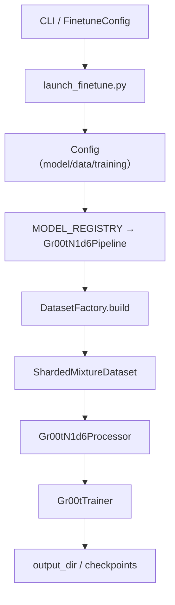

## GR00T 训练流程总览（experiment.py）

### 0. 数据流 & 类关系速览

**从命令行到输出目录的主链路：**



- **配置来源**：命令行 / YAML → `FinetuneConfig` → `Config`（含 `data` 和 `training`）。
- **数据流**：`Config.data` → `DatasetFactory` → `ShardedMixtureDataset`（迭代样本）→ `Gr00tN1d6Processor`（预处理 + 打包张量）。
- **训练流**：`Config.training` → `TrainingArguments` → `Gr00tTrainer.train()`（loss / train_accuracy 日志）。
- **输出流**：所有模型、配置、processor、profiling、checkpoint 等都落到 `output_dir` 及其子目录。

---

### 1. 从命令行到 Config

- **FinetuneConfig（入口配置）**：
  - 由 `launch_finetune.py` 通过 `tyro.cli(FinetuneConfig, ...)` 从命令行解析：
  - 关键字段：`base_model_path`、`dataset_path`、`embodiment_tag`、`output_dir`、batch size、学习率等。
- **构造 Config**：
  - 调用 `get_default_config().load_dict(...)` 注入数据配置：
    - `data.datasets[0].dataset_paths = [ft_config.dataset_path]`
    - `data.datasets[0].embodiment_tag = ft_config.embodiment_tag.value`
  - 覆盖模型与训练配置：
    - `config.model.*`（tune_llm / tune_visual / use_relative_action 等）。
    - `config.training.*`（`output_dir`、`global_batch_size`、`max_steps`、`use_wandb` 等）。
- **config.validate()**（在 `experiment.run()` 中调用）：
  - 检查每个 `SingleDatasetConfig` 的 `embodiment_tag`、`mix_ratio` 等是否合法。
  - 根据实际出现的 embodiment 裁剪 `data.modality_configs`。

---

### 2. 数据集路径与数据加载流程

#### 2.1 数据集路径的单一来源

- **配置位置**：
  - 所有训练数据路径集中在：`Config.data.datasets[*].dataset_paths`。
  - 默认由 `FinetuneConfig.dataset_path` 通过 `launch_finetune.py` 写入。
- **你需要记住的只有一条**：
  - **命令行 `--dataset_path` → `data.datasets[0].dataset_paths[0]` → 实际读数据的根目录。**

#### 2.2 从 Config 到 Dataset

- **Pipeline 层（与模型绑定）**：
  - `experiment.run()` 中按 `type(config.model)` 从 `MODEL_REGISTRY` 找到对应的 Pipeline（默认是 `Gr00tN1d6Pipeline`）。
  - `pipeline.setup()` 会依次：
    - `_create_model()`：加载/构建模型；
    - `_create_dataset()`：构建训练数据；
    - `_create_collator()`：构建 batch collator。
- **DatasetFactory 层（与模型无关）**：
  - `_create_dataset()` 内部调用 `DatasetFactory(config).build(processor)`：
    - 读取 `config.data.datasets`（每个 `SingleDatasetConfig` 包含 `dataset_paths`、`embodiment_tag`、`mix_ratio`）。
    - 对每个数据集创建底层 sharded dataset，并按 `mix_ratio` 组合成一个 `ShardedMixtureDataset` 作为 `train_dataset`。
    - 按 embodiment 合并统计信息，调用 `processor.set_statistics(...)`，保证不同数据集上的归一化一致。
  - 当前实现中 `eval_dataset` 固定为 `None`，并要求 `training.eval_strategy == "no"`（不做在线 eval）。
- **ShardedMixtureDataset 层**：
  - 负责：
    - 按权重在多个底层数据集和它们的 shard 之间采样；
    - 用后台线程预取 shard，前台迭代样本；
    - 在多 GPU + 多 worker 场景下拆分 shard，避免重复消费。
- **Processor 层**（`Gr00tN1d6Processor`）：
  - 根据 `data.modality_configs[embodiment_tag]`：
    - 解析 video / state / action / language 模态；
    - 用 `StateActionProcessor` 做归一化 & 相对动作转换；
    - 做图像增强，调用 VLM 预处理；
    - 打包成模型 forward 所需的张量字典：`state`、`action`、`action_mask`、`vlm_content`、`embodiment_id` 等。

> **流程小结（数据侧）**：
> CLI `--dataset_path` → `Config.data.datasets` → `DatasetFactory.build` → `ShardedMixtureDataset`（迭代样本）→ `Gr00tN1d6Processor`（张量化）→ 模型。 

---

### 3. 训练主流程与指标

#### 3.1 训练主流程（experiment.run）

- **环境与基础设置**：
  - 初始化分布式（根据 `WORLD_SIZE` / `LOCAL_RANK` 判断是否 `dist.init_process_group`）。
  - 调用 `setup_logging()` 配置日志；
  - `set_seed(config.data.seed)` 固定随机种子；
  - `config.validate()` 校验数据与模态配置。
- **输出目录与配置保存**：
  - 根据 `training.output_dir` 和 `training.experiment_name` 决定最终 `output_dir`：
    - 无 `experiment_name`：`output_dir = Path(training.output_dir)`；
    - 有 `experiment_name`：`output_dir = Path(training.output_dir) / experiment_name`。
  - 在 `output_dir/experiment_cfg/` 下保存：
    - `config.yaml`（完整 Config）；
    - `conf.yaml`（OmegaConf 版，额外包含 `max_steps`、`save_steps` 等）。
  - 写入 `output_dir/wandb_config.json`（project + run_id）。
  - 若启用 WandB，只在 rank 0 做 `wandb.init(...)`。
- **构建 Trainer**：
  - 根据 `training.global_batch_size`、`num_gpus` 计算 `per_device_train_batch_size`（若指定 `batch_size` 则覆盖）。
  - 用 `TrainingArguments` 封装训练超参数（lr / scheduler / logging_steps / save_steps / precision / deepspeed 等）。
  - 构造 `Gr00tTrainer(model, args, train_dataset, eval_dataset=None, data_collator, multiprocessing_context=...)`。
  - 注册回调：
    - `CheckpointFormatCallback`：检查点落盘时附带 `experiment_cfg/`、`processor/`、`wandb_config.json`；
    - 可选 `BestMetricCheckpointCallback`：如果你配置了 `save_best_eval_metric_name` 且有 eval 指标，就额外保存 best checkpoint。
- **启动训练**：
  - 打日志“Starting training...”。
  - 如果 `enable_profiling=True`：用 `torch.profiler.profile(...)` 包裹 `trainer.train(resume_from_checkpoint=True)`，trace 写到 `output_dir/profiling/`。
  - 否则：直接调用 `trainer.train(resume_from_checkpoint=True)`，自动从 `output_dir` 下最新 `checkpoint-*` 恢复（如存在）。
  - 训练结束后：`trainer.save_model()` 将最终模型权重写到 `output_dir` 根目录。

#### 3.2 训练时记录的指标

- **基础训练日志（来自 HF Trainer）**：
  - 每 `logging_steps` 步输出：
    - `loss`（训练 loss，带平滑）；
    - `learning_rate`；
    - 当前 step / global_step 等。
  - 若 `use_wandb=True`，上述指标同时同步到 WandB。
- **自定义训练准确率 `train_accuracy`**：
  - 在 `Gr00tTrainer.compute_loss` 中：
    - 调用父类 `compute_loss` 获取 `loss` 和 `outputs.logits`；
    - 周期性（按 `logging_steps`）从 logits 取 argmax，与 `inputs["labels"]` 对比；
    - 忽略 label == -100 的位置，多卡时聚合后在 rank 0 记录 `{"train_accuracy": acc}`。
- **验证指标（默认关闭）**：
  - 当前 sharded 训练管线中：`DatasetFactory.build` 要求 `training.eval_strategy == "no"`，并返回 `eval_dataset=None`；
  - 因此默认训练脚本不会自动跑 `evaluate()`，也就没有 `eval_loss`、`eval_accuracy` 等在线验证指标。

> **流程小结（训练侧）**：
> Config → TrainingArguments → Gr00tTrainer.train()（loss + train_accuracy）→ `trainer.save_model()` → 输出到 `output_dir`。

---

### 4. 输出目录与产物结构

- **输出目录的来源**：
  - 默认：[`TrainingConfig.output_dir`](gr00t/configs/training/training_config.py) 为 `"./outputs"`；
  - 微调脚本：[`FinetuneConfig.output_dir`](gr00t/configs/finetune_config.py) 通过 `launch_finetune.py` 写入 `config.training.output_dir`；
  - `experiment.run()` 再根据可选的 `training.experiment_name` 决定最终 `output_dir` 路径。
- **典型的目录结构**：
  - `output_dir/experiment_cfg/`：配置相关：
    - `config.yaml`、`conf.yaml`、可能还有 `initial_actions.npz`。
  - `output_dir/processor/`：processor 配置与统计：
    - `processor_config.json`、`statistics.json`、`embodiment_id.json` 等。
  - `output_dir/wandb_config.json`：WandB 运行配置（project、run_id）。
  - `output_dir/checkpoint-{global_step}/`：按 `save_steps` 周期保存的 checkpoint：
    - 标准 HF 权重与 `trainer_state.json`；
    - 通过 `CheckpointFormatCallback` 附带一份 `experiment_cfg/`、`processor/`、`wandb_config.json` 副本。
  - 可选 `output_dir/checkpoint-{step}-best-{metric_name}_{value}/`：
    - 只有在开启 best-metric 保存且存在 eval 指标时才会创建。
  - 可选 `output_dir/profiling/trace_rank_*_iter_*.json`：
    - `enable_profiling=True` 时的性能分析轨迹。
  - `output_dir/` 根目录：
    - 最终模型（`trainer.save_model()` 输出），可直接被 HF `from_pretrained(output_dir)` 加载。

> **整体记忆**：
> - **路径**：CLI / YAML → `FinetuneConfig.output_dir` / `TrainingConfig.output_dir` → `output_dir`（可叠加 `experiment_name`）。
> - **内容**：`experiment_cfg/` + `processor/` + 若干 `checkpoint-*` + 可选 `profiling/` + 根目录下的最终模型权重。

### 5. 微调操作示例（结合 README）

- **前置条件**：
  - 数据已转换为 **GR00T 风格的 LeRobot v2 格式**，并放在某个 `<DATASET_PATH>` 下；
  - 为当前具身形态准备好一个 Python 版 `modality_config_path`；
  - 已选择好基础模型 checkpoint（如 `nvidia/GR00T-N1.6-3B`）。

- **典型 NEW_EMBODIMENT 微调命令**（来自项目根目录 `README.md`）：

  ```bash
  # 设置 GPU 数量
  export NUM_GPUS=1

  CUDA_VISIBLE_DEVICES=0 uv run python \
    gr00t/experiment/launch_finetune.py \
    --base-model-path nvidia/GR00T-N1.6-3B \
    --dataset-path <DATASET_PATH> \
    --embodiment-tag NEW_EMBODIMENT \
    --modality-config-path <MODALITY_CONFIG_PATH> \
    --num-gpus $NUM_GPUS \
    --output-dir <OUTPUT_PATH> \
    --save-total-limit 5 \
    --save-steps 2000 \
    --max-steps 2000 \
    --use-wandb \
    --global-batch-size 32 \
    --color-jitter-params brightness 0.3 contrast 0.4 saturation 0.5 hue 0.08 \
    --dataloader-num-workers 4
  ```

- **与本文件流程的对应关系**（只记住主线即可）：
  - `--base-model-path` → `config.training.start_from_checkpoint` → 在第 2 节中的 Pipeline `_create_model()` 里决定从哪个 checkpoint 加载模型；
  - `--dataset-path` → `Config.data.datasets[0].dataset_paths[0]` → 第 2 节的 `DatasetFactory.build` / `ShardedMixtureDataset` 实际读取的数据根目录；
  - `--embodiment-tag` / `--modality-config-path` → 决定第 2 节中的模态配置和 `Gr00tN1d6Processor` 的输入结构；
  - `--output-dir` / `--num-gpus` / `--global-batch-size` / `--max-steps` 等 → 写入 `Config.training.*`，在第 3 节通过 `TrainingArguments` 影响训练过程；
  - `<OUTPUT_PATH>` 下的目录与文件布局，就是第 4 节“输出目录与产物结构”中描述的内容。